# Tutorial - Git + GitHub

**Sumário**:
- [Tutorial - Git + GitHub](#tutorial---git--github)
  - [Usando Git](#usando-git)
    - [0. Como instalar o Git no meu computador](#0-como-instalar-o-git-no-meu-computador)
    - [1. Como criar repositório no GitHub](#1-como-criar-repositório-no-github)
    - [2. Como copiar um repositório para meu computador (git clone)](#2-como-copiar-um-repositório-para-meu-computador-git-clone)
    - [3. Salvar alterações no GitHub (git commit + git push)](#3-salvar-alterações-no-github-git-commit--git-push)
    - [4. E se o ``git push`` der erro?](#4-e-se-o-git-push-der-erro)
    - [5. Como desfazer alterações](#5-como-desfazer-alterações)
      - [5.1 Alterações nao salvas (nao foi executado ``git commit``)](#51-alterações-nao-salvas-nao-foi-executado-git-commit)
      - [5.2 Alterações salvas (JA FOI executado ``git commit``)](#52-alterações-salvas-ja-foi-executado-git-commit)
    - [6. Como criar nomes para os commits do repositorio (``git tag``)](#6-como-criar-nomes-para-os-commits-do-repositorio-git-tag)
  - [Usando GitHub (para gerenciamento de projetos em equipe)](#usando-github-para-gerenciamento-de-projetos-em-equipe)
    - [0. Como adicionar Colaboradores em um repositório](#0-como-adicionar-colaboradores-em-um-repositório)
    - [1. Como criar ``Issues`` em um repositório](#1-como-criar-issues-em-um-repositório)
    - [2. Como criar ``Milestone`` (marco temporal)](#2-como-criar-milestone-marco-temporal)
    - [3. Como colocar uma ``Issue`` dentro de um ``Milestone``](#3-como-colocar-uma-issue-dentro-de-um-milestone)
    - [4. Como indicar uma pessoa para realizar uma ``Issue``](#4-como-indicar-uma-pessoa-para-realizar-uma-issue)
    - [5. Como marcar uma ``Issue`` como Concluída](#5-como-marcar-uma-issue-como-concluída)

## Usando Git

### 0. Como instalar o Git no meu computador

1. Baixe e instale o Git no seu sistema (Windows, Linux, ou MacOS)
   - **Para Windows**: Git Bash ( [https://git-scm.com/downloads/win](https://git-scm.com/downloads/win) )
   - **Para Linux / MacOS**: Use o gerenciador de pacotes do seu sistema (instruções disponíveis em [https://git-scm.com/downloads](https://git-scm.com/downloads) )
2. **[Para Windows]** Clique no botão ``Avançar`` ate o fim da instalação (
   - **NAO ALTERE** nenhuma configuração do instalador. Isto pode danificar a sua instalação do Git!
3. Abra um terminal CMD e teste sua instalação digitando o comando `git` (veja passo a passo na figura abaixo) 
    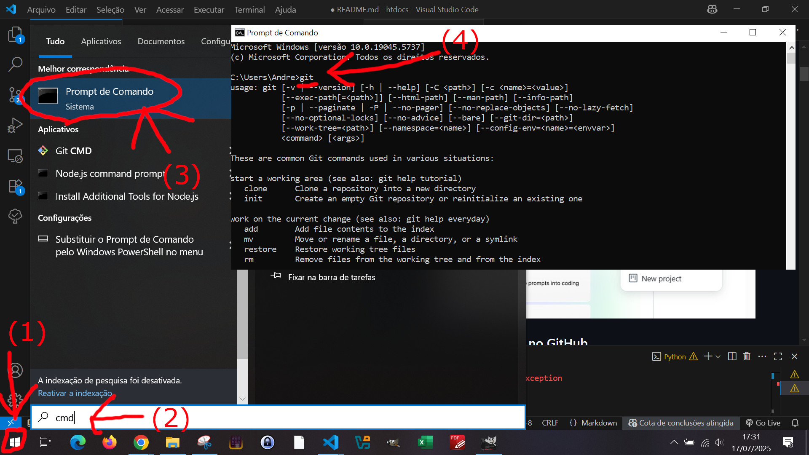

### 1. Como criar repositório no GitHub

1. Faça login no GitHub ( [http://www.github.com](http://www.github.com) )
2. Clique no botão `+` e selecione a opção `Novo repositório`
    
    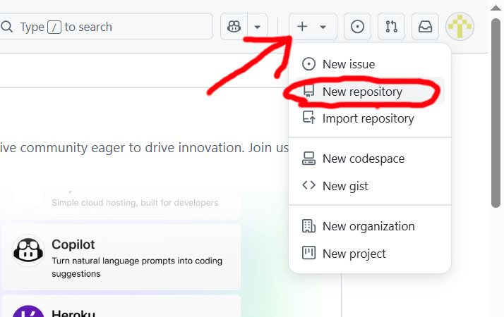

3. Escolha o nome do repositório (o GitHub irá lhe avisar se o nome que você escolheu esta disponível) e marque a opção ``Adicionar arquivo README``
    
    

4. Clique no botão ``Criar repositório``
    
    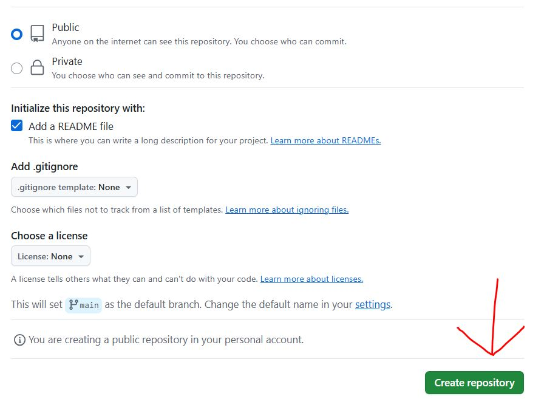

### 2. Como copiar um repositório para meu computador (git clone)

"Clonar" um repositório nada mais é do que criar uma copia dele no seu PC (copiar a pasta do repositório e todos os arquivos contidos nela). 

Para fazer isso, siga os passos abaixo:

1. Clique no botão verde ``Code``
2. Clique em ``HTTPS``
3. Clique no botão de copiar endereço URL do repositório (veja printscreen abaixo)
    
    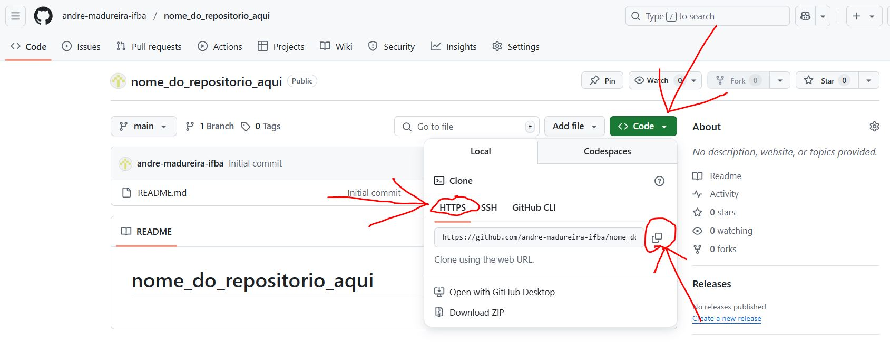

4. Abra o VSCode na pasta que deseja clonar o repositório
   
   

5. No VSCode, pressione ``` Ctrl + ' ``` (ctrl + aspas) para abrir o Terminal integrado do VSCode 
    
    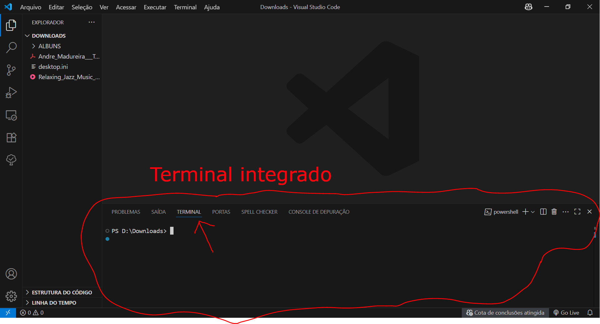

6. No terminal, digite o comando para clonar o repositório no GitHub.
   - No local onde tem `URL_DO_REPOSITORIO_AQUI` voce vai colar (``CTRL + V``) o URL que copiamos anteriormente do GitHub (veja passos 1,2 e 3 acima)
    ```bash
    git clone URL_DO_REPOSITORIO_AQUI
    ```
7. Depois de colar o URL do repositório acrescente logo apos o `https://` o nome do seu usuário no GitHub, seguido de um ``@`` (veja printscreen abaixo)
    
    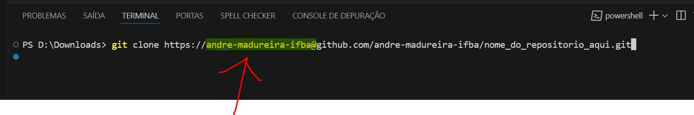

8. O Git irá copiar todos os arquivos que estão no repositório para uma pasta com mesmo nome do repositório
    
    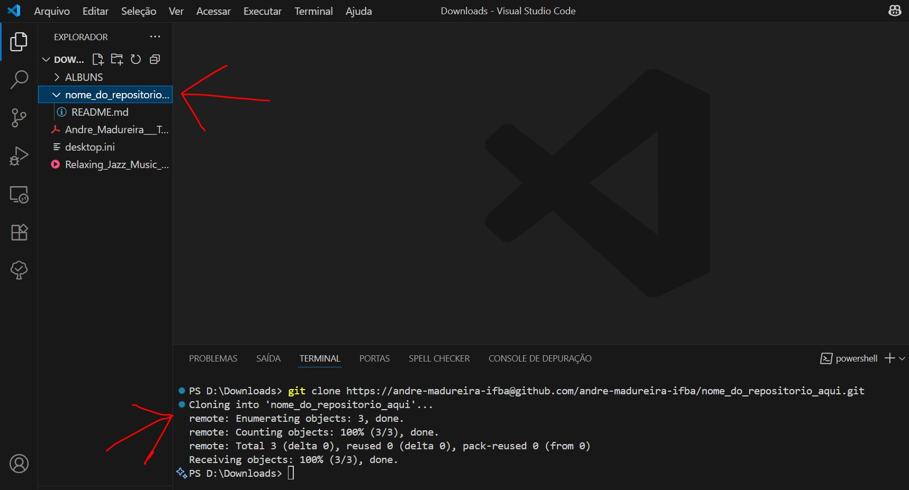

### 3. Salvar alterações no GitHub (git commit + git push)

Depois de salvar arquivos e subpastas dentro da pasta do repositório, voce precisará enviar essas alterações para o GitHub. 
- Note que arquivos novos ou modificados (que ainda nao foram enviados para o GitHub) aparecem com um **circulo verde** ou **amarelo** (vide printscreen abaixo)
    
    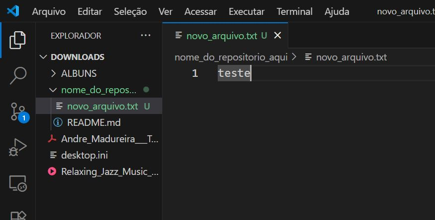


Para salvar as alterações no GitHub, siga os passos abaixo:
1. No terminal integrado do VSCode, va para dentro da pasta do repositório, digite os comandos abaixo:
    ```bash    
    cd PASTA_DO_REPOSITORIO
    git add .
    git status
    ```

    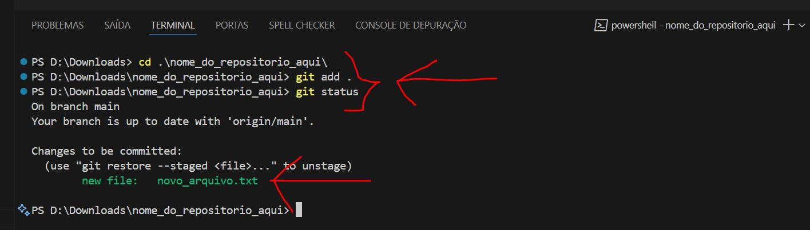 

    - Ir para a pasta do repositorio (`cd PASTA_DO_REPOSITORIO`)
    - Marcar arquivos para salvamento (`git add .`)
      - **ATENCAO**: Esse comando NAO salva os arquivos no repositório.
    - Mostrar arquivos marcados (`git status`)
       
2. Digite os seguintes comandos para salvar as alterações no seu repositório do Git (local):
    ```bash
    git commit -m "Comentario acerca do foi alterado no seu repositorio aqui"
    ```
   - Este comando ira salvar LOCALMENTE as alterações com o comentário fornecido. 
   - Se tudo der certo, voce vera uma tela parecida com a seguinte:
    
    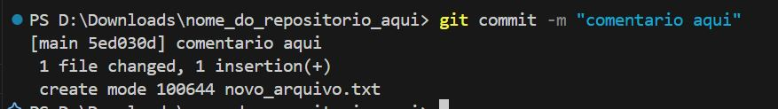 
   
   - **ATENÇÃO**: As alterações AINDA NAO foram enviadas para o GitHub (**elas estão apenas no seu computador**).
3. Para enviar as alterações para o GitHub, execute o comando:
   ```bash
   git push
   ```
   - Esse comando PODE pedir que você faça login na sua conta do GitHub. 
     - Para isso, ele irá abrir um navegador Web (Edge, Firefox, Chrome, etc) com uma tela de login do GitHub.
   - Se tudo der certo, voce vera uma tela parecida com a seguinte:
    
    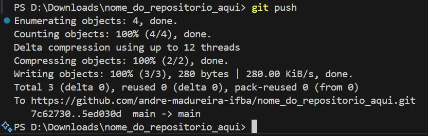 

**RESUMO DOS COMANDOS**:
```bash
cd PASTA_DO_REPOSITORIO
git add .
git commit -m "cometario aqui"
git push
```

### 4. E se o ``git push`` der erro?

Se algum colega salvar um arquivo novo no GitHub no momento em que voce estiver fazer o `git push`, isto pode gerar um erro. 

Para resolver esse problema, faça o seguinte:
1. No terminal integrado do VSCode, dentro da pasta do repositório, digite os comandos abaixo:
   ```bash
   git pull
   git add .
   git commit -m "Merge de conflitos"
   git push
   ```
    - Os comandos acima irão baixar as alterações para seu PC (``git pull``)
    - Adicionar os arquivos alterados (``git add .``)
    - Salvar essas alterações (`git commit`)
    - Enviar para as alteracoes para o GitHub (``git push``)

### 5. Como desfazer alterações

O Git mantém um histórico de TODAS as alterações, feitas em TODOS os arquivos e pastas armazenados no repositório. Isso nos ajuda em caso de erros de escrita, de programação ou outros que venham a surgir.

Existem duas formas de desfazer alterações, a depender se elas foram salvas no Git usando `git commit` ou não:

#### 5.1 Alterações nao salvas (nao foi executado ``git commit``)

Suponha que fiz alterações em um arquivo. Ainda nao rodei o `git commit` e desejo descartar as alterações (veja o exemplo da figura abaixo).
- Observe que o arquivo alterado parece em amarelo ou verde.

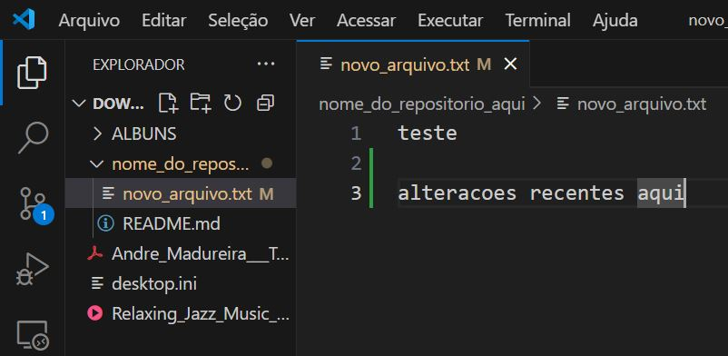 

Para desfazer alterações nao salvas, basta executar o comando de reset do Git:
```bash
git reset --hard
```
- Este comando ira retornar os arquivos alterados para o estado que eles tinham no ultimo ``git commit`` executado.

#### 5.2 Alterações salvas (JA FOI executado ``git commit``)

Nesse caso, precisaremos retornar nosso repositório para uma versão anterior (``commit`` anterior). Para isso siga os passos abaixo.

1. Execute o comando mostrar os ``commits`` do repositório:    
    ```bash
    git log
    ```
   - Observe que nesse caso eu sei que o ultimo commit foi a causa do problema. Logo, preciso retornar para o commit que tem o texto ``comentario aqui``.
   - Se eu nao soubesse o commit que desejo retornar, posso buscar pelos commits usando as setas do teclado (cima e baixo). 
   - Quando encontrar o commit que desejo retornar, basta pressionar a tecla `q` para sair do ``git log``.
    
    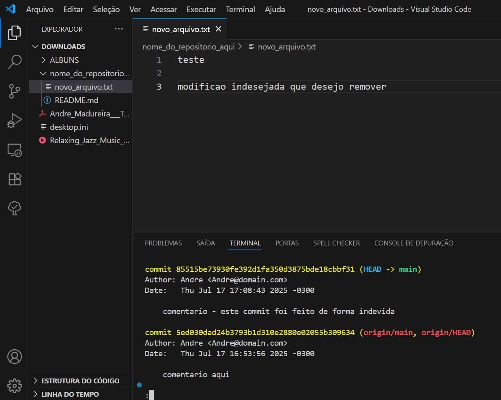 

3. Para retornar para o commit cujo comentário é `comentario aqui`, basta identificar o número do commit e executar o comando ``git checkout`` (veja exemplo abaixo):
    ```bash
    git checkout NUMERO_DO_COMMIT_AQUI
    ```
    
    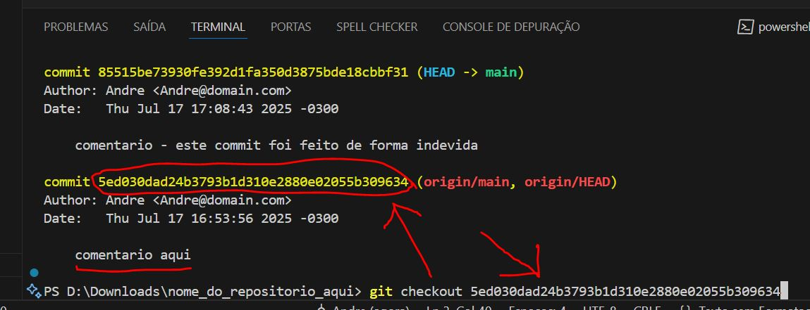 
    
4. Apos executar o ``git checkout``, voce deverá ver a seguinte tela:
    
    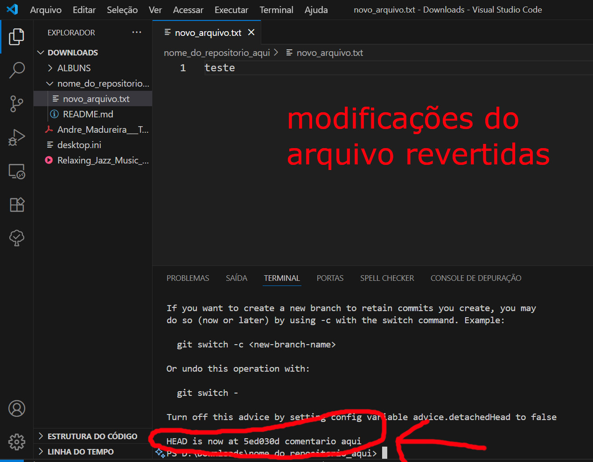 
   

### 6. Como criar nomes para os commits do repositorio (``git tag``)

Digamos que voce deseja criar nomes para cada um commit em particular. Nesse caso você deve usar o comando `git tag`.

1. Depois de executar o ``git commit`` e `git push`, digite o seguinte comando:
    ```bash
    git tag NOME_QUE_DESEJA_COLOCAR_NO_COMMIT
    git push --tags
    ```
    - Define um nome para o commit (`git tag`)
    - Envia as tags para o GitHub (`git push`)
2. Agora seu commit tera um número e um nome vinculado a ele (ambos podem ser usados com o comando ``git checkout``). Veja exemplo abaixo.
    
    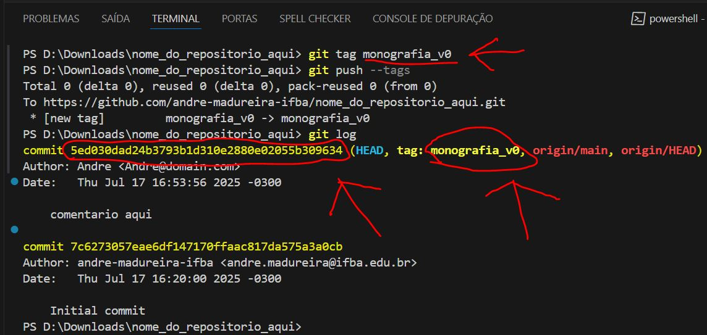 

## Usando GitHub (para gerenciamento de projetos em equipe)

### 0. Como adicionar Colaboradores em um repositório

1. Na página do seu repositório, clique em `Settings`
2. No menu a esquerda, clique em `Collaborators`
3. Clique em `Add people`

     

4. Chegara um email convidando a pessoa para participar no repositório. **A pessoa precisa confirmar a participação no email.**

### 1. Como criar ``Issues`` em um repositório

``Issues`` no GitHub sao "problemas" ou "tarefas" a serem cumpridas. 

Para criar uma ``issue``, faça o seguinte:
1. Va no canto superior esquerdo do seu repositório e clique em `Issues`
    
    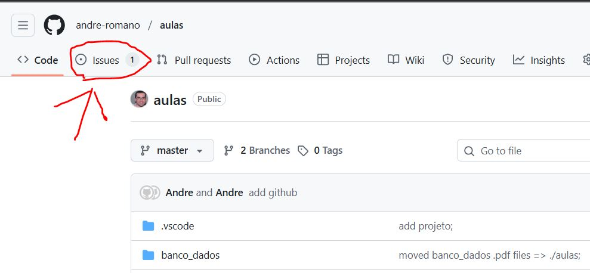 

2. Clique em `New Issue`

    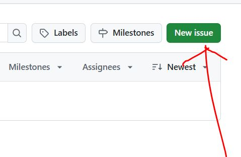 

3. Preencha o titulo e descrição
    
    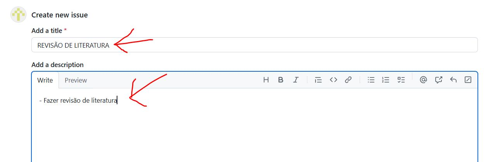 

4. Clique em `Create`
    
    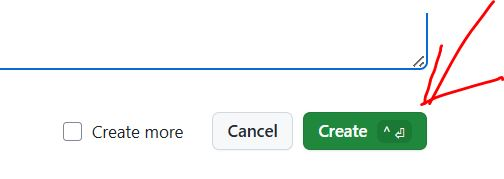 

### 2. Como criar ``Milestone`` (marco temporal)

1. Va no canto superior esquerdo do seu repositório e clique em `Issues`
    
     

2. Va no canto superior direito e clique em `Milestones`
    
    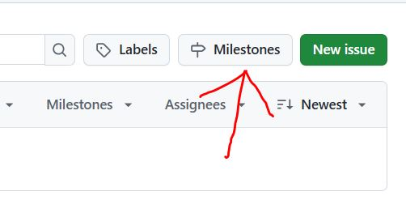 

3. Clique em `New milestone`
    
    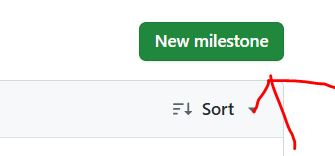 

4. Preencha o titulo, prazo para entrega e descricao. Em seguida clique em `Create milestone`
    
    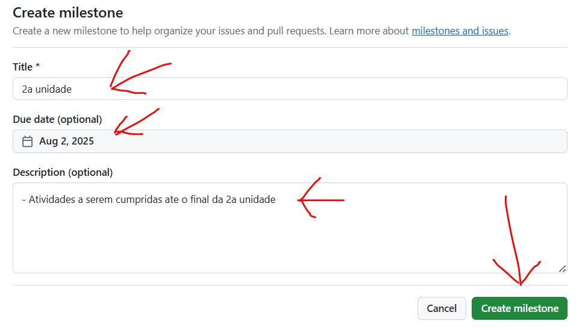 

### 3. Como colocar uma ``Issue`` dentro de um ``Milestone`` 

Ao colocar a ``Issue`` dentro do ``Milestone``, voce está definindo a data limite (``milestone``) para ela ser realizada.

Para isso, siga os passos abaixo:

1. Va no canto superior esquerdo do seu repositório e clique em `Issues`
    
     

2. Clique na ``issue`` desejada
    
    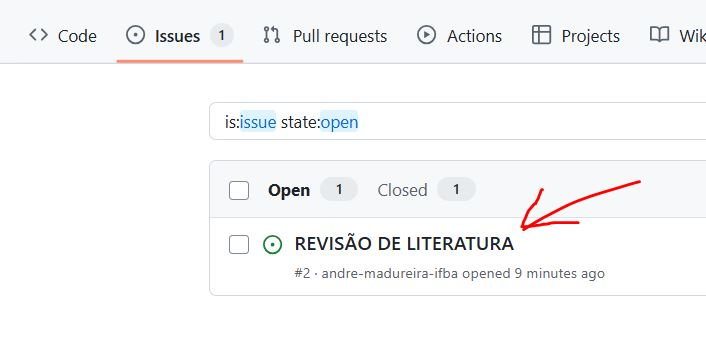  

3. Clique na ``Milestone`` e escolha a milestone desejada
    
    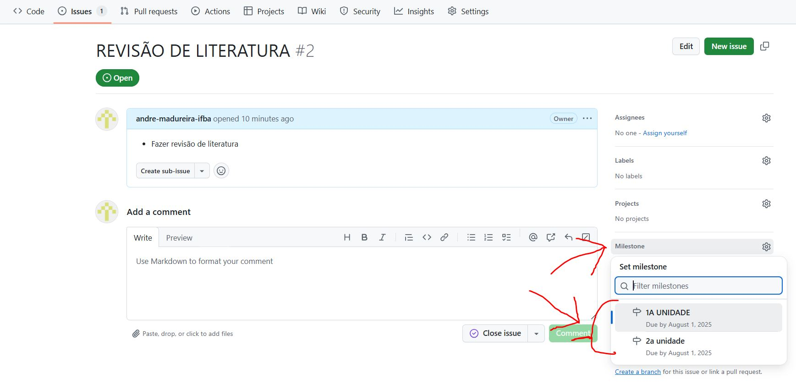 

### 4. Como indicar uma pessoa para realizar uma ``Issue`` 

1. Com a Issue aberta, clique em `Assignees` e escolha a(s) pessoa(s) que deverão realizar essa tarefa
    
    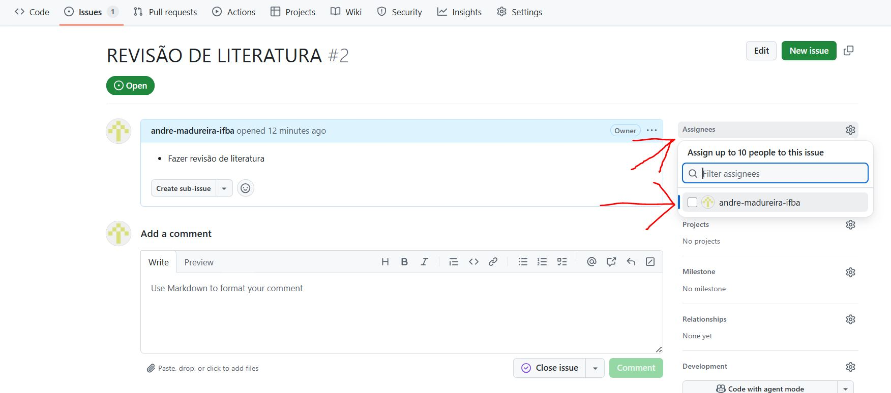  

### 5. Como marcar uma ``Issue`` como Concluída

1. Com a Issue aberta, clique em `Close issue`
    
    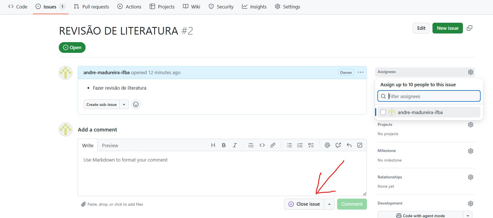  
    
    - Quando uma issue é fechada, ela interfere na conclusão do Milestone.
    - Isto é, quando todas as issues de um Milestone sao fechada, este Milestone está 100% concluído (veja imagem abaixo).
    
    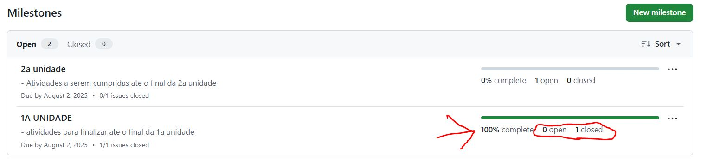   