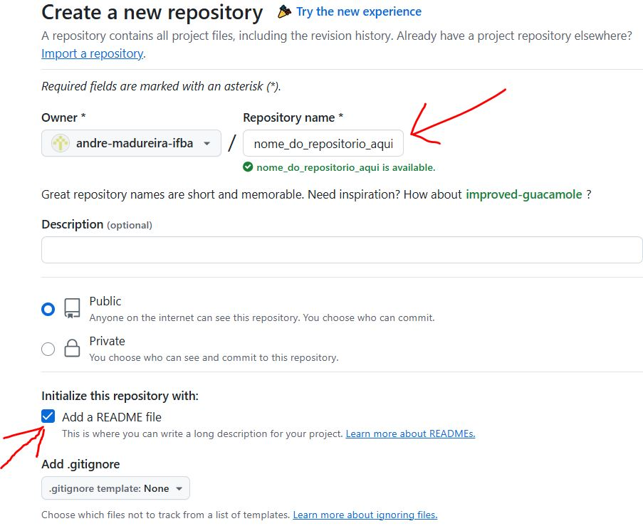
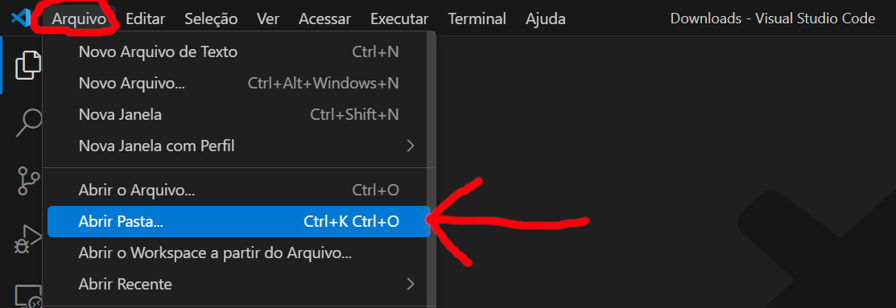

## Tutorial - Git + GitHub

**Sumário**:
- [Tutorial - Git + GitHub](#tutorial---git--github)
  - [0. Como instalar o Git no meu computador](#0-como-instalar-o-git-no-meu-computador)
  - [1. Como criar repositório no GitHub](#1-como-criar-repositório-no-github)
  - [2. Como copiar um repositório para meu computador (git clone)](#2-como-copiar-um-repositório-para-meu-computador-git-clone)
  - [3. Salvar alterações no GitHub (git commit + git push)](#3-salvar-alterações-no-github-git-commit--git-push)
  - [4. Como desfazer alterações](#4-como-desfazer-alterações)
    - [4.1 Alterações nao salvas (nao foi executado ``git commit``)](#41-alterações-nao-salvas-nao-foi-executado-git-commit)
    - [4.2 Alterações salvas (JA FOI executado ``git commit``)](#42-alterações-salvas-ja-foi-executado-git-commit)
  - [5. Como criar nomes para os commits do repositorio (``git tag``)](#5-como-criar-nomes-para-os-commits-do-repositorio-git-tag)

### 0. Como instalar o Git no meu computador

1. Baixe e instale o Git no seu sistema (Windows, Linux, ou MacOS)
   - **Para Windows**: Git Bash ( [https://git-scm.com/downloads/win](https://git-scm.com/downloads/win) )
   - **Para Linux / MacOS**: Use o gerenciador de pacotes do seu sistema (instruções disponíveis em [https://git-scm.com/downloads](https://git-scm.com/downloads) )
2. **[Para Windows]** Clique no botão ``Avançar`` ate o fim da instalação (
   - **NAO ALTERE** nenhuma configuração do instalador. Isto pode danificar a sua instalação do Git!
3. Abra um terminal CMD e teste sua instalação digitando o comando `git` (veja passo a passo na figura abaixo) 
    

### 1. Como criar repositório no GitHub

1. Faça login no GitHub ( [http://www.github.com](http://www.github.com) )
2. Clique no botão `+` e selecione a opção `Novo repositório`
    

3. Escolha o nome do repositório (o GitHub irá lhe avisar se o nome que você escolheu esta disponível) e marque a opção ``Adicionar arquivo README``
    

4. Clique no botão ``Criar repositório``
    

### 2. Como copiar um repositório para meu computador (git clone)

"Clonar" um repositório nada mais é do que criar uma copia dele no seu PC. 

Para fazer isso, siga os passos abaixo:

1. Clique no botão verde ``Code``
2. Clique em ``HTTPS``
3. Clique no botão de copiar endereço URL do repositório (veja printscreen abaixo)
    

4. Abra o VSCode na pasta que deseja clonar o repositório
   

5. No VSCode, pressione ``` Ctrl + ` ``` (ctrl + backtick) para abrir o Terminal integrado do VSCode 
   - O ``backtick`` é como se fosse a crase do português
    

6. No terminal, digite o comando para clonar o repositório no GitHub.
   - No local onde tem `URL_DO_REPOSITORIO_AQUI` voce vai colar (``CTRL + V``) o URL que copiamos anteriormente do GitHub (veja passos 1,2 e 3 acima)
    ```bash
    git clone URL_DO_REPOSITORIO_AQUI
    ```
7. Depois de colar o URL do repositório acrescente logo apos o `https://` o nome do seu usuário no GitHub, seguido de um ``@`` (veja printscreen abaixo)
    

8. O Git irá copiar todos os arquivos que estão no repositório para uma pasta com mesmo nome do repositório
    

### 3. Salvar alterações no GitHub (git commit + git push)

Depois de salvar arquivos e subpastas dentro da pasta do repositório, voce precisará enviar essas alterações para o GitHub. 
- Note que arquivos novos ou modificados (que ainda nao foram enviados para o GitHub) aparecem com um **circulo verde** ou **amarelo** (vide printscreen abaixo)
    


Para salvar as alterações no GitHub, siga os passos abaixo:
1. No terminal integrado do VSCode, dentro da pasta do repositório, digite os comandos abaixo:
    ```bash    
    git add .
    git status
    ```
    - Os comandos acima irao marcar os arquivos alterados ou criados para serem salvos no Git.
    - **ATENCAO**: Esses comandos NAO salvam os arquivos, apenas marcam eles para salvamento.
2. Após digitar os comandos acima, voce deve ver uma lista de arquivos a serem salvos no Git, com fonte em verde claro.
     
   - Se estiver tudo certo com a lista de arquivos, va para o proximo passo. 
3. Digite os seguintes comandos para salvar as alterações no seu repositório do Git (local):
    ```bash
    git commit -m "Comentario acerca do foi alterado no seu repositorio aqui"
    ```
   - Este comando ira salvar LOCALMENTE as alterações com o comentário que voce forneceu usando as aspas duplas (`"`). Se tudo certo, voce vera uma tela parecida com a seguinte:
     
   - **ATENÇÃO**: As alterações AINDA NAO foram enviadas para o GitHub (elas estão apenas no seu computador).
4. Para enviar as alterações para o GitHub, execute o comando:
   ```bash
   git push
   ```
   - Esse comando PODE pedir que você faça login na sua conta do GitHub, para autorizar o envio das alterações. Para isso, ele irá abrir um navegador Web (Edge, Firefox, Chrome, etc) com uma tela de login do GitHub.
   - Se tudo der certo, voce vera uma tela parecida com a seguinte:
     
   
5. Caso esteja usando um computador publico, é recomendável remover a pasta do repositório após você terminar de usar esta máquina.
   - Isso vai evitar que pessoas que nao deviam ter acesso consigam acessar o repositório.
  
### 4. Como desfazer alterações

O Git mantém um histórico de TODAS as alterações, feitas em TODOS os arquivos e pastas armazenados no repositório. Isso nos ajuda em caso de erros de escrita, de programacao ou outros que venham a surgir.

Existem duas formas de desfazer alterações, a depender se elas foram salvas no Git usando `git commit` ou não:

#### 4.1 Alterações nao salvas (nao foi executado ``git commit``)

Suponha que fiz alterações em um arquivo. Ainda nao rodei o `git commit` e desejo descartar as alterações (veja o exemplo da figura abaixo).
- Observe que o arquivo alterado parece em amarelo ou verde.

 

Para desfazer alterações nao salvas, basta executar o comando de reset do Git:
```bash
git reset --hard
```
- Este comando ira retornar os arquivos alterados para o estado que eles tinham no ultimo ``git commit`` executado.

#### 4.2 Alterações salvas (JA FOI executado ``git commit``)

Nesse caso, precisaremos retornar nosso repositório para uma versão anterior (``commit`` anterior). Para isso siga os passos abaixo.

1. Execute o comando mostrar os ``commits`` do repositório:    
    ```bash
    git log
    ```
   - Observe que nesse caso eu sei que o ultimo commit foi a causa do problema. Logo, preciso retornar para o commit que tem o texto ``comentario aqui``.
   - Se eu nao soubesse o commit que desejo retornar, posso buscar pelos commits usando as setas do teclado (cima e baixo). 
   - Quando encontrar o commit que desejo retornar, basta pressionar a tecla `q` para sair do ``git log``.
     

3. Para retornar para o commit cujo comentario é `comentario aqui`, basta identificar o número do commit e executar o comando ``git checkout`` (veja exemplo abaixo):
    ```bash
    git checkout NUMERO_DO_COMMIT_AQUI
    ```
     
    
4. Apos executar o ``git checkout``, voce deverá ver a seguinte tela:
     
   

### 5. Como criar nomes para os commits do repositorio (``git tag``)

Digamos que voce deseja criar nomes para cada um commit em particular. Nesse caso você deve usar o comando `git tag`.

1. Depois de executar o ``git commit`` e `git push`, digite o seguinte comando:
    ```bash
    git tag NOME_QUE_DESEJA_COLOCAR_NO_COMMIT
    ```
2. Depois disso, execute o comando `git push --tags` para enviar as tags para o GitHub
3. Agora seu commit tera um número e um nome vinculado a ele (ambos podem ser usados com o comando ``git checkout``). Veja exemplo abaixo.
     


