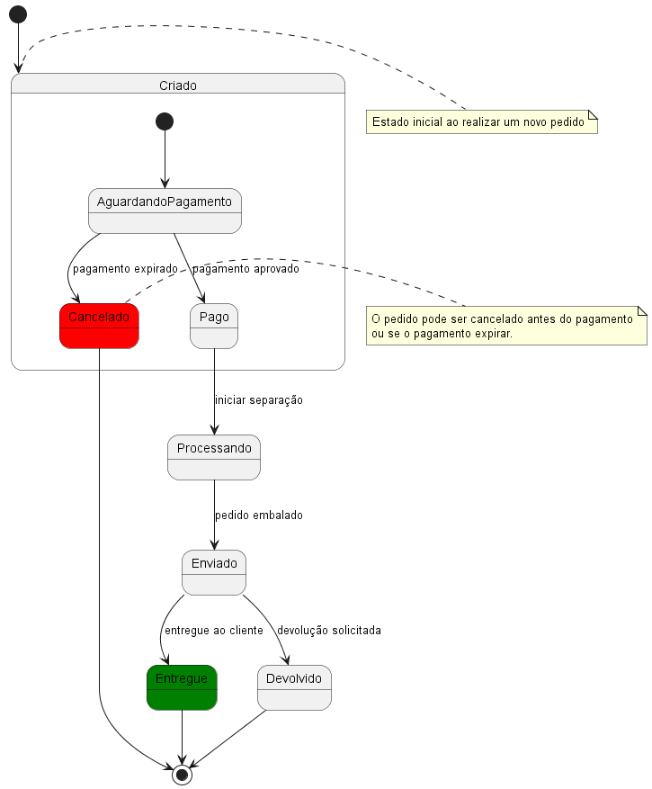

**Sumário**:
- [PlantUML](#plantuml)
  - [Como instalar (VS Code) ?](#como-instalar-vs-code-)
  - [Como usar ?](#como-usar-)
  - [Documentação](#documentação)
  - [Video-aulas e Tutoriais](#video-aulas-e-tutoriais)
  - [Exemplos](#exemplos)
    - [1. Gráficos de GANTT](#1-gráficos-de-gantt)
    - [2. Grade / Fluxograma de Curso](#2-grade--fluxograma-de-curso)
    - [3. Diagrama de Casos de Uso](#3-diagrama-de-casos-de-uso)
    - [4. Diagrama de Sequencia](#4-diagrama-de-sequencia)
    - [5. Diagrama de Classes](#5-diagrama-de-classes)
    - [6. Diagrama de Objetos](#6-diagrama-de-objetos)
    - [7. Diagrama de Implantação (Deployment)](#7-diagrama-de-implantação-deployment)
    - [8. Diagrama de Componentes](#8-diagrama-de-componentes)
    - [9. Diagrama de Atividades](#9-diagrama-de-atividades)
    - [10. Diagrama de Estados (Máquina de Estados Finita - FSM)](#10-diagrama-de-estados-máquina-de-estados-finita---fsm)
    - [11. Diagrama de Timing](#11-diagrama-de-timing)


# PlantUML

O PlantUML é uma ferramenta de código aberto que permite a criação de diagramas a partir de uma linguagem textual simples. 

Em vez de usar interfaces gráficas (como arrastar e soltar elementos), você escreve um código em formato de texto, e o PlantUML gera o diagrama automaticamente. 

É amplamente usado para documentação técnica, planejamento de software, modelagem de sistemas, construção de fluxogramas e diagramas.

## Como instalar (VS Code) ?

Instale a extensão ``PlantUML (jebbs.plantuml)`` no VS Code, conforme instrucoes abaixo:
- Abra o terminal do VS Code (Ctrl + P) 
- Digite o comando abaixo:

```vscode
ext install plantuml
```

## Como usar ?
- Crie um arquivo ``.puml``
- Digite os comandos PlantUML nele
- Exporte o diagrama no formato que desejar (i.e., PNG, SVG, PDF, etc)

## Documentação

A documentacao completa da ferramenta esta disponível em:
- [https://plantuml.com/](https://plantuml.com/)

## Video-aulas e Tutoriais

- [Video-aula](https://www.youtube.com/watch?v=WSC1K_rDf2w)
- [Tutorial](https://blog.jetbrains.com/dotnet/2020/10/06/create-uml-diagrams-using-plantuml/)

## Exemplos

Esta pasta contem vários exemplos de uso do PlantUML, conforme descritos abaixo.

### 1. Gráficos de GANTT


- Veja o código em [./grafico_gantt.puml](./grafico_gantt.puml)

### 2. Grade / Fluxograma de Curso


 
- Veja o código em [./fluxograma_curso.puml](./fluxograma_curso.puml)
  

### 3. Diagrama de Casos de Uso


- Veja o código em [./diagrama_casos_uso.puml](./diagrama_casos_uso.puml)

### 4. Diagrama de Sequencia


- Veja o código em [./diagrama_sequencia.puml](./diagrama_sequencia.puml)

### 5. Diagrama de Classes


 
- Veja o código em [./diagrama_classes.puml](./diagrama_classes.puml)

### 6. Diagrama de Objetos


 
- Veja o código em [./diagrama_objetos.puml](./diagrama_objetos.puml)

### 7. Diagrama de Implantação (Deployment)


- Veja o código em [./diagrama_implantacao.puml](./diagrama_implantacao.puml)

### 8. Diagrama de Componentes
   


- Veja o código em [./diagrama_componente.puml](./diagrama_componente.puml)
- 
### 9. Diagrama de Atividades
   


- Veja o código em [./diagrama_atividade.puml](./diagrama_atividade.puml)

### 10. Diagrama de Estados (Máquina de Estados Finita - FSM)



- Veja o código em [./diagrama_estados.puml](./diagrama_estados.puml)

### 11. Diagrama de Timing


- Veja o código em [./diagrama_timing.puml](./diagrama_timing.puml)

