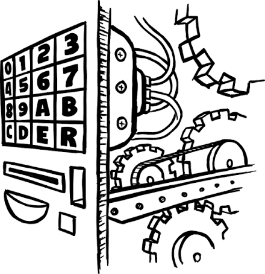
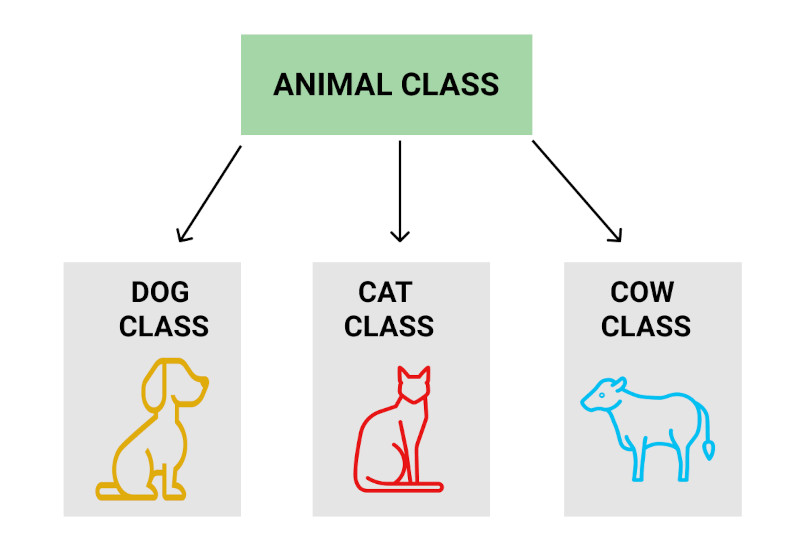
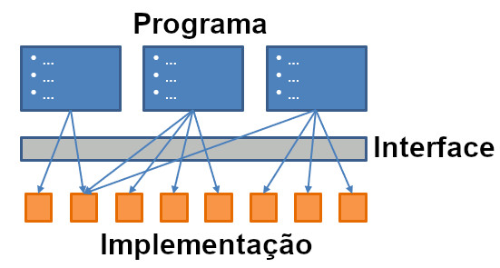

# Pilares da Programacao Orientada a Objetos (POO)

**Sumário**
- [Pilares da Programacao Orientada a Objetos (POO)](#pilares-da-programacao-orientada-a-objetos-poo)
- [1. Os 4 pilares da POO](#1-os-4-pilares-da-poo)
- [2. Abstração](#2-abstração)
- [3. Herança](#3-herança)
  - [3.1. Especialização](#31-especialização)
  - [3.2. Sobrescrita de métodos na herança](#32-sobrescrita-de-métodos-na-herança)
  - [3.3. `super()`](#33-super)
- [4. Interfaces e Polimorfismo](#4-interfaces-e-polimorfismo)
- [5. Encapsulamento](#5-encapsulamento)
  - [5.1. Encapsulamento em Python](#51-encapsulamento-em-python)
    - [Atributo público (``nome_do_atributo``)](#atributo-público-nome_do_atributo)
    - [Atributo protegido (``_nome_do_atributo``)](#atributo-protegido-_nome_do_atributo)
    - [Atributo privado (``__nome_do_atributo``)](#atributo-privado-__nome_do_atributo)
  - [5.2. Getters e Setters](#52-getters-e-setters)
- [Exercícios para fixação](#exercícios-para-fixação)
  - [Exercício 1](#exercício-1)
  - [Exercício 2](#exercício-2)
  - [Exercício 3](#exercício-3)
  - [Exercício 4](#exercício-4)
  - [Exercício 5](#exercício-5)
  - [Exercício 6](#exercício-6)
- [Estudos de caso (para fixacao do conteudo)](#estudos-de-caso-para-fixacao-do-conteudo)
  - [Estudo de caso 1](#estudo-de-caso-1)
  - [Estudo de caso 2](#estudo-de-caso-2)
  - [Estudo de caso 3](#estudo-de-caso-3)
  - [Estudo de caso 4](#estudo-de-caso-4)
  - [Estudo de caso 5](#estudo-de-caso-5)
- [Solucao dos Exercicios](#solucao-dos-exercicios)


# 1. Os 4 pilares da POO

Os quatro conceitos tradicionalmente apresentados como **pilares da Programação Orientada a Objetos** são:

1. Abstração
2. Herança
3. Polimorfismo
4. Encapsulamento

Eles são fundamentais, mas é importante compreender que POO não se resume a esses quatro conceitos.


# 2. Abstração

Abstração consiste em ***"esconder detalhes desnecessários"*** para quem utiliza a abstração.
- Isto é, tornar mais simples o uso de uma funcao, metodo, ou classe, escondendo dentro das funcoes, metodos e classes o funcionamento (e complexidade de um programa).



Exemplo:

Quando usamos:

```python
print("Olá")
```

não precisamos conhecer o funcionamento interno da funcao `print()`.

Da mesma forma, ao utilizar:

```python
conta.sacar(100)
```

o código que utiliza a conta não precisa conhecer todos os detalhes internos da operação. 
- Apenas a classe `Conta` precisa conhecer esses detalhes:

```python
class Conta:
    def __init__(self):
        self.saldo = 0

    def sacar(self, valor)
        if valor > 0 and valor <= saldo:
            self.saldo = self.saldo - valor
        else:
            print("Nao é possivel sacar", valor, "de", self.saldo)
```

Repare que apenas conta sabe as regras para ``sacar(valor)`` funcionar:
- valor > 0
- valor <= saldo

# 3. Herança

Herança permite criar uma classe baseada em outra.

Exemplo:

```text
                 Pessoa
                   │
        ┌──────────┴──────────┐
        │                     │
      Aluno                Professor
```

Podemos escrever:

```python
class Pessoa:
    def __init__(self, nome):
        self.nome = nome

    def cumprimentar(self):
        print("ola me chamo", self.nome)

class Aluno(Pessoa):
    pass
```

A classe `Aluno` herda características de `Pessoa`.
- Isto é, todo objeto da classe `Aluno` tem TODOS os atributos e métodos da classe `Pessoa`

Logo, podemos fazer:

```python
aluno = Aluno("João")

print(aluno.nome)

aluno.cumprimentar()
```

## 3.1. Especialização

Quando uma classe herda de outra classe, temos:
- Classe herdeira é chamada de **Subclasse** (ou **classe filha**)
- Classe herdada é chamada de **Superclasse** (ou **classe pai**)



No exemplo acima:
- ``Animal`` é **classe pai**
- ``Dog``, ``Cat`` e ``Cow`` sao **classes filhas**

Isto é, uma herença nada mais é do que uma relacao do tipo **é um**.

Exemplo:
- `Cachorro` é um ``Animal``
- `Gato` é um ``Animal``
- `Vaca` é um ``Animal``

Em Python teriamos:
```python
class Animal:
    def __init__(self, nome):
        self.nome = nome

    def emite_som(self):
        print("Som generico")

class Cachorro(Animal):
    pass

class Gato(Animal):
    pass

class Vaca(Animal):
    pass

cachorro1 = Cachorro("Toto")
gato1 = Gato("Felix")
vaca1 = Vaca("MuMu")

# so podemos fazer o print porque Cachorro, Gato e Vaca "sao tipos de" Animal
print(cachorro1.nome)
print(gato1.nome)
print(vaca1.nome)

cachorro1.emite_som()
```

**Cuidado**:

> Nem toda reutilização de código deve ser feita com herança. 

> Na realidade, costuma ser melhor reutilizar código usando outras técnicas, como a **Composicao** (que iremos ver em breve).


## 3.2. Sobrescrita de métodos na herança

Uma **subclasse** pode **sobrescrever** um método da **classe-pai**.

```python
class Animal:
    def emitir_som(self):
        return "Som genérico"


class Cachorro(Animal):
    def emitir_som(self):
        return "Au au"
```

Agora:

```python
animal = Animal()
cachorro = Cachorro()

print(animal.emitir_som())
print(cachorro.emitir_som())
```

Resultado:

```text
Som genérico
Au au
```

Esse mecanismo é chamado de **method overriding**, ou sobrescrita de método.


## 3.3. `super()`

Podemos usar a palavra reservada ``super()`` para acessemos métodos ou atributos da **classe pai**.

Exemplo:

```python
class Pessoa:
    def __init__(self, nome):
        print("Chamando construtor de Pessoa...")
        self.nome = nome

class Aluno(Pessoa):
    def __init__(self, nome, matricula):
        super().__init__(nome)
        print("Chamando construtor de Aluno...")
        self.matricula = matricula
```

Resultado:
```text
Chamando construtor de Pessoa...
Chamando construtor de Aluno...
```

Note que:
- ``Aluno.__init__()`` chama `Pessoa.__init__()` 
- somente depois dessa chamada que o construtor de `Aluno` faz as outras operacoes (como ``self.matricula = matricula``)
- Essa ordem é IMPORTANTE, pois é RECOMENDÁVEL **chamar o construtor da classe pai** ANTES de fazer **qualquer operacao** no contrutor da **classe filha**.


# 4. Interfaces e Polimorfismo


Para obtermos **polimorfismo**, devemos definir métodos com **nomes e parametros que possam ser reutilizados** em várias classes, como uma **interface**.
- Assim, qualquer classe que implemente os métodos da interface, pode ser usada no código de forma identica a qualquer outra classe (usando assim o **polimorfismo**).
- Logo, **polimorfismo** é a capacidade um programa usar qualquer classe em um código, desde que ela satisfaça a uma **interface** (conjunto de métodos previamente definidos).



Exemplo:

```python
class Cachorro:
    def emitir_som(self):
        print("Au au")


class Gato:
    def emitir_som(self):
        print("Miau")
```

Podemos usar as classes acima da seguinte forma: 

```python
def fazer_animal_falar(animal):
    animal.emitir_som()

cachorro1 = Cachorro()
gato1 = Gato()

fazer_animal_falar(cachorro1)
fazer_animal_falar(gato1)
```

Repare que a função `fazer_animal_falar()` não precisa saber se recebeu um objeto da classe `Cachorro` ou `Gato`.
- Ela simplesmente precisa que o objeto implemente o método ``emitir_som()``.
- Logo, podemos dizer que tanto `Cachorro` quanto `Gato` **implementam** a interface que contem o método `emitir_som()`.

**IMPORTANTE**: Interfaces podem conter mais de um método.

Exemplo:

```python
class Cachorro:
    def emitir_som(self):
        print("Au au")

    def comer(self, comida):
        print("Haf haf", comida, "boa")


class Gato:
    def emitir_som(self):
        print("Miau")
    
    def comer(self, comida):
        print("Nhom nhom", comida, "aceitavel. Quero mais!")

class Pessoa:
    def emitir_som(self):
        print("Ola")
    
    def comer(self, comida):
        print("Chomp chomp", comida, "quente")
```

Podemos escrever:

```python
cachorro = Cachorro()
gato = Gato()
pessoa = Pessoa()

animal = cachorro
print(animal.comer())

animal = gato
print(animal.comer())

animal = pessoa
print(animal.comer())
```

Aqui, o objeto `animal` pode ser qualquer objeto (``cachorro``, ``gato``, ou outros), desde que esse objeto implemente o metodo ``comer()``.
- Assim, `animal` é um objeto **polimorfico** (pois horas pode ser ``cachorro``, horas pode ser ``gato``, ou outro objeto qualquer que implemente ``comer()``).
- **poli** (multiplas) - **morfos** (formas)


# 5. Encapsulamento

Encapsulamento consiste em:
- organizar dados e comportamentos dentro de uma classe 
- controlar como o estado interno (dados) pode ser acessado ou modificado.

A ideia é **evitar que qualquer parte do programa altere livremente o estado interno** de um objeto.
- Isto é, SOMENTE métodos da classe do objeto podem alterar seu estado!

Considere uma conta bancária.

Nao podemos usar códigos como:

```python
conta.saldo = -5000
```

Pois isso permitiria colocar a conta em um estado possivelmente inválido: 
- Contas de banco (normalmente) nao tem saldo negativo 
- *(contas com cheque especial sao um caso aparte)*

Uma forma correta de alterar o ``saldo`` é controlando essa alteração de DENTRO da classe, usando um método como `sacar(valor)`:

```python
class Conta:

    def __init__(self, titular, saldo=0):
        self.titular = titular
        self.saldo = saldo

    def sacar(self, valor):
        # gerar erro se valor <= 0 (nao faz sentido sacar valor negativo)
        if valor <= 0:
            print("Valor inválido:", valor)
        # se tentar sacar valor mais alto do que tem disponivel no saldo, gerar erro
        elif valor > self.saldo:
            print("Saldo insuficiente:", saldo, "MENOR QUE", valor)
        else:
            # se valor > 0 e valor <= saldo, podemos fazer o saque
            self.saldo -= valor
```

Agora as regras ficam dentro do próprio objeto.

```python
conta = Conta("João", 1000)

conta.sacar(200)
```

## 5.1. Encapsulamento em Python

No Java ou C++, palavras reservadas sao usadas para indicar quem pode acessar cada atributo ou método. 
- Essas palavras sao chamadas de **modificadores de acesso**:
  - private
  - protected
  - public

Porem, **Python nao usa modificadores de acesso**. 
- Python usa convencoes na hora de nomear atributos e metodos
- Isto é, definimos quem pode acessar qual atributo ou metodo colocando `_` ou `__` na FRENTE no nome.

Exemplo:
```python
class Aluno:
    def __init__(self, curso, nome, idade):
        # curso é atributo publico (porque nao tem _ na frente do nome)
        self.curso = curso
        
        # nome é atributo protegido
        self._nome = nome

        # idade é atributo privado (pois tem __ na frente)
        self.__idade = idade
```

### Atributo público (``nome_do_atributo``)

No Python, qualquer atributo que NAO comece com `_` é PUBLICO:

```python
class Aluno
    def __init__(self, curso):
        self.curso = curso
```

Isto é, qualquer classe, objeto ou funcao pode alterar o atributo `nome` de um objeto da classe `Aluno`.

Exemplo:

```python
aluno1 = Aluno("Joao")
print(aluno1.nome)

# observe que conseguimos alterar o nome, mesmo estando fora da classe Aluno
aluno1.nome = "Maria"
print(aluno1.nome)
```

### Atributo protegido (``_nome_do_atributo``)


Quando colocamos `_` na FRENTE do nome de um atributo, estamos dizendo que este atributo SOMENTE pode ser usado pela **classe atual ou por subclasses**.

```python
self._saldo
```


Exemplo:

```python
class Pessoa:
    def __init__(self, nome):
        self._nome = nome

# Aluno é subclasse de Pessoa
class Aluno(Pessoa):
    def cumprimentar(self):
        # cumprimentar consegue acessar _nome, pois Aluno é subclasse de Pessoa
        print("Ola me chamo", self._nome)

aluno1.cumprimentar()
```

Observe que `aluno1`, por ser um objeto da classe `Aluno`, pode usar o metodo ``cumprimentar()``.
- `cumprimentar()` por sua vez, consegue acessar o atributo ``self._nome`` que foi definido na classe ``Pessoa``.
- Esse acesso a `_nome` so foi possivel porque ele esta definido como **atributo protegido** (atraves do uso do `_` na frente do nome do atributo)

### Atributo privado (``__nome_do_atributo``)

Usando ``__`` na frente do nome do atributo, conseguimo tornar esse **atributo privado**.

Exemplo:

```python
class Pessoa:
    def __init__(self, nome, idade):
        self.__nome = nome
        self.__idade = idade

    def mostrar_nome(self):
        print(self.__nome)

    def trocar_nome(self, nome):
        self.__nome = nome

class Aluno:
    def __init__(self, nome, idade):
        super().__init__(nome,idade)
    
    def trocar_nome_em_aluno(self, nome):
        self.__nome = nome
```

No exemplo acima, o Python evita que `__nome` e `__idade` sejam acessados de fora da classe `Pessoa`.

**Exemplo**:

```python
pessoa = Pessoa("Joao",18)
pessoa.mostrar_nome()

# o codigo abaixo da erro no Python, pois tenta alterar o atributo 
# privado __nome fora da classe Pessoa 
# (remova a linha abaixo para continuar testando o resto do codigo)
pessoa.__nome = "Carlos"
pessoa.mostrar_nome()

# ja o codigo abaixo funciona, pois a alteracao do nome 
# ocorre em um método que pertence a classe Pessoa
pessoa.trocar_nome("Carlos")
pessoa.mostrar_nome()

# note que em Aluno o metodo trocar_nome ainda funciona, 
# pois ele é um metodo que pertence a Pessoa
aluno = Aluno("Ana",18)
aluno.mostrar_nome()

aluno.trocar_nome("Joana")
aluno.mostrar_nome()

# porem tambem aqui tambem nao conseguimos acessar __nome diretamente 
# (a linha abaixo resulta em erro no python)
aluno.__nome = "Maria"
aluno.mostrar_nome()
```

**IMPORTANTE**: Métodos tambem podem ser definidos como públicos, protegidos ou privados. Basta usar a mesma convencao de nomes que usamos para os atributos:
- ``nome_do_metodo()`` para métodos PÚBLICOS
- ``_nome_do_metodo()`` para métodos PROTEGIDOS
- ``__nome_do_metodo()`` para métodos PRIVADOS

## 5.2. Getters e Setters

Uma das boas praticas de POO é **manter TODOS OS ATRIBUTOS PRIVADOS**, salvo quando há alguma excecao muito especial.

Pensando em simplificar o acesso a atributos privados, POO definiu um padrao chamado de ***Getters*** e ***Setters***:
- **Getters** acessam os dados do atributo e retornam eles para uso externo
- **Setters** alteram os dados de um atributo (permitindo executar testes antes de fazer essa alteracao)

Exemplo:

```python
class Pessoa:
    def __init__(self, idade):
        self.__idade = idade

    # essa funcao eh um Getter pra idade
    def get_idade(self):
        return self.__idade

    # essa eh um Setter pra idade
    def set_idade(self, valor):
        if valor > 0:
            self.__idade = valor
        else:
            print("Idade inválida")
```

Para acessar os dados precisamos:

```python
# criar o objeto pessoa1
pessoa1 = Pessoa(20)

# pegar a idade e mostrar na tela
print(pessoa1.get_idade())

# alterar a idade usando o setter
pessoa1.set_idade(25)
```

**IMPORTANTE**: Para CADA ATRIBUTO PRIVADO podemos criar UM PAR DE **Getter** e **Setter**.
- Nem todo atributo pode precisar de **Getters** e **Setters**. So devemos criar um:
  - **Getter** se precisarmos ACESSAR o atributo FORA DA CLASSE
  - **Setter** se precisarmos MODIFICAR o atributo FORA DA CLASSE

# Exercícios para fixação

## Exercício 1

Crie:

```text
Funcionario
 ├── Professor
 └── Tecnico
```

A classe `Funcionario` deve possuir:
- `nome` (protegido)
- `salario` (protegido)
- `calcular_beneficio()` (publico, sem implementacao)

Os atributos acima devem ser atributos protegidos.

Cada subclasse deve implementar `calcular_beneficio()`.

Crie uma lista de funcionarios usando `funcionarios = []`.
- Use o método `append()` da lista para adicionar objetos de cada subclasse:

```python
funcionarios = []

professor = Professor("Fulano", 3000)
tecnico = Tecnico("Cicrano", 2000)
# crie outros professores e tecnicos aqui 

funcionarios.append(professor)
funcionarios.append(tecnico)
# adicione os demais funcionarios aqui, usando metodo .append()
```

Em seguida, use polimorfismo e loops para calcular os benefícios de vários funcionários.

Responda o seguinte:
1. Quem é a classe pai?
2. Quais sao as classes filhas?
3. Os atributos sao publicos, protegidos ou privados? Porque?
4. As classes filhas tem acesso aos atributos definidos na classe pai? Explique e justifique.

## Exercício 2

Crie um classe ``Veiculo``, contendo:
- ``consumo_km_por_litro`` (atributo privado)
- ``calcular_consumo(km_rodados)`` (método publico)

``calcular_consumo(km_rodados)`` calcula o consumo de combustível do veículo (em Litros), dado a distância percorrida em quilômetros.
- Considere que a fórmula para calcular o consumo é: 
  - ``consumo = km_rodados / consumo_km_por_litro``

E as classes concretas:
- ``Moto`` (eficiencia de consumo 25 km/l)
- ``Carro`` (eficiencia de consumo 12 km/l)
- ``Caminhao`` (eficiencia de consumo 8 km/l)

Peça ao usuário para digitar ao menos um veiculo de cada classe (``Carro``, ``Moto`` e ``Caminhao``).

Armazene os veiculos em uma lista.

Utilize polimorfismo e loop ``for`` para exibir o consumo.

## Exercício 3

Crie:

```text
Funcionario
├── Professor
└── Tecnico
```

A classe ``Funcionario`` deve possuir:
- ``nome`` (privado)
- ``salario`` (protegido)
- ``calcular_beneficio()`` (publico, sem implementacao)
- ``mostrar_dados()`` (publico)

``mostrar_dados()`` deve mostrar o nome e salario do funcionario.

As subclasses devem sobrescrever ``calcular_beneficio()``
- ``calcular_beneficio()`` deve calcular um percentual do salario do funcionário, e retornar ele, conforme abaixo:
  - Professor → benefício = 20% do salário
  - Tecnico   → benefício = 10% do salário

Crie objetos de ambas as classes e teste os métodos.

Faça ``print()`` onde for necessario para testar seus metodos e classes.

Verifique se o método ``mostrar_dados()`` funciona corretamente para ambas as subclasses.

Verifique se é possivel acessar os atributos privados ``nome`` e ``salario`` dentro das classes concretas (``Professor`` e ``Tecnico``).

## Exercício 4

Crie:

```text
Funcionario
├── Professor
└── Tecnico
```

A classe ``Funcionario`` deve receber:
- ``nome`` (protegido)
- ``salario`` (protegido)

``Professor`` deve receber:
- ``nome`` (protegido)
- ``salario`` (protegido)
- ``disciplina`` (privado)

``Tecnico`` deve receber:
- ``nome`` (protegido)
- ``salario`` (protegido)
- ``setor`` (privado)

Os construtores das subclasses devem utilizar ``super()``.

Depois implemente um método ``mostrar_dados()`` em cada classe.
- O método ``mostrar_dados()`` deve mostrar o nome, salario e disciplina (ou setor) do funcionário.
- Use `super().mostrar_dados()` para ajudar nesse processo.

## Exercício 5

Desenvolva um pequeno sistema utilizando os conceitos estudados.

Crie:

```text
Funcionario
├─ Professor
└─ Tecnico
```

``Funcionario`` deve possuir:
- ``nome`` (privado)
- ``salario`` (privado)

``Funcionario`` tambem possui os métodos:
- ``get_nome()`` (publico)
- ``get_salario()`` (publico)
- ``mostrar_dados()`` (publico)

``Funcionario`` as classes concretas abaixo devem possuir:
- ``Professor`` deve possuir:
  - ``disciplina`` (privado)
- `Tecnico` deve possuir:
  - ``setor`` (privado)

Ambas as classes concretas devem implementar ``calcular_beneficio()``, considerando os seguintes percentuais de benefício:
- ``Professor`` → 20%
- ``Tecnico`` → 10%

Utilize ``super()`` nos construtores.

Depois crie:

``funcionarios = []``

Adicione pelo menos:
- 3 professores
- 3 técnicos

Finalmente, utilize um loop ``for`` e polimorfismo para chamar os métodos apropriados.

## Exercício 6

Considere:

```python
class Conta:
    def __init__(self):
        self.saldo = 0

    def depositar(self, valor):
        if valor > 0:
            self.saldo += valor

    def sacar(self, valor):
        if 0 < valor <= self.saldo:
            self.saldo -= valor    
```

Identifique as assertivas corretas (explique e justifique suas respostas):

**I.** Quem usa ``conta.depositar(100)`` precisa conhecer como o ``saldo`` é armazenado internamente. 

**II.** A abstração está relacionada a esconder do usuário da classe os detalhes de implementação de depositar() e sacar(). 

**III.** Se a classe Conta for reescrita internamente (por exemplo, guardando o saldo em centavos), o código que apenas chama conta.depositar(100) não precisa mudar, desde que a interface do método permaneça a mesma. 

**IV.** Abstração e Encapsulamento são exatamente a mesma coisa, apenas com nomes diferentes.

# Estudos de caso (para fixacao do conteudo)

Cada estudo de caso abaixo apresenta um código com problemas. Assim, para cada estudo de caso proposto, faça o que se pede abaixo:

1. Identifique os erros ou problemas presentes no código, bem como violações de princípios de POO.
2. Refatore o código, corrigindo os problemas encontrados.
3. Justifique cada correção feita, explicando qual pilar da POO ela está respeitando.

**DICA**: Execute o código antes e depois das correções para verificar se ele funciona corretamente.

## Estudo de caso 1

```python
class ItemAcervo:
    def __init__(self, titulo, autor):
        self.titulo = titulo
        self.autor = autor

    def emprestar(self):
        print("Item emprestado")


class Livro(ItemAcervo):
    def __init__(self, titulo, autor, numero_paginas):
        self.numero_paginas = numero_paginas
        print("Livro criado")

    def emprestar(self, dias):
        print("Livro '", self.titulo, "' contem ", self.numero_paginas, " paginas e esta emprestado por ", dias, " dias")


class Revista(ItemAcervo):
    def emprestar(self):
        print("Revista", self.titulo, "emprestada por 7 dias")

revista1 = Revista("Superinteressante", "Vários autores")
revista1.emprestar()

livro1 = Livro("Dom Casmurro", "Machado de Assis", 256)
print(livro1.titulo)

itens_do_acervo = [livro1, revista1]
for item in itens_do_acervo:
    item.emprestar()
```

## Estudo de caso 2

O código abaixo funciona corretamente, porém ele nao faz uso de polimorfismo. 

Indique porque isso seria um problema, e refatore o código para que ele use polimorfismo.

```python
class Personagem:
    def __init__(self, nome, tipo):
        self.nome = nome
        self.tipo = tipo


def atacar(personagem):
    if personagem.tipo == "guerreiro":
        print(personagem.nome, "ataca com a espada")
    elif personagem.tipo == "mago":
        print(personagem.nome, "ataca com uma bola de fogo")
    elif personagem.tipo == "arqueiro":
        print(personagem.nome, "ataca com flechas")
    else:
        print(personagem.nome, "não sabe atacar")


personagens = [
    Personagem("Thorin", "guerreiro"),
    Personagem("Elara", "mago"),
    Personagem("Robin", "arqueiro"),
]

for p in personagens:
    atacar(p)
```

## Estudo de caso 3 

```python
class ItemPedido:
    def __init__(self, produto, quantidade, preco_unitario):
        self.produto = produto
        self.quantidade = quantidade
        self.preco_unitario = preco_unitario

    def calcular_subtotal(self):
        return self.quantidade * self.preco_unitario


item = ItemPedido("Mouse", 2, 50)
print("Produto:", item.produto,"- Preco: ", item.preco_unitario, " - Quantidade: ", item.quantidade, " - Subtotal: ", item.calcular_subtotal())

item.quantidade = -5
print("Produto:", item.produto,"- Preco: ", item.preco_unitario, " - Quantidade: ", item.quantidade, " - Subtotal: ", item.calcular_subtotal())

item.preco_unitario = 0
print("Produto:", item.produto,"- Preco: ", item.preco_unitario, " - Quantidade: ", item.quantidade, " - Subtotal: ", item.calcular_subtotal())
```

## Estudo de caso 4 
```python
class Usuario:
    def __init__(self, nome, tipo_plano, minutos_assistidos):
        self.nome = nome
        self.tipo_plano = tipo_plano
        self.minutos_assistidos = minutos_assistidos


usuario1 = Usuario("Bianca", "premium", 340)

if usuario1.tipo_plano == "premium":
    limite = 10000
else:
    limite = 300

minutos_restantes = limite - usuario1.minutos_assistidos
print(usuario1.nome, "ainda pode assistir", minutos_restantes, "minutos")
```

## Estudo de caso 5

Este código combina problemas relacionados aos quatro pilares ao mesmo tempo.

```python
class Profissional:
    def __init__(self, nome, registro):
        self.nome = nome
        self.registro = registro

    def atender(self, paciente):
        print(self.nome, "atende", paciente.nome)


class Medico(Profissional):
    def __init__(self, nome, registro, especialidade):
        self.especialidade = especialidade
        super().__init__(nome, registro)


class Enfermeiro(Profissional):
    def atender(self, paciente):
        print(self.nome, "faz triagem de", paciente.nome)


class Paciente:
    def __init__(self, nome, diagnostico):
        self.nome = nome
        self.diagnostico = diagnostico

    def get_diagnostico(self):
        return self.__diagnostico


def realizar_atendimento(profissional, paciente):
    if isinstance(profissional, Medico):
        print(profissional.nome, "(médico) atende", paciente.nome)
    elif isinstance(profissional, Enfermeiro):
        print(profissional.nome, "(enfermeiro) atende", paciente.nome)


medico1 = Medico("Dra. Helena", "CRM123", "Cardiologia")
enfermeiro1 = Enfermeiro("João", "COREN456")
paciente1 = Paciente("Sr. Ari", "Hipertensão")

realizar_atendimento(medico1, paciente1)
realizar_atendimento(enfermeiro1, paciente1)

paciente1.diagnostico = "Sem diagnóstico"
print(paciente1.get_diagnostico())
```

Responda:
1. Identifique pelo menos quatro problemas distintos no código acima. Para cada um, indique:
   1. O trecho de código onde ele ocorre;
   2. Qual pilar da POO (Abstração, Herança, Polimorfismo ou Encapsulamento) está relacionado ao problema;
   3. O que exatamente está incorreto ou mal projetado.
2. Um dos problemas está no construtor de ``Medico``. O que aconteceria se ``Profissional`` tivesse alguma lógica importante de validação dentro do seu ``__init__`` (por exemplo, verificar se registro não está vazio)? Explique o risco de definir ``self.especialidade`` antes de chamar ``super().__init__()``.
3. A classe ``Paciente`` guarda ``diagnostico`` como atributo público, mas ``get_diagnostico()`` tenta retornar ``self.__diagnostico``. O que acontece ao executar ``print(paciente1.get_diagnostico())``? Isso seria um problema de encapsulamento?
4. A função ``realizar_atendimento()`` usa ``isinstance()`` para decidir o que imprimir. Reescreva essa função para que ela simplesmente chame ``profissional.atender(paciente)``, aproveitando o polimorfismo já existente entre ``Medico`` e ``Enfermeiro``. O que precisa ser ajustado nas classes para que essa chamada produza as mensagens corretas?
5. Refatore o código completo, corrigindo todos os problemas identificados nos itens anteriores.
6. Justifique, pilar a pilar, como a versão refatorada resolve os problemas da versão original:
   1. Herança
   2. Polimorfismo
   3. Encapsulamento
   4. Abstração

# Solucao dos Exercicios

A solucao dos exercicios e estudos de caso estao disponiveis no arquivo [`2_solucao_exercicios.md`](./2_solucao_exercicios.md) que acompanha este material.

