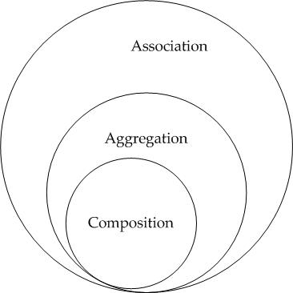

# Classes Abstratas, Composição e Conceitos avançados

**Sumário**
- [Classes Abstratas, Composição e Conceitos avançados](#classes-abstratas-composição-e-conceitos-avançados)
- [1. Classes abstratas](#1-classes-abstratas)
- [2. Associacao, Agregacao e Composição](#2-associacao-agregacao-e-composição)
  - [2.1. Associação](#21-associação)
  - [2.2. Agregação](#22-agregação)
  - [2.3. Composicao](#23-composicao)
    - [2.3.1. Composicao X Herança](#231-composicao-x-herança)
  - [2.4. Composicao X Agregacao x Associacao](#24-composicao-x-agregacao-x-associacao)
- [Exercícios para fixação](#exercícios-para-fixação)
  - [Exercicio 1: Classes abstratas](#exercicio-1-classes-abstratas)
  - [Exercicio 2: Associação](#exercicio-2-associação)
  - [Exercicio 3: Agregação](#exercicio-3-agregação)
  - [Exercício 4: Composição](#exercício-4-composição)
    - [Parte A](#parte-a)
    - [Parte B](#parte-b)
    - [Parte C](#parte-c)

# 1. Classes abstratas

Python possui o módulo `abc` para criação de classes abstratas.

```python
# importacao do modulo para uso abaixo
from abc import ABC, abstractmethod

# ABC define que Animal é uma classe abstrata
class Animal(ABC):
    
    # esse metodo é abstrato (significa que as subclasses devem sobrescrever esse metodo)
    @abstractmethod
    def emitir_som(self):
        pass

# classes abstratas nao permitem a criacao de objetos,
# Logo a linha abaixo daria um erro no Python
animal = Animal()
```

Nesse exemplo, `Animal` estabelece um **contrato**, que as subclasses devem implementar.
- Nesse caso, a subclasse é chamada de **classe concreta**, pois implementa o contrato definido pela classe abstrata `Animal`

Exemplo:

```python
class Cachorro(Animal):
    def emitir_som(self):
        return "Au au"


class Gato(Animal):
    def emitir_som(self):
        return "Miau"

cachorro = Cachorro()
gato = Gato()

print(cachorro.emitir_som())
print(gato.emitir_som())
```

Se tentarmos fazer:

```python
# a linha abaixo da erro no Python 
# (Animal é classe abstrata e nao pode ter objetos criados diretamente)
animal = Animal()

class Cavalo(Animal):
    pass

# a linha abaixo da erro no Python 
# (Cavalo nao implementou o metodo emitir_som(), logo Cavalo, assim como Animal, 
# tambem é uma classe abstrata e nao pode ter objetos sendo criados)
cavalo = Cavalo()
```

# 2. Associacao, Agregacao e Composição

## 2.1. Associação

Uma **Associação** representa uma relação entre objetos, em que os objetos relacionados podem existir independentemente.

Exemplo:

```text
Professor ─────> ministra ─────> Disciplina
```

Note que um ``Professor`` ainda existe no sistema, mesmo quando ele nao esta lecionando nenhum ``Disciplina``.
- ``Professor`` existe indepentemente de ``Disciplina``.

Em Python:

```python
class Professor:
    def __init__(self, nome):
        self.nome = nome

class Disciplina:
    def __init__(self, nome, professor):
        self.nome = nome
        self.professor = professor
```

Podemos estabelecer a relação da seguinte forma:

```python
professor_carlos = Professor("Carlos")
disciplina = Disciplina("Banco de Dados", professor_carlos)
```

Note que `professor_carlos` é um objeto criado fora do construtor de ``Disciplina``, e existe de forma independente dela. 
- Se o objeto `disciplina` deixar de existir, ``professor_carlos`` continua existindo.

## 2.2. Agregação

Agregação é uma tipo de Associacao em que **TEMOS VARIOS** objetos independentes relacionados.

Exemplo:

```text
Departamento
 ├── Professor
 ├── Professor
 └── Professor
```

Um professor pode continuar existindo mesmo que o departamento seja removido.

Em código:

```python
class Professor:
    def __init__(self, nome):
        self.nome = nome


class Departamento:
    def __init__(self):
        self.professores = []

    def adicionar_professor(self, professor):
        self.professores.append(professor)
```

## 2.3. Composicao

**Composição** é uma Agregacao na qual os objetos se relacionam de forma dependente.
- Isto é, um objeto esta contido dentro de outro, e ele so existe em virtude do outro objeto

Em outras palavras, **Composicao** significa construir objetos utilizando outros objetos dentro deles, *como se fossem atributos*. Isto é:
- Composicao define uma relacao **"TEM UM"**

Exemplo: Suponha que temos a seguinte estrutura de classes abaixo.

```text
Carro tem:
 ├── Motor
 └── Rodas
```

Em Python:

```python
class RodasPirelli:
    def freiar(self):
        print("Freiando")

class MotorV8:
    def ligar(self):
        print("Motor V8 ligado")

class Carro:
    def __init__(self):
        # o objeto carro tem um atributo motor 
        # (que é um objeto da classe Motor)
        self.motor = MotorV8()
        self.rodas = RodasPirelli()

    def ligar(self):
        self.motor.ligar()

    def freiar(self):
        self.rodas.freiar()
```

Uso:

```python
carro = Carro()
carro.ligar()
carro.freiar()
```

Resultado:

```text
Motor ligado
Freiando
```

Observe que poderiamos inclusive trocar o tipo de motor ou rodas, sem precisar mudar muita coisa no codigo:

```python
class MotorV3:
    def ligar(self):
        print("Motor 3 cilindros ligado")

class Carro:
    def __init__(self):
        # troquei a implementacao do motor de V8 pra V3
        self.motor = MotorV3()
        self.rodas = RodasPirelli()

    def ligar(self):
        # note que tanto V8 quanto V3 implementam o metodo ligar(), 
        # logo estamos usando aqui polimorfismo (pois self.motor pode ser
        # um motorV3 ou motorV8)
        self.motor.ligar()

    def freiar(self):
        self.rodas.freiar()
```

### 2.3.1. Composicao X Herança

Veja que é **Composicao** diferente de **Herança**, pois:
- **Composicao** é uma relacao **"TEM UM"**
- **Herança** pressupoe a relacao **"É UM TIPO DE"**

Exemplo:

```text
Veiculo pode ser:
 ├── Carro
 └── Moto
```

Escrito de outra forma, temos que: 
- **Carro é um Veiculo**
- **Moto é um Veiculo**

Para imitar o cenario de composicao que tinhamos antes, precisariamos fazer:

```python
class Veiculo:
    def freiar(self):
        print("Nao faz nada, este metodo precisa ser sobrescrito")

    def ligar(self):
        print("Nao faz nada, este metodo precisa ser sobrescrito")

class Moto(Veiculo):
    def __init__(self):
        super().__init__()

class Carro(Veiculo):
    def __init__(self):
        super().__init__()
```

Uso:

```python
carro = Carro()
carro.ligar()
carro.freiar()
```

Resultado:

```text
Nao faz nada, este metodo precisa ser sobrescrito
Nao faz nada, este metodo precisa ser sobrescrito
```

Note que para cada tipo de veiculo (``Carro``, ``Moto``, etc) precisariamos implementar um metodo ``ligar()`` e ``freiar()``.
- Se tivessemos usado Composicao, nao precisariamos implementar esses metodos pra cada tipo de veiculo.
- Poderiamos ter criado implementacoes de Motor, Rodas, etc para cada tipo de veiculo (com metodos `ligar()` e `freiar()` proprios).
- Em geral, **composicao permite reutilizar código mais facilmente do que herança**

**IMPORTANTE**: Herança tambem gera hierarquias de classes que podem ser complexas, o que dificulta alteracoes de código nas classes pai (superclasses).
- Imagine que tivessemos a seguinte herança:
- `Veiculo` -> `VeiculoTerrestre` -> `Carro`
- Se eu precisasse alterar um pedaco de codigo em `Veiculo`, essa alteracao poderia afetar todas as classes que herdam dele (`VeiculoTerrestre`, `Carro`, etc), o que poderia gerar serios problemas.
- Por isso, via de regra, é mais facil construir um sistema grande usando **Composicao** do que usando **Heranças**

## 2.4. Composicao X Agregacao x Associacao

**Composicao** requer que um objeto so existe se o outro existir (um objeto controla o ciclo de vida do outro).

Exemplo:

```python
class MotorV3:
    def ligar(self):
        print("Motor 3 cilindros ligado")

class Carro:
    def __init__(self):
        # troquei a implementacao do motor de V8 pra V3
        self.motor = MotorV3()

carro = Carro()
```

Se o objeto ``carro`` deixar de existir, `self.motor` dentro dele tambem deixa de existir.

Ja na Agregacao e Associacao a diferença esta na quantidade de objetos relacionados:
- Agregacao envolve MULTIPLOS OBJETOS relacionados
- Associacao envolve UM OBJETO relacionado



# Exercícios para fixação

## Exercicio 1: Classes abstratas

Crie uma classe abstrata ``FormaGeometrica`` com um método abstrato ``calcular_area()``. 
- Implemente duas classes concretas, ``Retangulo`` e ``Circulo``, sobrescrevendo esse método.

Tente instanciar ``FormaGeometrica`` diretamente e descreva o que aconteceu.

Crie uma terceira classe, ``Triangulo``, que herda de ``FormaGeometrica`` mas não implementa ``calcular_area()``. 
- Tente instanciar `Triangulo` e explique o que ocorreu.

## Exercicio 2: Associação

Baseado no exemplo ``Professor`` / ``Disciplina``, crie as classes ``Medico`` e ``Consulta``, em que uma ``Consulta`` recebe um ``Medico`` já existente em seu construtor. 

Mostre, com código, que o objeto ``Medico`` pode ser criado antes da consulta e continua existindo normalmente mesmo se o objeto ``Consulta`` deixar de existir.
- Para isso, atribua `None` ao objeto ``consulta`` e mostre que ainda é possivel acessar dados do objeto `medico`.

## Exercicio 3: Agregação

Baseado no exemplo ``Departamento``/``Professor``, crie uma classe ``Biblioteca`` com uma lista interna de objetos ``Livro`` e um método ``adicionar_livro()``. 

Explique, em texto, por que essa relação é uma ``Agregação`` e não uma ``Composição``.

Explique tambem o que aconteceria com os objetos ``Livro`` se o objeto ``Biblioteca`` fosse removido do programa?

## Exercício 4: Composição

### Parte A
Implemente uma classe ``Computador`` composta por dois objetos:
- ``Processador``, com um método ``processar()``;
- ``MemoriaRAM``, com um método ``armazenar()``.

``Computador`` deve ter:

```text
ligar()        -> chama processar() do processador
salvar_dados() -> chama armazenar() da memória
```

### Parte B

Agora, crie duas implementações diferentes de ``Processador``: 
- ``ProcessadorIntel`` 
- ``ProcessadorAMD``
- Cada uma com seu próprio ``processar()`` imprimindo uma mensagem distinta. 

Mostre que basta trocar qual classe é instanciada dentro de ``Computador.__init__()`` para mudar o comportamento de ``ligar()``, sem alterar o método em si.

Em seguida, responda ao que se pede abaixo:
1. Se um objeto ``computador`` deixar de existir, o que acontece com os objetos ``processador`` e ``memoria`` guardados dentro dele? Estude o conceito de "ciclo de vida" de Associação, Agregação e Composição para justificar sua resposta.

### Parte C
Refaça o exercicio, agora usando herança ao inves de composicao: 
- Crie uma superclasse ``Dispositivo`` com métodos ``processar()`` e ``armazenar()`` que não fazem nada de fato (no estilo do exemplo ``Veiculo``), e duas subclasses específicas. 
- Depois responda: 
  - Qual abordagem (composição ou herança) permitiu trocar a implementação do processador alterando menos código? Por quê?
