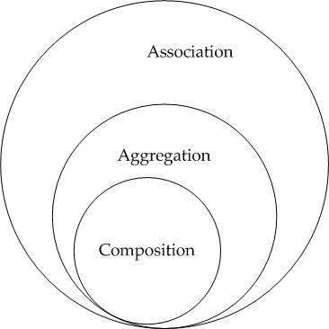

# Modulo 3 - Classes Abstratas, Composição e Conceitos avançados

**Sumário**
- [Modulo 3 - Classes Abstratas, Composição e Conceitos avançados](#modulo-3---classes-abstratas-composição-e-conceitos-avançados)
- [1. Classes abstratas](#1-classes-abstratas)
- [2. Associacao, Agregacao e Composição](#2-associacao-agregacao-e-composição)
  - [2.1. Associação](#21-associação)
  - [2.2. Agregação](#22-agregação)
  - [2.3. Composicao](#23-composicao)
    - [2.3.1. Composicao X Herança](#231-composicao-x-herança)
  - [2.4. Composicao X Agregacao x Associacao](#24-composicao-x-agregacao-x-associacao)
- [Exercícios para fixação](#exercícios-para-fixação)
  - [Exercicio 1](#exercicio-1)
  - [Exercicio 2](#exercicio-2)
  - [Exercicio 3](#exercicio-3)
  - [Exercício 4](#exercício-4)
    - [Exercício 4-A](#exercício-4-a)
    - [Exercício 4-B](#exercício-4-b)
    - [Exercício 4-C](#exercício-4-c)
  - [Exercicio 5](#exercicio-5)
  - [Exercicio 6](#exercicio-6)
  - [Exercicio 7](#exercicio-7)
  - [Exercicio 8](#exercicio-8)
    - [Exercicio 8-A](#exercicio-8-a)
    - [Exercicio 8-B](#exercicio-8-b)
    - [Exercicio 8-C](#exercicio-8-c)
- [Estudos de caso para fixacao](#estudos-de-caso-para-fixacao)
  - [Estudo de caso 1](#estudo-de-caso-1)
  - [Estudo de caso 2](#estudo-de-caso-2)
  - [Estudo de caso 3](#estudo-de-caso-3)
- [Solucao dos Exercicios](#solucao-dos-exercicios)

# 1. Classes abstratas

Python possui o módulo `abc` para criação de classes abstratas.

```python
# importacao do modulo para uso abaixo
from abc import ABC, abstractmethod

# ABC define que Animal é uma classe abstrata
class Animal(ABC):
    
    # esse metodo é abstrato (significa que as subclasses devem sobrescrever esse metodo)
    @abstractmethod
    def emitir_som(self):
        pass

# classes abstratas nao permitem a criacao de objetos,
# Logo a linha abaixo daria um erro no Python
animal = Animal()
```

Nesse exemplo, `Animal` estabelece um **contrato**, que as subclasses devem implementar.
- Nesse caso, a subclasse é chamada de **classe concreta**, pois implementa o contrato definido pela classe abstrata `Animal`

Exemplo:

```python
class Cachorro(Animal):
    def emitir_som(self):
        return "Au au"


class Gato(Animal):
    def emitir_som(self):
        return "Miau"

cachorro = Cachorro()
gato = Gato()

print(cachorro.emitir_som())
print(gato.emitir_som())
```

Se tentarmos fazer:

```python
# a linha abaixo da erro no Python 
# (Animal é classe abstrata e nao pode ter objetos criados diretamente)
animal = Animal()

class Cavalo(Animal):
    pass

# a linha abaixo da erro no Python 
# (Cavalo nao implementou o metodo emitir_som(), logo Cavalo, assim como Animal, 
# tambem é uma classe abstrata e nao pode ter objetos sendo criados)
cavalo = Cavalo()
```

**Exercicios para fixação**:
- [Exercicio 1](#exercicio-1)
- [Exercicio 5](#exercicio-5)
- [Estudo de caso 1](#estudo-de-caso-1)

# 2. Associacao, Agregacao e Composição

## 2.1. Associação

Uma **Associação** representa uma relação entre objetos, em que os objetos relacionados podem existir independentemente.

Exemplo:

```text
            ministra
Professor ------------> Disciplina
```

Note que um ``Professor`` ainda existe no sistema, mesmo quando ele nao esta lecionando nenhum ``Disciplina``.
- ``Professor`` existe indepentemente de ``Disciplina``.

Em Python:

```python
class Professor:
    def __init__(self, nome):
        self.nome = nome

class Disciplina:
    def __init__(self, nome, professor):
        self.nome = nome
        self.professor = professor
```

Podemos estabelecer a relação da seguinte forma:

```python
professor_carlos = Professor("Carlos")
disciplina = Disciplina("Banco de Dados", professor_carlos)
```

Note que `professor_carlos` é um objeto criado fora do construtor de ``Disciplina``, e existe de forma independente dela. 
- Se o objeto `disciplina` deixar de existir, ``professor_carlos`` continua existindo.

**Exercicios para fixação**:
- [Exercicio 2](#exercicio-2)
- [Estudo de caso 2](#estudo-de-caso-2)

## 2.2. Agregação

Agregação é uma tipo de Associacao em que **TEMOS VARIOS** objetos independentes relacionados.

Exemplo:

```text
Departamento
 ├── Professor
 ├── Professor
 └── Professor
```

Um professor pode continuar existindo mesmo que o departamento seja removido.

Em código:

```python
class Professor:
    def __init__(self, nome):
        self.nome = nome


class Departamento:
    def __init__(self):
        self.professores = []

    def adicionar_professor(self, professor):
        self.professores.append(professor)
```

**Exercicios para fixação**:
- [Exercicio 3](#exercicio-3)

## 2.3. Composicao

**Composição** é uma Agregacao na qual os objetos se relacionam de forma dependente.
- Isto é, um objeto esta contido dentro de outro, e ele so existe em virtude do outro objeto

Em outras palavras, **Composicao** significa construir objetos utilizando outros objetos dentro deles, *como se fossem atributos*. Isto é:
- Composicao define uma relacao **"TEM UM"**

Exemplo: Suponha que temos a seguinte estrutura de classes abaixo.

```text
Carro tem:
 ├── Motor
 └── Rodas
```

Em Python:

```python
class RodasPirelli:
    def freiar(self):
        print("Freiando")

class MotorV8:
    def ligar(self):
        print("Motor V8 ligado")

class Carro:
    def __init__(self):
        # o objeto carro tem um atributo motor 
        # (que é um objeto da classe Motor)
        self.motor = MotorV8()
        self.rodas = RodasPirelli()

    def ligar(self):
        self.motor.ligar()

    def freiar(self):
        self.rodas.freiar()
```

Uso:

```python
carro = Carro()
carro.ligar()
carro.freiar()
```

Resultado:

```text
Motor ligado
Freiando
```

Observe que poderiamos inclusive trocar o tipo de motor ou rodas, sem precisar mudar muita coisa no codigo:

```python
class MotorV3:
    def ligar(self):
        print("Motor 3 cilindros ligado")

class Carro:
    def __init__(self):
        # troquei a implementacao do motor de V8 pra V3
        self.motor = MotorV3()
        self.rodas = RodasPirelli()

    def ligar(self):
        # note que tanto V8 quanto V3 implementam o metodo ligar(), 
        # logo estamos usando aqui polimorfismo (pois self.motor pode ser
        # um motorV3 ou motorV8)
        self.motor.ligar()

    def freiar(self):
        self.rodas.freiar()
```

**Exercicios para fixação**:
- [Exercicio 4 - Parte A](#exercício-4-a)
- [Exercicio 4 - Parte B](#exercício-4-b)
- [Estudo de caso 3](#estudo-de-caso-3)

### 2.3.1. Composicao X Herança

Veja que é **Composicao** diferente de **Herança**, pois:
- **Composicao** é uma relacao **"TEM UM"**
- **Herança** pressupoe a relacao **"É UM TIPO DE"**

Exemplo:

```text
Veiculo pode ser:
 ├── Carro
 └── Moto
```

Escrito de outra forma, temos que: 
- **Carro é um Veiculo**
- **Moto é um Veiculo**

Para imitar o cenario de composicao que tinhamos antes, precisariamos fazer:

```python
from abc import ABC, abstractmethod
class Veiculo(ABC):
    @abstractmethod
    def freiar(self):
        pass

    @abstractmethod
    def ligar(self):
        pass

class Moto(Veiculo):
    def ligar(self):
        print("Moto ligada")
    
    def freiar(self):
        print("Moto freiando")


class Carro(Veiculo):
    def ligar(self):
        print("Carro ligado")
    
    def freiar(self):
        print("Carro freiando")
```

Uso:

```python
carro = Carro()
carro.ligar()
carro.freiar()

moto = Moto()
moto.ligar()
moto.freiar()
```

Resultado:

```text
Carro ligado
Carro freiando
```

Note que para cada tipo de veiculo (``Carro``, ``Moto``, etc) precisariamos implementar um metodo ``ligar()`` e ``freiar()``.
- Se tivessemos usado Composicao, nao precisariamos implementar esses metodos pra cada tipo de veiculo.
- Poderiamos ter criado implementacoes de ``Motor``, ``Rodas``, etc para cada tipo de veiculo (com metodos `ligar()` e `freiar()` proprios).
- Em geral, **composicao permite reutilizar código mais facilmente do que herança**.

Exemplo:
```python
class MotorV8:
    def ligar(self):
        print("Motor V8 ligado")

class MotorV3:
    def ligar(self):
        print("Motor 3 cilindros ligado")

class RodasPirelli:
    def freiar(self):
        print("Freiando")

class RodasMichelin:
    def freiar(self):
        print("Freiando com rodas Michelin")

class Veiculo:
    def __init__(self, motor, rodas):
        self.motor = motor
        self.rodas = rodas

    def ligar(self):
        # ligar repassa a chamada para o objeto motor, seja ele V8 ou V3 ou outro qualquer
        self.motor.ligar()

    def freiar(self):
        # freiar repassa a chamada para o objeto rodas, seja ele Pirelli ou Michelin ou outro qualquer
        self.rodas.freiar()
```

**IMPORTANTE**: Herança tambem gera hierarquias de classes que podem ser complexas, o que dificulta alteracoes de código nas classes pai (superclasses).
- Imagine que tivessemos a seguinte herança:
- `Veiculo` -> `VeiculoTerrestre` -> `Carro`
- Se eu precisasse alterar um pedaco de codigo em `Veiculo`, essa alteracao poderia afetar todas as classes que herdam dele (`VeiculoTerrestre`, `Carro`, etc), o que poderia gerar serios problemas.
- Por isso, via de regra, é mais facil construir um sistema grande usando **Composicao** do que usando **Heranças**

**Exercicios de Fixacao**:
- [Exercicio 4 - Parte C](#exercício-4-c)

## 2.4. Composicao X Agregacao x Associacao

**Composicao** requer que um objeto so existe se o outro existir (um objeto controla o ciclo de vida do outro).

Exemplo:

```python
class MotorV3:
    def ligar(self):
        print("Motor 3 cilindros ligado")

class Carro:
    def __init__(self):
        # troquei a implementacao do motor de V8 pra V3
        self.motor = MotorV3()

carro = Carro()
```

Se o objeto ``carro`` deixar de existir, `self.motor` dentro dele tambem deixa de existir.

Ja na **Agregacao** e **Associacao** a diferença esta na **quantidade de objetos relacionados**:
- **Agregacao** envolve MULTIPLOS OBJETOS relacionados
- **Associacao** envolve UM OBJETO relacionado



**Exercicios de fixacao**:
- [Exercicio 6](#exercicio-6)
- [Exercicio 7](#exercicio-7)
- [Exercicio 8](#exercicio-8)

# Exercícios para fixação

## Exercicio 1

Crie uma classe abstrata ``FormaGeometrica`` com um método abstrato ``calcular_area()``. 

Implemente duas classes concretas, ``Retangulo`` e ``Circulo``, sobrescrevendo o método abstrato ``calcular_area()``:
- `Retangulo` deve receber `base` e `altura` no construtor, e calcular a área como `base * altura`.
- `Circulo` deve receber `raio` no construtor, e calcular a área como `3.14159 * raio ** 2`.

Tente instanciar ``FormaGeometrica`` diretamente e descreva o que aconteceu.

Crie uma terceira classe, ``Triangulo``, que herda de ``FormaGeometrica`` mas não implementa ``calcular_area()``. 
- Tente instanciar `Triangulo` e explique o que ocorreu.

## Exercicio 2

Baseado no exemplo ``Professor`` / ``Disciplina``, crie as classes:
- ``Medico``
- ``Consulta``
  
Considere que ``Consulta`` recebe um ``Medico`` já existente em seu construtor. 

Mostre, com código, que o objeto ``Medico`` pode ser criado antes da consulta e continua existindo normalmente mesmo se o objeto ``Consulta`` deixar de existir.
- Para isso, atribua `None` ao objeto ``consulta`` e mostre que ainda é possivel acessar dados do objeto `medico`.

## Exercicio 3

Baseado no exemplo ``Departamento``/``Professor``, crie:
- classe ``Biblioteca`` com uma lista interna de objetos ``Livro`` e um método ``adicionar_livro()``. 

Explique, em texto, por que essa relação é uma ``Agregação``.

Explique tambem o que aconteceria com os objetos ``Livro`` se o objeto ``Biblioteca`` fosse removido do programa?

## Exercício 4

### Exercício 4-A
Implemente uma classe ``Computador`` composta por dois objetos:
- ``Processador``, com um método ``processar()``;
- ``MemoriaRAM``, com os métodos ``armazenar()`` e `ler()`.

``Computador`` deve ter:
- ``ligar()`` -> chama ler() e processar() dos objetos memória e processador
- ``salvar_dados()`` -> chama armazenar() da memória

### Exercício 4-B

Agora, crie duas implementações diferentes de ``Processador``, cada uma com seu próprio ``processar()`` (imprimindo uma mensagem distinta): 
- ``ProcessadorIntel`` 
- ``ProcessadorAMD``

Mostre que basta trocar qual classe é instanciada dentro de ``Computador.__init__()`` para mudar o comportamento de ``ligar()``, sem precisar alterar o método `ligar()`.

Em seguida, responda ao que se pede abaixo:
1. Se um objeto ``computador`` deixar de existir, o que acontece com os objetos ``processador`` e ``memoria`` guardados dentro dele? Estude o conceito de "ciclo de vida" de Associação, Agregação e Composição para justificar sua resposta.

### Exercício 4-C
Refaça o exercicio anterior, agora usando **herança** ao inves de **composicao**:
- Crie uma superclasse abstrata ``Computador`` com os métodos abstratos: 
  - ``processar()``
  - ``armazenar()`` 
- Em seguida, crie duas subclasses para ``Computador`` (``ComputadorIntel`` e ``ComputadorAMD``).

Depois responda: 
1. Qual abordagem (composição ou herança) permitiu trocar a implementação do processador alterando menos código? Por quê?

## Exercicio 5

Seja o codigo abaixo:
```python
from abc import ABC, abstractmethod

class Instrumento(ABC):
    @abstractmethod
    def tocar(self):
        pass

class Violao(Instrumento):
    def tocar(self):
        return "Dedilhando as cordas"

class Flauta(Instrumento):
    pass
```

Identifique quais assertivas abaixo sao Verdadeiras (V) e quais sao falsas (F). Explique e justifique suas respostas.

**I.** É possível criar um objeto ``Instrumento()`` diretamente, pois a classe não possui atributos. 

**II.** ``Violao`` é uma classe concreta, pois implementa o método abstrato ``tocar()``. 

**III.** Como ``Flauta`` não implementa ``tocar()``, porem podemos criar um objeto usando ``Flauta()``. 

**IV.** Um método abstrato define um "contrato" que as subclasses concretas são obrigadas a implementar.

## Exercicio 6

Seja o codigo abaixo:

```python
class Motorista:
    def __init__(self, nome):
        self.nome = nome

class Corrida:
    def __init__(self, motorista, destino):
        self.motorista = motorista
        self.destino = destino

motorista1 = Motorista("Renato")
corrida1 = Corrida(motorista1, "Aeroporto")
corrida1 = None
print(motorista1.nome)
```

Identifique quais assertivas abaixo sao Verdadeiras (V) e quais sao falsas (F). Explique e justifique suas respostas.

**I.** ``motorista1`` é criado dentro do construtor de ``Corrida``, e por isso deixaria de existir quando ``corrida1`` for destruída. 

**II.** O relacionamento entre ``Corrida`` e ``Motorista`` é uma associação, pois ``Motorista`` existe independentemente de ``Corrida``. 

**III.** Após ``corrida1`` = None, o objeto ``motorista1`` continua existindo e print(``motorista1.nome``) funciona normalmente. 

**IV.** Esse é um exemplo de composição, pois ``Corrida`` "tem um" ``Motorista``.

## Exercicio 7

A tabela abaixo contem termos e definicoes de conceitos de programação orientada a objetos, porem os termos estao relacionados com definicoes incorretas.

Reorganizea a tabela abaixo, associando cada termo da coluna A com sua definição correta, na coluna B.

| Termo                   | Definição                                                                                                                                 |
| ----------------------- | ----------------------------------------------------------------------------------------------------------------------------------------- |
| 1. Classe abstrata      | a) Relação em que um objeto existe dentro de outro e depende dele para existir.                                                           |
| 2. Método abstrato      | b) Decorador do módulo ``abc`` usado para marcar um método que nao tme implementacao, e deve ser obrigatoriamente sobrescrito.            |
| 3. Classe concreta      | c) Relação típica da herança, em que uma subclasse é um tipo mais específico da superclasse.                                              |
| 4. Associação           | d) Classe que implementa todos os métodos abstratos herdados, podendo ter objetos instanciados.                                           |
| 5. Agregação            | e) Relação entre objetos que existem de forma independente um do outro.                                                                   |
| 6. Composição           | f) Classe que não pode ser instanciada diretamente, geralmente por conter métodos abstratos.                                              |
| 7. Relação "é um"       | g) Relação típica da composição, em que um objeto guarda outro como parte de si mesmo.                                                    |
| 8. Relação "tem um"     | h) Conceito relacionado a quando um objeto é criado e quando deixa de existir, usado para diferenciar composição de agregação/associação. |
| 9. Ciclo de vida        | i) Método sem implementação, definido em uma classe abstrata, que atua como um "contrato" a ser cumprido pelas subclasses.                |
| 10. ``@abstractmethod`` | j) Tipo de associação envolvendo vários objetos relacionados, que continuam existindo mesmo se o "todo" deixar de existir.                |

## Exercicio 8

Para cada trecho abaixo, escreva exatamente o que aparece na tela (ou o comportamento/erro esperado), na ordem correta.

### Exercicio 8-A
```python
from abc import ABC, abstractmethod

class Sensor(ABC):
    @abstractmethod
    def detectar(self):
        pass

class SensorInfravermelho(Sensor):
    def detectar(self):
        return "Detectando calor"

sensor = SensorInfravermelho()
print(sensor.detectar())

sensor_generico = Sensor()
```

### Exercicio 8-B
```python
class AltoFalanteBluetooth:
    def emitir_som(self):
        print("Som via bluetooth")

class AltoFalanteCabo:
    def emitir_som(self):
        print("Som via cabo")

class CaixaDeSom:
    def __init__(self, alto_falante):
        self.alto_falante = alto_falante

    def tocar_musica(self):
        self.alto_falante.emitir_som()

caixa1 = CaixaDeSom(AltoFalanteBluetooth())
caixa2 = CaixaDeSom(AltoFalanteCabo())

caixa1.tocar_musica()
caixa2.tocar_musica()
```

### Exercicio 8-C
```python
class Jogador:
    def __init__(self, nome):
        self.__nome = nome

    def to_string(self):
        return self.__nome

class Time:
    def __init__(self, nome):
        self.__nome = nome
        self.__jogadores = []

    def adicionar_jogador(self, jogador):
        self.__jogadores.append(jogador)

    def get_nome(self):
        return self.__nome

    def get_jogadores(self):
        return self.__jogadores
        
jogador1 = Jogador("Marcos")
jogador2 = Jogador("Paulo")

time1 = Time("Alfa")
time1.adicionar_jogador(jogador1)
time1.adicionar_jogador(jogador2)

for jogador in time1.jogadores:
    print(jogador.to_string(), "joga no time", time1.get_nome())

time1 = None
print(jogador1.to_string())
```

# Estudos de caso para fixacao

Para cada estudo de caso: 
- (a) identifique o(s) problema(s); 
- (b) refatore o código; 
- (c) justifique a correção, indicando o conceito envolvido.

## Estudo de caso 1

```python
from abc import ABC, abstractmethod

class Instrumento(ABC):
    def tocar(self):
        pass

class Violao(Instrumento):
    pass

class Piano(Instrumento):
    def tocar(self):
        return "Tocando piano"

instrumentos = [Violao(), Piano()]

for instrumento in instrumentos:
    print(instrumento.tocar())
```

## Estudo de caso 2
```python
class Motorista:
    def __init__(self, nome):
        self.nome = nome

class Corrida:
    def __init__(self, nome_motorista, destino):
        self.motorista = Motorista(nome_motorista)
        self.destino = destino

corrida1 = Corrida("Renato", "Aeroporto")
corrida2 = Corrida("Renato", "Rodoviária")

print(corrida1.motorista is corrida2.motorista)
print(corrida1.motorista.nome == corrida2.motorista.nome)
```

**Pergunta adicional**: no mundo real, ``corrida1`` e ``corrida2`` deveriam ser corridas do mesmo motorista "Renato". O código acima representa isso corretamente? 
- Explique o que ``corrida1.motorista is corrida2.motorista`` revela sobre isso.

## Estudo de caso 3
```python
class Drone:
    def __init__(self, tipo_motor):
        self.tipo_motor = tipo_motor

    def decolar(self):
        if self.tipo_motor == "eletrico":
            print("Motor elétrico girando")
        elif self.tipo_motor == "combustao":
            print("Motor a combustão girando")


drone1 = Drone("eletrico")
drone1.decolar()
```

**Pergunta adicional**: o código funciona, mas não usa de fato composição. 
- O que precisaria mudar para que ``Drone`` guardasse um objeto ``Motor`` de verdade (como ``MotorEletrico`` ou ``MotorCombustao``, cada um com seu próprio método ``girar()``), em vez de uma string indicando o tipo? 
- Refatore usando composição + polimorfismo, de forma que ``decolar()`` nunca precise de ``if/elif``.

# Solucao dos Exercicios

A solucao dos exercicios e estudos de caso estao disponiveis no arquivo [`3_solucao_exercicios.md`](./3_solucao_exercicios.md) que acompanha este material.
