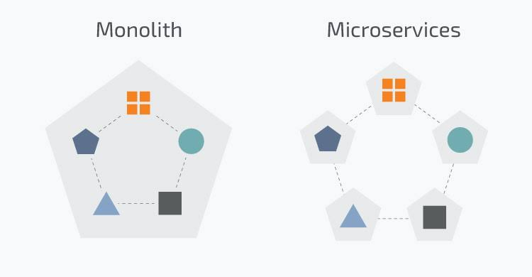
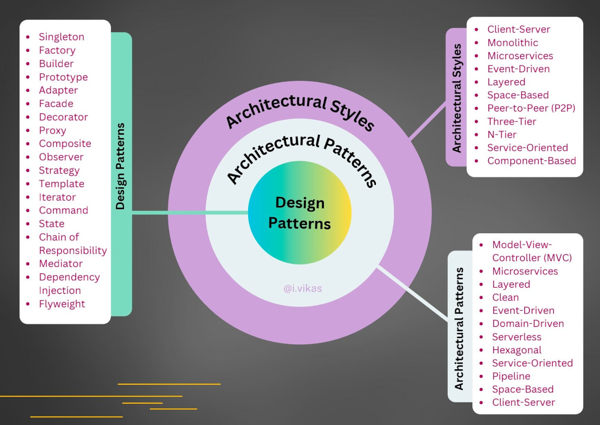

# Estilos de Arquitetura de Software

**Sumário**
- [Estilos de Arquitetura de Software](#estilos-de-arquitetura-de-software)
  - [1. O que é arquitetura de software?](#1-o-que-é-arquitetura-de-software)
  - [2. Estilo de Arquitetura X Padrão Arquitetural X Padrão de projeto](#2-estilo-de-arquitetura-x-padrão-arquitetural-x-padrão-de-projeto)
    - [2.1. Estilo de Arquitetura](#21-estilo-de-arquitetura)
    - [2.2. Padrão arquitetural](#22-padrão-arquitetural)
    - [2.3. Padrão de projeto](#23-padrão-de-projeto)
    - [2.4. Como diferenciar estilo de arquitetura, padrão arquitetural e padrão de projeto?](#24-como-diferenciar-estilo-de-arquitetura-padrão-arquitetural-e-padrão-de-projeto)
  - [3. Por que estilo e arquitetura de software sao importantes?](#3-por-que-estilo-e-arquitetura-de-software-sao-importantes)
  - [4. Conceitos fundamentais](#4-conceitos-fundamentais)
    - [4.1. Componentes](#41-componentes)
    - [4.2. Responsabilidades](#42-responsabilidades)
    - [4.3. Dependências](#43-dependências)
    - [4.4. Interfaces](#44-interfaces)
  - [5. Como escolher um estilo e uma arquitetura](#5-como-escolher-um-estilo-e-uma-arquitetura)
  - [6. Estilo de Arquitetura Monolítica (e Monolítica Modular)](#6-estilo-de-arquitetura-monolítica-e-monolítica-modular)
    - [6.1. Vantagens e Desvantagens](#61-vantagens-e-desvantagens)
  - [7. Estilo de Arquitetura de Microserviços](#7-estilo-de-arquitetura-de-microserviços)
    - [7.1. Vantagens e desvantagens](#71-vantagens-e-desvantagens)
  - [8. Estilo de Arquitetura Microkernel](#8-estilo-de-arquitetura-microkernel)
    - [8.1. Vantagens e desvantagens](#81-vantagens-e-desvantagens)
  - [9. Estilo de Arquitetura Cliente-Servidor](#9-estilo-de-arquitetura-cliente-servidor)
    - [2.1. Vantagens e Desvantagens](#21-vantagens-e-desvantagens)
  - [10. Estilo de Arquitetura Peer-to-Peer (P2P)](#10-estilo-de-arquitetura-peer-to-peer-p2p)
  - [Exercícios de fixacao](#exercícios-de-fixacao)
    - [Exercício 1](#exercício-1)
  - [Exercício 2](#exercício-2)
  - [Exercício 3](#exercício-3)
  - [Exercício 4](#exercício-4)


## 1. O que é arquitetura de software?

Arquitetura de software é a **organização de alto nível de um sistema** de software.

Ela define principalmente:

- quais são os **principais componentes** do sistema;
- quais **responsabilidades** cada componente possui;
- como os componentes se **relacionam**;
- como os componentes se **comunicam**;
- onde ficam determinadas **regras**;
- como **dependências** são organizadas;
- como **fluxo de informacoes** pelo sistema.

Podemos pensar em **arquitetura como a estrutura do sistema**.

Considere um sistema acadêmico:

```text
Sistema Acadêmico
    ├── Interface
    ├── Regras de negócio
    ├── Acesso ao banco
    ├── Autenticação
    └── Relatórios
```

A arquitetura define como essas partes são organizadas.
- Porem, há **estilos** e **padrões de arquitetura** diferentes, cada um com suas vantagens e desvantagens.
- A escolha de um estilo ou padrão de arquitetura depende de varios fatores, como veremos abaixo.

## 2. Estilo de Arquitetura X Padrão Arquitetural X Padrão de projeto

Esses três conceitos são frequentemente confundidos.

### 2.1. Estilo de Arquitetura

Visa responder:
> Quantos processos existem (um processo EXE, vários processos, etc.) e como eles se comunicam pela rede (TCP/IP, HTTP, etc.)?

Exemplo de estilo de Sistema Monolítico, onde o sistema é construido para ser um unico arquivo EXE executável (um unico processo no sistema operacional):

```text
                SISTEMA
┌─────────────────────────────────────┐
│ Usuários                            │
│ Vendas                              │
│ Pagamentos                          │
│ Estoque                             │
│ Relatórios                          │
└─────────────────────────────────────┘
                   ↓
             Banco de Dados
```

Exemplo de estilo de Sistema baseado em Microserviços, onde o sistema é construido para ser dividido em vários arquivos executáveis (EXE):

```text
                  SISTEMA
    Processo 1               Processo 2
┌───────────────┐         ┌───────────────┐
│ Usuários      │         │ Vendas        │
│ Pagamentos    │         │ Estoque       │
└───────────────┘         └───────────────┘
        ↓                        ↓
  Banco de Dados            Banco de Dados
```

- Pense em um sistema de Microserviços como um **conjunto de programas pequenos (EXE), escritos como sistemas monolíticos**, cada um com sua própria arquitetura independente.



### 2.2. Padrão arquitetural

É uma **solução comum**, usada de forma recorrente **para organizar sistemas**.

Exemplos:
- Arquitetura em camadas
- Model-View-Controller (MVC)
- Arquitetura Limpa
- Arquitetura Hexagonal
- Arquitetura Orientada a Eventos

### 2.3. Padrão de projeto

É uma solução recorrente normalmente aplicada EM UMA ESCALA MENOR, **dentro de uma arquitetura**.

Exemplos:
- Strategy
- Factory
- Observer
- Adapter
- Decorator
- Singleton

Uma arquitetura pode utilizar vários padrões de projeto.

Por exemplo:
```text
Clean Architecture
      ├── Repository
      ├── Factory
      ├── Strategy
      └── Adapter
```

### 2.4. Como diferenciar estilo de arquitetura, padrão arquitetural e padrão de projeto?

Podemos pensar da seguinte forma:
- **Estilo de arquitetura**: organiza o sistema em processos e a comunicação entre eles
- **Padrão arquitetural**: quebra o sistema em componentes
- **Padrão de projeto**: organiza cada componente.



## 3. Por que estilo e arquitetura de software sao importantes?

Um programa pequeno pode funcionar sem uma arquitetura claramente definida.

Por exemplo:

```python
print("Cadastrar aluno")
print("Salvar no banco")
print("Enviar email")
```

Entretanto, conforme o sistema cresce, começam a surgir problemas:
- muitas classes
- muitas dependências
- muitos arquivos
- regras duplicadas
- código difícil de testar
- código difícil de modificar

A arquitetura procura organizar essa complexidade.

Uma arquitetura adequada pode contribuir para:
- manutenção;
- reutilização;
- testabilidade;
- escalabilidade;
- segurança;
- substituição de componentes;
- desenvolvimento por equipes;
- evolução do sistema.

## 4. Conceitos fundamentais

### 4.1. Componentes

Um componente é uma parte do sistema que possui uma **responsabilidade bem definida**.

Exemplo:
```text
Sistema
│
├── Autenticacao
├── Usuarios
├── Pagamentos
├── Relatorios
└── Banco de dados
```

Um componente pode ser um (ou uma):
- classe;
- módulo;
- pacote;
- serviço;
- processo;
- servidor;
- microserviço.

A definição depende do nível de abstração utilizado. 
- Nesta disciplina, como iremos trabalhar com Orientacao a Objetos, vamos considerar **componentes como classes**.   

### 4.2. Responsabilidades

Cada componente deve possuir **responsabilidades definidas, separadas entre si**.

Por exemplo:
```python
class UsuarioService:
    def cadastrar(self, usuario):
        ...
```

Nesse exemplo, o objetivo do componente ``UsuarioService`` é lidar com operações relacionadas ao cadastro.

Não seria uma boa ideia colocar nele:
- ``gerar_pdf()``
- ``enviar_email()``
- ``calcular_frete()``
- ``conectar_mysql()``

sem que essas operações façam parte de sua responsabilidade.


### 4.3. Dependências

Uma parte do sistema pode depender de outra.

Exemplo:
```text
UsuarioService
      ↓
Repositorio
      ↓
Banco de dados
```

Quanto mais rígidas forem essas dependências, maior tende a ser o acoplamento.
- Quanto maior o acoplamento, mais difícil será modificar o sistema (isto é, dar manutencao nele).

### 4.4. Interfaces

Uma interface representa um **conjunto de operações esperadas (métodos)**.

Em Python podemos representar isso com **classes abstratas com métodos abstratos** e SEM ATRIBUTOS:

```python
from abc import ABC, abstractmethod

class RepositorioInterface(ABC):
    @abstractmethod
    def salvar(self, usuario):
        pass
```

Outra forma de fazer isso é utilizando **protocolos** (Protocol) do módulo typing, que é a forma mais moderna de se criar Interfaces no Python:

```python
from typing import Protocol

class RepositorioInterface(Protocol):
    def salvar(self, usuario):
        ...
```

Implementações da interface normalmente sao feitas usando **classes concretas**:

```python
class RepositorioMySQL(RepositorioInterface):
    def salvar(self, usuario):
        print("Salvando no MySQL")

class RepositorioMemoria(RepositorioInterface):
    def salvar(self, usuario):
        print("Salvando em memória")
```

Dessa forma, sistema depende da abstração ``RepositorioInterface`` e nao das implementações concretas (``RepositorioMySQL``, ``RepositorioMemoria``, e tantas outras que surgirem depois).

## 5. Como escolher um estilo e uma arquitetura

> Não existe um estilo ou uma arquitetura universalmente melhores.

A escolha depende de multiplos fatores (tamanho do sistema, equipe, complexidade, requisitos, volume de usuários, necessidade de escalabilidade, integrações, segurança, custo, tempo de desenvolvimento, etc).

Um sistema simples pode utilizar **Monólito com Camadas**, enquanto um sistema distribuído de grande escala pode utilizar **Microserviços com Orientacao a Eventos**.

Mais complexidade arquitetural não significa automaticamente melhor arquitetura.
- Aqui o foco é a **arquitetura certa para os requisitos de sistema** descritos no projeto.

## 6. Estilo de Arquitetura Monolítica (e Monolítica Modular)

Em uma aplicação monolítica, as funcionalidades estão dentro da mesma aplicação (mesmo arquivo EXE).
- Isto é, há apenas um processo no sistema operacional, que contém todas as funcionalidades do sistema.

```text
┌────────────────────────────┐
│       Aplicação            │
│                            │
│ usuários                   │
│ vendas                     │
│ pagamentos                 │
│ relatórios                 │
│ autenticação               │
└────────────────────────────┘
             ↓
          Banco
```

Isso não significa necessariamente que o código esteja mal organizado.
- Um monólito pode ser muito bem **modularizado** (em pastas, arquivos e módulos).
- Quando há separacao em modulos, dizemos que este estilo de arquitetura é **monolítico modular**.

Exemplo de sistema monolítico modular:

```text
Aplicação
│
├── usuarios.py
├── vendas.py
├── pagamentos.py
└── relatorios.py
```

### 6.1. Vantagens e Desvantagens

**Vantagens:**
* simplicidade operacional e de desenvolvimento (um único processo, um unico sistema para instalar, configurar e executar);
* implantação relativamente simples;
* fácil execução local;
* menor complexidade distribuída;
* comunicação interna normalmente simples.

**Desvantagens:**
À medida que o sistema cresce (mais código é adicionado), pode surgir:
* alto acoplamento;
* dificuldade para escalar partes específicas.

## 7. Estilo de Arquitetura de Microserviços

Pelo estilo de arquitetura de Microserviços, o sistema é organizado em **serviços independentes**, que se comunicam entre si.
- Cada serviço é um **processo independente**, que pode ser desenvolvido, implantado e escalado separadamente.

Exemplo:

```text
                API Gateway
                    │
      ┌─────────────┼──────────────┐
      ↓             ↓              ↓
 Usuários       Pagamentos      Estoque
(Processo A)        (Processo B)     (Processo C)
      ↓             ↓              ↓
  Banco de Dados  Banco de Dados  Banco de Dados  
```

Cada serviço pode possuir:

* seu próprio código;
* sua própria implantação;
* sua própria escala;
* eventualmente seu próprio banco de dados.

### 7.1. Vantagens e desvantagens

**Vantagens:**
* escalabilidade independente;
* implantação independente;
* equipes podem trabalhar separadamente;
* isolamento entre componentes;
* tecnologias diferentes podem ser utilizadas.

**Desvantagens**:
Microserviços adicionam bastante complexidade de:
- rede
- latência
- monitoramento
- logs distribuídos
- falhas distribuídas
- deploys múltiplos
- consistência de dados
- segurança

Portanto:
> Microserviços não são automaticamente melhores que um monólito.
- Eles na verdade são mais complexos, e só devem ser utilizados quando há necessidade de escalabilidade, equipes grandes, ou requisitos de alta disponibilidade.

## 8. Estilo de Arquitetura Microkernel

A arquitetura Microkernel organiza o sistema em torno de um **núcleo mínimo (*kernel*), contendo apenas as funcionalidades essenciais**.
- As **funcionalidades adicionais** ficam em módulos externos, **fora do kernel**.
- **Exemplo**: O kernel do Linux é um microkernel, e os drivers de dispositivos podem ser instalados como módulos externos (plugins).

Representação simplificada:
```text
             Aplicação
                │
      ┌─────────┼─────────┐
      ↓         ↓         ↓
   Plugin A  Plugin B  Plugin C
      \         |         /
       \        |        /
        ┌──────────────┐
        │  Microkernel │
        └──────────────┘
```

A ideia fundamental é **manter o núcleo pequeno** e **adicionar funcionalidades** por meio de módulos ou plugins.

Exemplo:

Imagine um editor de texto, na qual o núcleo sabe:
- abrir documentos
- fechar documentos
- editar textos
- carregar plugins

Os recursos adicionais ficam em plugins:
- Plugin PDF
- Plugin Markdown
- Plugin Git
- Plugin Corretor

Assim, temos a seguinte estrutura:
```text
Editor
 │
 ├── Core
 │
 ├── PDF Plugin
 │
 ├── Markdown Plugin
 │
 └── Git Plugin
 ```
 
Exemplo de código em Python:

```python
class Microkernel:
    def __init__(self):
        self.plugins = []

    def registrar_plugin(self, plugin):
        self.plugins.append(plugin)

    def executar_plugins(self):
        for plugin in self.plugins:
            plugin.executar()
```

Para criar um plugin, fazemos:
```python
class PluginPDF:
    def executar(self):
        print("Plugin PDF executado")
```

Fazendo outro plugin:
```python
class PluginGit:
    def executar(self):
        print("Plugin Git executado")
```

Agora, para usarmos esses plugins, precisamos apenas registrar e executar:
```python
kernel = Microkernel()

kernel.registrar_plugin(PluginPDF())
kernel.registrar_plugin(PluginGit())

kernel.executar_plugins()
```

Resultado:
```text
Plugin PDF executado
Plugin Git executado
```

O microkernel não precisa conhecer os detalhes de cada plugin.
- Ele precisa apenas que o **plugin forneça a interface** ``executar()``
- Isso é, um sistema de plugins utiliza **polimorfismo**.

### 8.1. Vantagens e desvantagens

**Vantagens:**
- Novas funcionalidades podem ser adicionadas como módulos (modularidade)
- As funcionalidades ficam separadas (facilitando a manutenção do código).
- É possível adicionar recursos sem modificar constantemente a parte central (kernel).
- Diferentes instalações podem possuir diferentes conjuntos de plugins.

**Desvantagens**
- Complexidade de integração (plugins precisam obedecer corretamente às interfaces do núcleo)
- Dependências entre plugins (um plugin pode precisar de outro para funcionar corretamente)
- Alta complexidadde da arquitetura.
- Mudanças no núcleo podem quebrar plugins existentes.

## 9. Estilo de Arquitetura Cliente-Servidor

Nesse modelo existem pelo menos dois programas independentes (um cliente e outro servidor), que se comunicam entre si:
- **Cliente**: solicita alguma operação.
- **Servidor**: processa e responde aos clientes.

```text
          solicita
Cliente -----------> Servidor
        <-----------
          responde
```

Podemos ter vários clientes se comunicando com o mesmo servidor.

Exemplo:

```text
Browser ---> Servidor Web ---> Banco de dados
```

Considere um servidor web que possui uma rota (API) para listar usuários:

```python
@app.get("/usuarios")
def listar_usuarios():
    return [...]
```

O navegador ou outro cliente envia a solicitacao (`GET /usuarios`) ao Servidor, que consulta o banco de dados e retorna os dados:

```text
          GET /usuarios                 consulta
Browser ----------------> Servidor Web ----------> Banco de dados
Browser <---------------- Servidor Web <---------- 
            resposta                      dados
```

### 2.1. Vantagens e Desvantagens

**Vantagens:**
* centralização de dados;
* múltiplos clientes;
* controle central;
* facilidade de atualização do sistema (atualização do servidor é baixada pelos clientes, sob demanda).

**Desvantagens**:
* dependência da rede;
* servidor pode se tornar gargalo (bottleneck -- uma maquina para atender muitos clientes);
* problemas de disponibilidade (servidor indisponível) afetam varios clientes.


## 10. Estilo de Arquitetura Peer-to-Peer (P2P)

Peer-to-Peer (P2P), ou par-a-par, é um modelo arquitetural no qual os participantes do sistema (chamados de **pares** ou **peers**), podem atuar simultaneamente como clientes e servidores.

Em uma arquitetura tradicional Cliente-Servidor:

          Servidor
          /      \
         /        \
     Cliente A   Cliente B

os clientes normalmente solicitam serviços e o servidor os fornece.

Em P2P:

       Peer A
       /    \
      /      \
 Peer B ---- Peer C
    \          /
     \        /
       Peer D

Cada peer pode:
- solicitar serviços;
- fornecer serviços;
- armazenar dados;
- encaminhar informações;
- comunicar-se diretamente com outros peers.

A principal característica é que **não existe necessariamente um servidor central** responsável por todas as operações.

## Exercícios de fixacao

### Exercício 1

Classifique cada afirmação como verdadeira (V) ou falsa (F), corrigindo as falsas:

a) Em um monólito, o sistema é sempre mal organizado, sem separação em módulos.

b) Um sistema monolítico modular já é, por definição, um sistema de microsserviços.

c) Microsserviços são sempre uma escolha superior ao monólito, independentemente do tamanho do projeto.

d) Em uma arquitetura Microkernel, o núcleo deve conhecer os detalhes internos de cada plugin.

e) Na arquitetura Cliente-Servidor, um servidor pode atender múltiplos clientes.

f) Em uma rede Peer-to-Peer, cada participante pode atuar simultaneamente como cliente e servidor.

## Exercício 2

Para cada cenário, identifique qual estilo de arquitetura está sendo descrito (monolítico, monolítico modular, microsserviços, microkernel, cliente-servidor ou peer-to-peer):

a) Um sistema acadêmico é construído como um único executável, mas seu código é organizado em usuarios.py, vendas.py e relatorios.py.

b) Um sistema é dividido em processos independentes — "Usuários", "Pagamentos" e "Estoque" — cada um com seu próprio banco de dados, acessados por um API Gateway.

c) Um navegador faz uma requisição GET /usuarios para uma aplicação web, que consulta o banco de dados e devolve a resposta.

d) Um editor de texto possui um núcleo mínimo capaz de abrir e fechar documentos, e funcionalidades como "corretor ortográfico" e "exportar PDF" são adicionadas por meio de módulos externos.

e) Um aplicativo de compartilhamento de arquivos permite que cada usuário baixe arquivos de outros usuários e, ao mesmo tempo, disponibilize arquivos para que outros baixem, sem depender de um servidor central.

## Exercício 3

Utilizando como base o exemplo de Microkernel apresentado neste guia, implemente uma classe ``PluginMarkdown`` que, ao ser executada, imprima 
> Plugin Markdown executado

Em seguida, registre esse novo plugin junto aos já existentes (``PluginPDF`` e ``PluginGit``) e execute todos. O resultado esperado no terminal deve ser:

```text
Plugin PDF executado
Plugin Git executado
Plugin Markdown executado
```

## Exercício 4

Considere o cenário abaixo:

> Uma pequena startup, com apenas 3 desenvolvedores, precisa lançar um MVP (produto mínimo viável) de um sistema de gestão financeira em 2 meses. Não há previsão de grande volume de usuários no curto prazo.

a) Qual estilo de arquitetura você recomendaria: monolítico, monolítico modular ou microsserviços? Justifique.

b) Que fatores mudariam sua resposta se, em vez de uma startup, fosse uma grande empresa com 8 equipes trabalhando em paralelo e milhões de usuários simultâneos? Justifique.

c) E se o sistema fosse ser disponibilizado como aplicacao extensível por plugins, qual estilo de arquitetura você recomendaria (cliente-servidor, P2P, microkernel, monolítico)? Justifique.