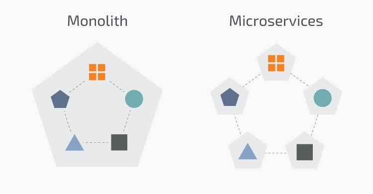

# Modulo 7 - Padrões de Arquitetura de Software

**Sumário**
- [Modulo 7 - Padrões de Arquitetura de Software](#modulo-7---padrões-de-arquitetura-de-software)
  - [1. O que é arquitetura de software?](#1-o-que-é-arquitetura-de-software)
  - [2. Estilo de Arquitetura X Padrão Arquitetural X Padrão de projeto](#2-estilo-de-arquitetura-x-padrão-arquitetural-x-padrão-de-projeto)
    - [2.1. Estilo de Arquitetura](#21-estilo-de-arquitetura)
    - [2.2. Padrão arquitetural](#22-padrão-arquitetural)
    - [2.3. Padrão de projeto](#23-padrão-de-projeto)
    - [2.4. Como diferenciar estilo de arquitetura, padrão arquitetural e padrão de projeto?](#24-como-diferenciar-estilo-de-arquitetura-padrão-arquitetural-e-padrão-de-projeto)
  - [3. Por que estilo e arquitetura de software sao importantes?](#3-por-que-estilo-e-arquitetura-de-software-sao-importantes)
  - [4. Conceitos fundamentais](#4-conceitos-fundamentais)
    - [4.1. Componentes](#41-componentes)
    - [4.2. Responsabilidades](#42-responsabilidades)
    - [4.3. Dependências](#43-dependências)
    - [4.4. Interfaces](#44-interfaces)
  - [5. Padrao de Arquitetura MVC (Model-View-Controller)](#5-padrao-de-arquitetura-mvc-model-view-controller)
    - [5.1. Onde MVC é utilizado?](#51-onde-mvc-é-utilizado)
    - [5.2. Vantagens e desvantagens](#52-vantagens-e-desvantagens)
  - [Estudos de casos](#estudos-de-casos)
    - [Estudo de caso 1](#estudo-de-caso-1)


## 1. O que é arquitetura de software?

Arquitetura de software é a **organização de alto nível de um sistema** de software.

Ela define principalmente:

- quais são os **principais componentes** do sistema;
- quais **responsabilidades** cada componente possui;
- como os componentes se **relacionam**;
- como os componentes se **comunicam**;
- onde ficam determinadas **regras**;
- como **dependências** são organizadas;
- como **fluxo de informacoes** pelo sistema.

Podemos pensar em **arquitetura como a estrutura do sistema**.

Considere um sistema acadêmico:

```text
Sistema Acadêmico
    ├── Interface
    ├── Regras de negócio
    ├── Acesso ao banco
    ├── Autenticação
    └── Relatórios
```

A arquitetura define como essas partes são organizadas.
- Porem, há **estilos** e **padrões de arquitetura** diferentes, cada um com suas vantagens e desvantagens.
- A escolha de um estilo ou padrão de arquitetura depende de varios fatores, como veremos abaixo.

## 2. Estilo de Arquitetura X Padrão Arquitetural X Padrão de projeto

Esses três conceitos são frequentemente confundidos.

### 2.1. Estilo de Arquitetura

Visa responder:
> Quantos processos existem (um processo EXE, vários processos, etc.) e como eles se comunicam pela rede (TCP/IP, HTTP, etc.)?

Exemplo de estilo de Sistema **Monolítico**, onde o sistema é construido para ser **um unico arquivo EXE executável** (um unico processo no sistema operacional):

```text
                SISTEMA
┌─────────────────────────────────────┐
│ Usuários                            │
│ Vendas                              │
│ Pagamentos                          │
│ Estoque                             │
│ Relatórios                          │
└─────────────────────────────────────┘
                   ↓
             Banco de Dados
```

Exemplo de estilo de Sistema baseado em **Microserviços**, onde o sistema é construido para ser **dividido em vários arquivos executáveis (EXE)**:

```text
                  SISTEMA
    Processo 1               Processo 2
┌───────────────┐         ┌───────────────┐
│ Usuários      │         │ Vendas        │
│ Pagamentos    │         │ Estoque       │
└───────────────┘         └───────────────┘
        ↓                        ↓
  Banco de Dados            Banco de Dados
```

- Pense em um sistema de Microserviços como um **conjunto de programas pequenos (EXE), escritos como sistemas monolíticos**, cada um com sua própria arquitetura independente.



### 2.2. Padrão arquitetural

É uma **solução comum**, usada de forma recorrente **para organizar sistemas**.

Exemplos:
- Arquitetura em camadas
- Model-View-Controller (MVC)
- Arquitetura Limpa
- Arquitetura Hexagonal
- Arquitetura Orientada a Eventos

### 2.3. Padrão de projeto

É uma solução recorrente normalmente aplicada EM UMA ESCALA MENOR, **dentro de uma arquitetura**.

Exemplos:
- Strategy
- Factory
- Observer
- Adapter
- Decorator
- Singleton

Uma arquitetura pode utilizar vários padrões de projeto.

Por exemplo:
```text
Arquitetura MVC
      ├── Observer
      ├── Strategy
      └── Singleton
```

### 2.4. Como diferenciar estilo de arquitetura, padrão arquitetural e padrão de projeto?

Podemos pensar da seguinte forma:
- **Estilo de arquitetura**: organiza o sistema em processos e a comunicação entre eles
- **Padrão arquitetural**: quebra o sistema em componentes
- **Padrão de projeto**: organiza cada componente.


## 3. Por que estilo e arquitetura de software sao importantes?

Um programa pequeno pode funcionar sem uma arquitetura claramente definida.

Por exemplo:

```python
print("Cadastrar aluno")
print("Salvar no banco")
print("Enviar email")
```

Entretanto, conforme o sistema cresce, começam a surgir problemas:
- muitas classes
- muitas dependências
- muitos arquivos
- regras duplicadas
- código difícil de testar
- código difícil de modificar

A arquitetura procura organizar essa complexidade.

Uma arquitetura adequada pode contribuir para:
- manutenção;
- reutilização;
- testabilidade;
- escalabilidade;
- segurança;
- substituição de componentes;
- desenvolvimento por equipes;
- evolução do sistema.

## 4. Conceitos fundamentais

### 4.1. Componentes

Um componente é uma parte do sistema que possui uma **responsabilidade bem definida**.

Exemplo:
```text
Sistema
   ├── Autenticacao
   ├── Usuarios
   ├── Pagamentos
   ├── Relatorios
   └── Banco de dados
```

Um componente pode ser um (ou uma):
- classe;
- módulo;
- pacote;
- serviço;
- processo;
- servidor;
- microserviço.

A definição depende do nível de abstração desejado. 
- Nesta disciplina, como iremos trabalhar com Orientacao a Objetos, vamos considerar **componentes = classes**.   

### 4.2. Responsabilidades

Cada componente deve possuir **responsabilidades definidas, separadas entre si**.

Por exemplo:
```python
class UsuarioService:
    def cadastrar(self, usuario):
        ...
```

Nesse exemplo, o objetivo do componente ``UsuarioService`` é lidar com operações relacionadas ao cadastro.

Não seria uma boa ideia colocar nele:
- ``gerar_pdf()``
- ``enviar_email()``
- ``calcular_frete()``
- ``conectar_mysql()``

sem que essas operações façam parte de sua responsabilidade.

### 4.3. Dependências

Uma parte do sistema pode depender de outra.

Exemplo:
```text
UsuarioController
      ↓
UsuarioModel
      ↓
Banco de dados
```

Quanto mais rígidas forem essas dependências, maior tende a ser o acoplamento.
- Quanto maior o acoplamento, mais difícil será modificar o sistema (isto é, dar manutencao nele).

### 4.4. Interfaces

Uma interface representa um **conjunto de operações esperadas (métodos)**.

Em Python podemos representar isso com **classes abstratas com métodos abstratos** e SEM ATRIBUTOS:

```python
from abc import ABC, abstractmethod

class RepositorioInterface(ABC):
    @abstractmethod
    def salvar(self, usuario):
        pass
```

Outra forma de fazer isso é utilizando **protocolos** (``Protocol``) do módulo ``typing``, que é a forma mais moderna de se criar Interfaces no Python:

```python
from typing import Protocol

class RepositorioInterface(Protocol):
    def salvar(self, usuario):
        ...
```

Nesta disciplina, iremos utilizar **classes abstratas** para representar interfaces, pois:
1. É a forma mais tradicional e compatível com versões antigas do Python;
2. Tem **validação em tempo de execução (runtime)**, enquanto Protocols nao tem (Protocols so serve pra IDE identificar a interface, coisa que classes abstratas também fazem).

- **Validacao em tempo de execucao (runtime)**: Python testa se uma classe concreta implementa todos os métodos da interface (métodos abstratos), e se caso nao implemente, levanta um erro.
- **Validacao em tempo de desenvolvimento (IDE)**: IDEs como PyCharm, VSCode, etc. conseguem identificar se uma classe concreta implementa todos os métodos da interface (métodos abstratos), e, caso nao implemente, mostra um aviso na IDE. 
  - O aviso na IDE, porém, **nao impede a execução do código pelo Python, nem gera nenhum tipo de erro quando o código é executado**. O codigo vai rodar normalmente, sem gerar erros, mesmo que a classe concreta nao implemente todos os métodos da interface. 
  - Logo, a validacao em tempo de desenvolvimento (IDE) é *"menos confiável"* que a validacao em tempo de execucao (runtime).

Implementações da interface normalmente sao feitas usando **classes concretas**:

```python
class RepositorioMySQL(RepositorioInterface):
    def salvar(self, usuario):
        print("Salvando no MySQL")

class RepositorioMemoria(RepositorioInterface):
    def salvar(self, usuario):
        print("Salvando em memória")
```

Dessa forma, sistema depende da abstração ``RepositorioInterface`` e nao das implementações concretas (``RepositorioMySQL``, ``RepositorioMemoria``, e tantas outras que surgirem depois).

## 5. Padrao de Arquitetura MVC (Model-View-Controller)

MVC é **um dos padrões de arquitetura de software mais comuns**, sendo usadas em aplicacoes Web, Desktop, Mobile e até frameworks.

MVC divide a aplicação em 3 partes:
- **Model**: representa dados e regras relacionadas ao domínio.
  - Acessa o banco de dados, valida dados, aplica regras de negócio.
- **View**: responsável pela apresentação (ex: HTML + CSS).
  - Recebe dados do Model e mostrar para o usuário na tela.
- **Controller**: recebe ações do usuário e coordena a operação (conversa com o Model e a View).
  - Recebe ações do usuário, consulta o Model e envia dados para a View.

```text
Usuário
   ↓ interage
  View
   ↓ aciona
Controller
   ↓ consulta
 Model   
```

Convencao de nomes:
- **Model**: classes que representam dados e regras de negócio, com o sufixo ``Model`` ou ``Modelo`` (em português).
- **View**: classes que fornecem a representação visual da tela para o Usuario, com o sufixo ``View`` ou ``Visao`` (em português).
- **Controller**: classes que recebem ações do usuário e coordenam a operação, com o sufixo ``Controller``, `Ctrl` ou ``Controlador`` (em português).
  
Exemplo:

```python
class UsuarioModel:
    def __init__(self, nome):
        self.nome = nome

class UsuarioView:
    def mostrar_usuario(self, usuario):
        print(usuario.nome)

class UsuarioController:
    def __init__(self):
        self.view = UsuarioView()

    def cadastrar_usuario(self, nome):
        usuario = UsuarioModel(nome)
        self.view.mostrar_usuario(usuario)
```

### 5.1. Onde MVC é utilizado?


Exemplo:

```text
Browser
   ↓
Controller
   ↓
Model
   ↓
View
```

### 5.2. Vantagens e desvantagens

**Vantagens:**
* separação de responsabilidades;
* facilita manutenção;
* separa apresentação das regras;
* útil para aplicações com interface.

**Desvantagens:**
* pode adicionar complexidade ao sistema;

**Estudos de caso para fixação**:
- [Estudo de caso 1](#estudo-de-caso-1)

## Estudos de casos

### Estudo de caso 1 

Seja o sistema de gerenciamento de tarefas abaixo, no qual o usuário pode criar, editar e excluir tarefas:

```python
class TarefaModel:
    # note o ": str" depois do parametro "descricao" do metodo abaixo.
    # Ele indica que o parametro descricao é do tipo texto (isto é, 
    # "string" que no python é representada por "str").
    def __init__(self, descricao: str):
        self.__descricao = descricao
        self.__concluida = False

    # note o "-> str" depois do metodo "get_descricao" abaixo. 
    #   - Ele indica que o metodo retorna uma string (texto).
    # Isso nao muda o funcionamento do metodo, mas serve como uma "dica" 
    # para o programador (e para a IDE, que pode fazer testes no codigo
    # pra ajudar o programador a evitar erros, antes mesmo de rodar o 
    # programa). 
    #   - O mesmo vale pra quando colocamos ": str" depois do parametro 
    # "descricao" do metodo "__init__" acima (é uma dica pra IDE e para 
    # o programador).
    def get_descricao(self) -> str:
        return self.__descricao
        
    # note que temos apenas o get, pois nao faz  sentido ter um set 
    # para descricao, pois a descricao da tarefa nao deve ser alterada
    # depois de criada.

    # Nao faz sentido chamar o metodo abaixo de get_concluida, pois o
    # nome get sugere que ele retorna um valor (string, inteiro, etc), 
    # mas esse metodo nao retorna um valor. 
    # Ele apenas verifica se a tarefa foi concluida (True) ou nao (False).
    def is_concluida(self) -> bool:
        return self.__concluida

    # define a tarefa como concluida (True)
    def set_concluida(self):
        self.__concluida = True


class TarefasModel:
    def __init__(self):
        self._tarefas: list[TarefaModel] = []

    # criamos o metodo pra evitar de repetir o mesmo codigo de 
    # validacao de indice em varios metodos (principio DRY - 
    # Don't Repeat Yourself - Nao Se Repita, em portugues).
    def __validar_indice(self, indice: int):        
        if indice < 0 or indice >= len(self._tarefas):
            # raise ValueError("Índice inválido") é uma forma de 
            # gerar um erro (excecao) no Python. Quando esse erro é 
            # gerado, o programa para de executar e mostra uma mensagem 
            # de erro no terminal.
            raise ValueError("Índice inválido")

    def adicionar_tarefa(self, tarefa: TarefaModel) -> int:
        self._tarefas.append(tarefa)
        # Retorna o índice da tarefa adicionada (pra que o 
        # possamos saber qual é o índice da tarefa adicionada)
        return len(self._tarefas) - 1  

    def concluir_tarefa(self, indice: int):
        # testa indice (se é válido) antes de concluir a tarefa
        self.__validar_indice(indice)
        # se chegamos ate aqui, o indice é válido (ou seja, nao 
        # houve erro/excecao na linha acima)
        self._tarefas[indice].set_concluida()

    def remover_tarefa(self, indice: int):
        # testa indice (se é válido) antes de remover a tarefa
        self.__validar_indice(indice)
        # se chegamos ate aqui, o indice é válido (ou seja, nao
        # houve erro/excecao na linha acima)
        self._tarefas.pop(indice)

    def listar_tarefas(self):
        # retorna uma copia da lista de tarefas, para que o usuario nao
        # consiga alterar a lista de tarefas diretamente (o que poderia
        # quebrar a integridade do sistema - e viola o princípio do 
        # Encapsulamento de POO).
        return self._tarefas.copy()

# Abaixo, temos uma classe que representa a interface do usuário (View) 
# do sistema de gerenciamento de tarefas.
# Ela é responsável por exibir o menu (mostrar dados na tela) e obter 
# as opções do usuário (interagir com o usuário).
#   - Quem usa essa classe é o Controller, que é responsável por coordenar 
# a operação do sistema.
class TarefasView:
    def exibir_menu(self):
        print("\n=== Gerenciador de Tarefas ===")
        print("1. Adicionar tarefa")
        print("2. Concluir tarefa")
        print("3. Remover tarefa")
        print("4. Listar tarefas")
        print("5. Sair")

    def obter_opcao_menu(self) -> str:
        return input("Escolha uma opção do menu acima: ")

    def obter_descricao_tarefa(self) -> str:
        return input("Digite a descrição da tarefa: ")

    def obter_indice_tarefa(self) -> int:
        return int(input("Digite o número da tarefa: "))

    def exibir_tarefas(self, tarefas: list[TarefaModel]):
        if not tarefas:
            raise ValueError("Nenhuma tarefa cadastrada.")
        for i, tarefa in enumerate(tarefas):
            # note que nao precisamos do "else" aqui, pois se
            # a tarefa nao estiver concluida, o status ja é "[ ]" 
            # por padrao.
            status = "[ ]"
            if tarefa.is_concluida():
                status = "[X]"    
            print(f"{i} - {status} {tarefa['descricao']}")

    def exibir_mensagem(self, mensagem):
        print(mensagem)


class TarefaController:
    def __init__(self):
        self.__model = TarefasModel()
        self.__view = TarefasView()

    def executar(self):
        # O loop abaixo é infinito, e só vai parar quando o usuário 
        # escolher a opção de sair (5).
        while True:
            self.__view.exibir_menu()
            opcao = self.__view.obter_opcao_menu()

            if opcao == "1":
                descricao = self.__view.obter_descricao_tarefa()
                tarefa = TarefaModel(descricao)
                self.__model.adicionar_tarefa(tarefa)
                self.__view.exibir_mensagem("Tarefa adicionada!")
            elif opcao == "2":
                indice = self.__view.obter_indice_tarefa()
                self.__model.concluir_tarefa(indice)
                self.__view.exibir_mensagem("Tarefa concluída!")
            elif opcao == "3":
                indice = self.__view.obter_indice_tarefa()
                self.__model.remover_tarefa(indice)
                self.__view.exibir_mensagem("Tarefa removida!")
            elif opcao == "4":
                tarefas = self.__model.listar_tarefas()
                self.__view.exibir_tarefas(tarefas)
            elif opcao == "5":
                self.__view.exibir_mensagem("Encerrando...")
                break
            else:
                self.__view.exibir_mensagem("Opção inválida!")

# Abaixo, temos o código que inicia o sistema de gerenciamento de tarefas.
# O loop abaixo é infinito, pois o sistema deve continuar rodando (mesmo 
# que ocorra uma exceção, no codigo abaixo). Isto é, o sistema roda até que 
# o usuário escolha a opção de sair.
while True:
    #   - Toda excecao deve ser tratada (com try/except) em algum 
    # lugar do programa, caso contrario o programa vai parar 
    # de executar e somente mostrar a mensagem de erro no terminal.
    #   - Tratar uma excecao significa "pegar" a excecao e fazer algo com ela,
    # como por exemplo mostrar uma mensagem de erro melhor, mais 
    # organizada, para o usuario (do que so mostrar "Índice inválido").
    try:
        # executar o sistema de gerenciamento de tarefas
        TarefaController().executar()
    except Exception as e:
        # se acontecer algum erro (excecao) no codigo acima, o programa nao 
        # vai parar de executar.
        #   - Em vez disso, o programa vai mostrar a mensagem de erro usando 
        # o print() abaixo        
        print("Erro no sistema: ", e)
        # depois de mostrar a mensagem de erro, o programa vai continuar rodando,
        # e vai voltar pro inicio do loop while True, que vai executar o
        # sistema de gerenciamento de tarefas novamente.
        #   - Tente remover o loop while True e veja o que acontece quando ocorre um erro (excecao) no sistema de gerenciamento de tarefas. O programa continua rodando?
        #   - Em seguida, tente remover o try/except e veja o que acontece quando ocorre um erro (excecao) no sistema de gerenciamento de tarefas. O programa continua rodando, ou mostra o erro e termina?
```

Analise o código acima e responda as perguntas abaixo:
1. Qual é o padrão de arquitetura utilizado no código acima?
2. Quais são as responsabilidades de cada componente (Model, View e Controller) no código acima?
3. Explique o passo-a-passo do fluxo de execução do sistema de gerenciamento de tarefas, desde o momento em que o usuário inicia o programa até o momento em que ele escolhe sair do sistema.
4. O que acontece quando o usuário tenta concluir ou remover uma tarefa que não existe (ou seja, quando o índice informado é inválido)?
5. O que acontece quando o usuário tenta listar as tarefas, mas não há nenhuma tarefa cadastrada?
6. Observe os atributos e métodos de ``TarefasController``. 
   - Ele guarda uma referência para ``self.__model`` e para ``self.__view``. 
   - Já olhando para os construtores de ``TarefasModel`` e ``TarefasView``, eles guardam alguma referência um para o outro? Explique por que essa ausência de referência direta entre *Model* e *View* é uma característica esperada (e não um esquecimento) no padrão MVC.
7. Onde está a lógica de negócio do sistema? 
   - O método ``concluir_tarefa`` está implementado em ``TarefasModel``, e não em ``TarefasController`` nem em TarefaView. Explique por que faz sentido colocar a lógica de "marcar uma tarefa como concluída" dentro do ``Model``, e não em qualquer uma das outras duas classes.
8. Onde mora a interação com o usuário? 
   - Todos os ``input()`` e ``print()`` do sistema estão concentrados em ``TarefasView``. O que aconteceria com a testabilidade e a manutenção do sistema se, em vez disso, esses comandos estivessem espalhados dentro de ``TarefasController`` ou de ``TarefasModel``? Dê um exemplo concreto de problema que isso causaria.
9. Considere que você precisa adicionar uma nova funcionalidade: ``editar a descrição de uma tarefa existente (opção "6" do menu)``. 
   - Escreva o código necessário em cada uma das 3 classes (``TarefasModel``, ``TarefasView``, ``TarefasController``), criando metodos se necessario. Em seguida, justifique e explique suas escolhas. Não é permitido que ``TarefasView`` acesse a lista ``self._tarefas`` diretamente (violacao de encapsulamento), nem que ``TarefasModel`` contenha qualquer ``print()`` ou ``input()`` (violacao do princípio da responsabilidade única e da arquitetura MVC).