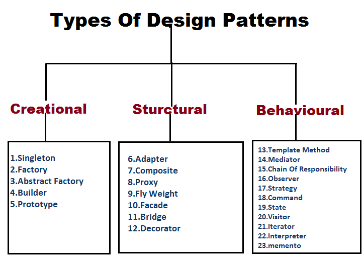

# Padrões de Projeto em POO

**Sumário**
- [Padrões de Projeto em POO](#padrões-de-projeto-em-poo)
  - [1. O que são padrões de projeto?](#1-o-que-são-padrões-de-projeto)
  - [2. Padrões de projeto não são bibliotecas](#2-padrões-de-projeto-não-são-bibliotecas)
  - [3. Padrões arquiteturais versus padrões de projeto](#3-padrões-arquiteturais-versus-padrões-de-projeto)
  - [4. Os padrões GoF (Gang of Four)](#4-os-padrões-gof-gang-of-four)
  - [5. Padrões Criacionais](#5-padrões-criacionais)
    - [5.1. Factory Method](#51-factory-method)
      - [5.1.1. Porque e quando usar Factory Method?](#511-porque-e-quando-usar-factory-method)
    - [5.2. Abstract Factory](#52-abstract-factory)
    - [5.3. Singleton](#53-singleton)
      - [5.3.1. Porque e Quando usar o padrao Singleton?](#531-porque-e-quando-usar-o-padrao-singleton)
  - [6. Padrões Estruturais](#6-padrões-estruturais)
    - [6.3. Facade (ou Fachada)](#63-facade-ou-fachada)
  - [7. Padrões Comportamentais](#7-padrões-comportamentais)
    - [7.1. Template Method](#71-template-method)
    - [7.2. Strategy](#72-strategy)
      - [7.2.1. Quanto usar o padrao Strategy?](#721-quanto-usar-o-padrao-strategy)
    - [7.3. Observer](#73-observer)
    - [7.4. State](#74-state)
  - [8. Como reconhecer padrões no código](#8-como-reconhecer-padrões-no-código)
- [Exercícios para fixação](#exercícios-para-fixação)
  - [Exercício 1](#exercício-1)
    - [A](#a)
    - [B](#b)
    - [C](#c)
    - [D](#d)
- [Exercício 2](#exercício-2)
- [Exercício 3](#exercício-3)
- [Exercício 4](#exercício-4)
- [Exercício 5](#exercício-5)
- [Exercício 6](#exercício-6)
- [Exercício 7](#exercício-7)
- [Exercício 8](#exercício-8)
- [Exercício 9](#exercício-9)


## 1. O que são padrões de projeto?

**Padrões de projeto** (ou **Design Patterns**) são **soluções recorrentes para problemas comuns** de projeto de software.

> Um padrão de projeto não é uma biblioteca pronta.
- Ele representa uma **solução geral e reutilizável** para um problema recorrente de projeto.

Considere um problema:
> Precisamos permitir diferentes formas de desconto.


Uma solução seria usar varios `if`:

```python
def calcular_desconto(tipo, valor):
    if tipo == "normal":
        return valor * 0.05
    elif tipo == "vip":
        return valor * 0.10
    elif tipo == "funcionario":
        return valor * 0.20
```

Conforme o sistema cresce, novos casos precisam ser adicionados, o que torna o código difícil de manter.

Uma alternativa seria utilizar objetos que representam diferentes estratégias:

```python
from abc import ABC, abstractmethod
class DescontoInterface(ABC):
    @abstractmethod
    def calcular(self, valor):
        raise NotImplementedError

class DescontoNormal(Desconto):
    def calcular(self, valor):
        return valor * 0.05

class DescontoVIP(Desconto):
    def calcular(self, valor):
        return valor * 0.10
```

Essa ideia é a base do padrão **Strategy**.

O padrão **não fornece código pronto**.
- Ele fornece uma FORMA DE PENSAR a solução.

## 2. Padrões de projeto não são bibliotecas

Um erro comum é pensar que:
> "Vou instalar a biblioteca do padrão Strategy."

Isso não faz sentido, pois um padrão como `Strategy` descreve uma **estrutura** de colaboração entre objetos (não um código pronto que possa ser instalado).

O programador implementa essa estrutura na linguagem escolhida.

Em Python:

```python
from abc import ABC, abstractmethod
class EstrategiaInterface(ABC):
    @abstractmethod
    def executar(self):
        raise NotImplementedError
```

Em Java:

```java
interface EstrategiaInterface
```

Em C#:

```csharp
interface EstrategiaInterface
```

O padrão permanece conceitualmente semelhante, apesar das diferenças de implementação de cada linguagem de programação.

## 3. Padrões arquiteturais versus padrões de projeto

Os dois conceitos são diferentes principalmente pela **escala**:
- **Padroes arquiteturais**: Afetam a **organização** do sistema como um todo.
  - **Exemplos**:
    - Camadas x MVC    
    - Monolito x Microserviços
    - Cliente-servidor x P2P
- **Padroes de projeto**: Afetam **partes específicas** do sistema (como classes e objetos), normalmente **dentro de uma arquitetura**.
  - **Exemplos**:
    - Strategy
    - Factory
    - Adapter
    - Observer
    - Decorator

Portanto:
- ***Padrões de projeto normalmente são utilizados dentro de uma arquitetura de software.***


## 4. Os padrões GoF (Gang of Four)

A classificação mais conhecida é a dos **23 padrões de projeto**, proposta por 4 grandes pesquisadores de engenharia de software, que ficaram conhecidos como o **Gang of Four (GoF ou Gangue dos Quatro)**.

Eles são divididos em três grupos de padroes:
- **Criacionais**: 
  - **Objetivo**: controlar a criação de objetos, evitando acoplamento entre classes e subclasses.
- **Estruturais**:
  - **Objetivo**: organizar a estrutura das classes (heranças e associações).
- **Comportamentais**:
  - **Objetivo**: gerenciar o comportamento dos objetos (quem se comunica e colabora com quem).   



Dentre os padroes disponíveis, temos:
- **Padroes Criacionais**:
  - Factory (ou Factory Method)
  - Abstract Factory
  - Builder
  - Prototype
  - Singleton
- **Padroes Estruturais**:
  - Adapter
  - Bridge
  - Composite
  - Decorator
  - Facade
  - Flyweight
  - Proxy
- **Padroes Comportamentais**:
  - Chain of Responsibility
  - Command
  - Interpreter
  - Iterator
  - Mediator
  - Memento
  - Observer
  - State
  - Strategy
  - Template Method
  - Visitor

Devido a grande quantidade de padrões, iremos focar em alguns **padrões mais usados (ou mais importantes) para a prática de programação**, no decorrer desta disciplina:
- Factory Method
- Abstract Factory
- Singleton
- Facade
- Template Method
- Strategy
- Observer
- State

> Os demais padroes de projeto não serão abordados em detalhes, mas podem ser estudados posteriormente.

## 5. Padrões Criacionais

### 5.1. Factory Method

O **Factory Method** encapsula a criação de objetos.

Em vez de escrever:

```python
if tipo == "pdf":
    relatorio = RelatorioPDF()
elif tipo == "html":
    relatorio = RelatorioHTML()
```

podemos utilizar classes e polimorfismo:

```python
from abc import ABC, abstractmethod

class Relatorio(ABC):
    @abstractmethod
    def gerar(self):
        pass

class RelatorioPDF(Relatorio):
    def gerar(self):
        return "Relatório PDF"

class RelatorioHTML(Relatorio):
    def gerar(self):
        return "Relatório HTML"
```

e um método de fábrica (*Factory Method*):

```python
class RelatorioFactory:
    @staticmethod
    def criar(tipo):
        if tipo == "pdf":
            return RelatorioPDF()

        if tipo == "html":
            return RelatorioHTML()

        raise ValueError("Tipo inválido")
```

Uso:

```python
relatorio = RelatorioFactory.criar("pdf")

print(relatorio.gerar())
```

#### 5.1.1. Porque e quando usar Factory Method?

- **Objetivo**: Separar a lógica de criação dos objetos da lógica que utiliza esses objetos.
- **Vantagem:** Quem utiliza o objeto não precisa conhecer necessariamente como ele é construído.
- **Desvantagem:** Metodo fabrica precisa conhecer todas as classes concretas que podem ser criadas, o que pode gerar acoplamento.
  - **Solucao**: Podemos utilizar o padrão **Abstract Factory** (ver descrição abaixo) para criar famílias de objetos relacionados, evitando acoplamento.

### 5.2. Abstract Factory

A **Abstract Factory** cria **famílias de objetos relacionados**.

Imagine uma aplicação que pode possuir interfaces diferentes:

```python
from abc import ABC, abstractmethod
class ButtonInterface(ABC):
    @abstractmethod
    def clicar(self):
        pass

class TextInterface(ABC):
    @abstractmethod
    def escrever(self):
        pass
```

Considere que temos uma implementacao para cada sistema operacional:

```python
class WindowsButton(ButtonInterface):
    def clicar(self):
        print("Botão Windows clicado")

class WindowsText(TextInterface):
    def escrever(self):
        print("Texto Windows escrito")

class LinuxButton(ButtonInterface):
    def clicar(self):
        print("Botão Linux clicado")

class LinuxText(TextInterface):
    def escrever(self):
        print("Texto Linux escrito")
```

Podemos usar uma fábrica abstrata (*Abstract Factory*) para criar objetos relacionados:

```python
from abc import ABC, abstractmethod

class AbstractGUIFactory(ABC):
    @abstractmethod 
    def criar_botao(self):
        pass

    @abstractmethod
    def criar_texto(self):
        pass
```

E estas fabricas teriam implementações:

```python
class WindowsFactory(AbstractGUIFactory):
    def criar_botao(self):
        return WindowsButton()

    def criar_texto(self):
        return WindowsText()

class LinuxFactory(AbstractGUIFactory):
    def criar_botao(self):
        return LinuxButton()

    def criar_texto(self):
        return LinuxText()
```

A ideia é garantir que objetos relacionados (ex: todos os objetos da família Windows, como `WindowsText` e `WindowsButton`) pertençam à mesma classe fábrica.

### 5.3. Singleton

O **Singleton** garante que **exista apenas uma instância** de determinado objeto.

Exemplo:

```python
class Configuracao:
    _instance = None

    def __new__(cls):
        if cls._instance is None:
            cls._instance = super().__new__(cls)
        return cls._instance
```

Agora:

```python
a = Configuracao()
b = Configuracao()

print(a is b)
```

Resultado:

```text
True
```

Isto é, `a` e `b` são a mesma instância (o mesmo objeto em memória).

Ter um único objeto (ou ponto de acesso) é útil para objetos que representam **recursos globais**, como:
- Configurações 
- Banco de dados
- Gerenciadores de conexão
- etc

**IMPORTANTE**: No Python, o método ``__new__(cls)`` é chamado antes do ``__init__()`` e é responsável por criar a instância da classe. 
- Ao sobrescrevêr `__new__(cls)`, podemos controlar a criação de instâncias e garantir que apenas uma seja criada no Python.
  - Poderiamos tentar replicar o mesmo comportamento em `__init__()`, mas isso não impediria a criação de múltiplas instâncias, apenas impediria a inicialização de múltiplas instâncias. 
  - Isto é, **quando `__init__()` é chamado, a instância já foi criada**, então não podemos impedir a criação de múltiplas instâncias apenas com `__init__()`. Por isso, o padrão Singleton é implementado sobrescrevendo `__new__(cls)`.

**IMPORTANTE 2**: Outras linguagens como Java e C# não possuem o método `__new__()`, mas possuem mecanismos equivalentes para controlar a criação de instâncias, como construtores privados e métodos estáticos.

Outra forma (mais comum até do que o ``__new__(cls)``) é utilizar **Factory Methods de classe** para implementar **Singleton**:

```python
class Configuracao:
    _instance = None

    @classmethod
    def get_instance(cls):
        if cls._instance is None:
            cls._instance = cls()
        return cls._instance
```

**IMPORTANTE 3**: O método `get_instance()` é um **Factory Method** que cria e retorna a única instância da classe.
- Essa tecnica pode ser utilizada em outras linguagens, como **Java** e **C#**, que não possuem o método `__new__()`, mas possuem métodos estáticos.

#### 5.3.1. Porque e Quando usar o padrao Singleton?

Singleton é um padrão controverso, pois pode levar a um código mais difícil de manter e testar, uma vez que ele pode:
* introduzir estado global;
* dificultar testes;
* aumentar acoplamento;
* dificultar o uso de código multi-thread.

Portanto utilize Singleton apenas quando **for realmente necessário**:
- Isto é, quando for necessário garantir que **exista apenas uma instância** de determinado objeto.

Muitas vezes, **injeção de dependência** é uma solução melhor.

## 6. Padrões Estruturais

### 6.3. Facade (ou Fachada)

O **Facade** fornece uma interface simples para um subsistema ou biblioteca complexos.

Imagine um sistema com várias classes:

```text
Sistema de vídeo
├── Codec
├── Audio
├── Video
├── Arquivo
└── Conversor
```

Sem Facade:

```python
codec = Codec()
audio = Audio()
video = Video()
arquivo = Arquivo()

# muitas operações...
```

Com Facade:

```python
class ConversorFacade:
    def __ler(self, arquivo):
        print("Lendo arquivo")

    def __definir_formato(self, formato):
        print(f"Definindo formato: {formato}")
    
    def __definir_codecs(self, audio_codec, video_codec):
        print(f"Definindo codecs de audio e video: {audio_codec}, {video_codec}")

    def converter(self, arquivo, formato="mp4", audio_codec="MP3", video_codec="H264"):
        self.__ler(arquivo)
        self.__definir_formato(formato)
        self.__definir_codecs(audio_codec, video_codec)
        print("Convertendo arquivo")        
```

Uso:

```python
facade = ConversorFacade()
facade.converter("video.mp4")
```

O **usuário conhece uma interface simples** de uso.
- **Metodos privados escondem a complexidade** do subsistema.
- **Poucos metodos publicos são expostos**, facilitando o uso e a manutenção do código.

## 7. Padrões Comportamentais

### 7.1. Template Method

Define o **esqueleto de um algoritmo** e permite que subclasses implementem determinadas etapas.

```python
from abc import ABC, abstractmethod

class Relatorio(ABC):
    def gerar(self):
        self.abrir()
        self.processar()
        self.fechar()

    def abrir(self):
        print("Abrindo relatório")

    @abstractmethod
    def processar(self):
        pass

    def fechar(self):
        print("Fechando relatório")
```

Assim, nas subclasses, devemos implementar os metodos abstratos, e PODEMOS sobrepor os demais metodos, se necessario:
```python
class RelatorioPDF(Relatorio):
    def processar(self):
        print("Gerando PDF")
```

O fluxo principal é mantido pela classe-base.

### 7.2. Strategy

**Strategy** encapsula diferentes algoritmos ou comportamentos.

Seja uma interface `DescontoInterface`:

```python
from abc import ABC, abstractmethod
class DescontoInterface(ABC):
    @abstractmethod
    def calcular(self, valor):
        pass
```

Podemos criar subclasses que implementam a interface:

```python
class DescontoNormal(DescontoInterface):
    def calcular(self, valor):
        return valor * 0.05


class DescontoVIP(DescontoInterface):
    def calcular(self, valor):
        return valor * 0.10
```

e usar essas estrategias (subclasses de `DescontoInterface`) em `Pedido` (que é o **contexto** que utiliza a **estratégia**):

```python
class Pedido:
    def __init__(self, estrategia):
        self.estrategia = estrategia

    def desconto(self, valor):
        return self.estrategia.calcular(valor)
```

Uso:

```python
pedido = Pedido(DescontoVIP())

print(pedido.desconto(1000))

#podemos trocar a estrategia em tempo de execucao
pedido.estrategia = DescontoNormal()
print(pedido.desconto(1000))
```

Resultado:
```text
100.0
50.0
```

#### 7.2.1. Quanto usar o padrao Strategy?

> Quando precisamos permitir que o algoritmo (chamado de estratégia) seja trocado em tempo de execução, sem modificar o código que o utiliza (chamado de contexto).
- No exemplo acima, temos:
  - **Contexto**: ``Pedido``
  - **Estratégia**: ``DescontoVIP`` ou ``DescontoNormal``

**IMPORTANTE**: **Strategy** e **Template Method** são parecidos, mas possuem diferenças importantes:
- **Strategy**: Permite trocar o algoritmo em tempo de execução, passando um objeto (a estratégia) para a classe que o utiliza (o contexto).
- **Template Method**: Define o esqueleto do algoritmo, mas não permite trocar o algoritmo em tempo de execução (a menos que seja feito um design mais complexo, o que nao é recomendado).

### 7.3. Observer

**Observer** estabelece uma **relação de notificacao**:
- Quando há alguma **mudança no estado** de um objeto  observado (**observer**), todos os objetos que dependem dele (os **observadores** ou **subscribers**) são notificados:

```text                   
Objeto observado ------------> Observadores
                   Notifica
```

Pelo fato do objeto observado emitir notificacoes para os observadores, as vezes esse padrao de projeto é chamado de **Publisher-Subscriber**:
- **Publisher**: o objeto que envia as notificações (objeto oberservado).
  - **Publish** = publicar ou enviar (em portugues)
- **Subscriber**: o objeto que se registra para receber as notificações (observador).
  - **Subscribe** = inscrever-se ou registrar-se (em portugues)

Exemplo:

Primeiro precisamos definir a interface do **Subscriber**:

```python
from abc import ABC, abstractmethod
class SubscriberInterface(ABC):
    @abstractmethod
    def atualizar(self, nota):
        pass
```

Em seguida, definimos as implementações (quem deseja ser notificado):

```python
class AlunoSubscriber(SubscriberInterface):    
    def atualizar(self, nota):
        print("Minha foi nota atualizada:", nota)


class ResponsavelSubscriber(SubscriberInterface):
    def atualizar(self, nota):
        print("Nota do filho atualizada:", nota)
```

Agora configuramos o objeto a ser observado (**Publisher**), que deve guardar uma lista de observadores (método ``adicionar()``) e notificar todos eles quando houver uma mudança de estado (método ``notificar()``):

```python
class NotaPublisher:
    def __init__(self):
        self.subscribers = []

    def adicionar(self, subcriber):
        self.subscribers.append(subcriber)

    def notificar(self, nota):
        for subcriber in self.subscribers:
            subcriber.atualizar(nota)
```

Uso:

```python
nota = NotaPublisher()

nota.adicionar(AlunoSubscriber())
nota.adicionar(ResponsavelSubscriber())

nota.notificar(8.5)
```

### 7.4. State

**State** permite alterar o comportamento de um objeto conforme seu estado interno.

Considere que um pedido em uma plataforma de vendas online pode ter os seguintes estados:
- Criado
- Processando
- Enviado
- Entregue

Cada estado pode possuir comportamento diferente, que é definido pelo método ``processar()`` da interface `EstadoPedidoInterface`.

```python
from abc import ABC, abstractmethod
class EstadoPedidoInterface(ABC):
    @abstractmethod
    def processar(self, pedido):
        pass
```

Assim podemos definir o comportamento de cada estado:

```python
class EstadoEntregue(EstadoPedidoInterface):
    def processar(self, pedido):
        print("Pedido entregue")
        print("Não há próximo estado. Tudo certo com o pedido.")

class EstadoEnviado(EstadoPedidoInterface):
    def processar(self, pedido):
        print("Pedido enviado")
        print("Passando para o próximo estado: Entregue...")
        self.pedido.estado = EstadoEntregue()

class EstadoProcessando(EstadoPedidoInterface):
    def processar(self, pedido):
        print("Pedido processado")
        print("Passando para o próximo estado: Enviado...")
        self.pedido.estado = EstadoEnviado()

class EstadoCriado(EstadoPedidoInterface):
    def processar(self, pedido):
        print("Pedido criado")
        print("Passando para o próximo estado: Processando...")
        self.pedido.estado = EstadoProcessando()
```

O objeto muda de estado coforme o método ``self.estado.processar()`` é chamado:

```python
class Pedido:
    def __init__(self):
        self.estado = EstadoCriado()

    def processar(self):
        self.estado.processar(self)
```

Note que cada estado é responsável por definir o próximo estado do pedido, permitindo que o comportamento do objeto mude dinamicamente conforme seu estado interno.
- **Exemplo**: 
  - Quando o pedido está no estado `EstadoCriado`, ao chamar `processar()`, ele muda para o estado `EstadoProcessando`. 
  - Ao chamar `processar()` novamente, ele muda para `EstadoEnviado`, e assim por diante, até chegar em `EstadoEntregue`, onde não há próximo estado.

## 8. Como reconhecer padrões no código

Um bom exercício é aprender a fazer as perguntas certas, para identificar quando usar cada padrao:
- **Factory Method**: Existe uma lógica centralizada para criar objetos diferentes?
- **Abstract Factory**: Existe uma família de objetos relacionados que precisam ser criados?
- **Singleton**: Existe a necessidade de controlar uma única instância de uma classe?
- **Facade**: Existe um subsistema complexo que poderia ter uma interface mais simples?
- **Template Method**: Existe um algoritmo com uma estrutura fixa, mas com passos que podem variar?
- **Strategy**: Existem diferentes algoritmos que podem ser trocados em tempo de execução?
- **Observer**: Vários objetos precisam ser avisados quando algo acontece? 
- **State**: O comportamento de um objeto muda dependendo do estado do objeto?

# Exercícios para fixação

## Exercício 1 

Associe cada problema ao padrão mais adequado.

### A

Existem vários algoritmos diferentes para calcular um desconto.

```text
Resposta: __________________
```

### B

Precisamos avisar vários objetos quando um usuário for cadastrado.

```text
Resposta: __________________
```

### C

Um subsistema possui muitas classes, mas queremos oferecer uma interface simples.

```text
Resposta: __________________
```

### D

O comportamento muda conforme o estado atual do objeto.

```text
Resposta: __________________
```

---

# Exercício 2 

Crie um sistema de descontos, baseado no padrão **Strategy**, contendo as classes:
- ``DescontoNormal``: desconto de 5%
- ``DescontoVIP``: desconto de 10%
- ``DescontoEstudante``: desconto de 15%
- ``DescontoFuncionario``: desconto de 20%

Todos devem implementar ``calcular(valor)``

Depois crie:

```python
class Pedido:
    ...
```

O pedido deve receber a estratégia externamente.

Teste todas as estratégias.

# Exercício 3 

Crie uma fábrica ``RelatorioFactory`` que consiga produzir:
- RelatorioPDF
- RelatorioHTML
- RelatorioTXT

Todos devem implementar o método `gerar()`.
- ``gerar()`` deve retornar uma string indicando o tipo de relatório gerado.

Utilize a Factory para criar os objetos.

# Exercício 4

Crie um sistema que notifique o usuario por varios meios de comunicacao, como:
- Email
- Log
- SMS

quando ocorrer um cadastro de usuario no sistema.

Implemente utilizando o padrao Observer.

# Exercício 5

Imagine um sistema de compressao de arquivos, com as seguintes classes:
- Leitor
- Compactador
- Gravador

Crie a classe `CompressorFacade` que forneça ``comprimir(arquivo)``, usando o padrao **Facade**.
- O usuário deve conhecer apenas o `CompressorFacade` e seu metodo publico ``comprimir(arquivo)``.

# Exercício 6

Crie a classe `Relatorio` com os metodos:
- abrir(arquivo)
- processar(arquivo)
- fechar(arquivo)

Depois implemente as subclasses abaixo, usando o padrao **Template Method**:
- RelatorioPDF
- RelatorioHTML
- RelatorioTXT

Cada subclasse deve implementar seu próprio processamento (método `processar(arquivo)`).

# Exercício 7

Considere:

```python
class Sistema:
    def executar(self, tipo, valor):
        if tipo == "A":
            ...
        elif tipo == "B":
            ...
        elif tipo == "C":
            ...
        elif tipo == "D":
            ...
```

Responda:
1. Qual problema de projeto existe?
2. Qual padrão poderia ajudar?
3. Como ficaria a solução após a refatoração? Escreva o codigo refatorado.

# Exercício 8

Para cada situação, escolha o padrão mais adequado:
1. Muitos algoritmos intercambiáveis
2. Muitos observadores
3. Subsistema complexo
4. Estado altera comportamento

# Exercício 9

Desenvolva um sistema utilizando pelo menos **4 padrões de projeto**.

**Sugestões**:
- Sistema acadêmico
- Sistema bancário
- Sistema de biblioteca
- Sistema de vendas
- Sistema de pedidos
- Sistema de gerenciamento de arquivos

**Requisitos**:

O projeto deve conter:
* pelo menos 1 padrão criacional;
* pelo menos 1 padrão estrutural;
* pelo menos 1 padrão comportamental;
* utilização de polimorfismo;
* baixo acoplamento;
* responsabilidades bem definidas.

**Documentação**:

Para cada padrão, explique:

```text
Nome:
________________________________

Problema:
________________________________

Por que foi utilizado:
________________________________

Onde aparece no código:
________________________________

Qual princípio SOLID ele ajuda a atender:
________________________________
```
