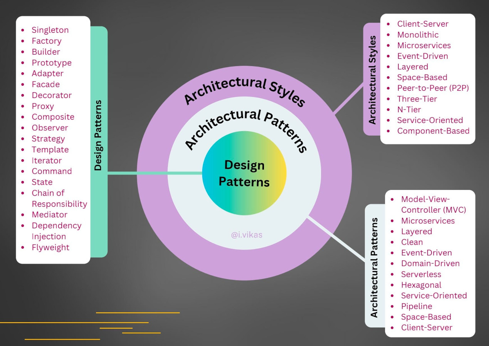
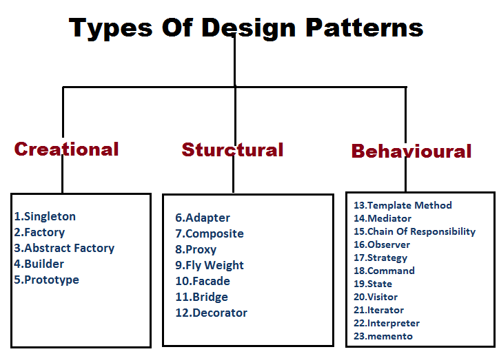

# Modulo 9 - Padrões de Projeto em POO

**Sumário**
- [Modulo 9 - Padrões de Projeto em POO](#modulo-9---padrões-de-projeto-em-poo)
  - [1. O que são padrões de projeto?](#1-o-que-são-padrões-de-projeto)
  - [2. Padrões de projeto não são bibliotecas](#2-padrões-de-projeto-não-são-bibliotecas)
  - [3. Padrões Arquiteturais vs Padrões de Projeto](#3-padrões-arquiteturais-vs-padrões-de-projeto)
  - [4. Os padrões GoF (Gang of Four)](#4-os-padrões-gof-gang-of-four)
  - [5. Padrões Criacionais](#5-padrões-criacionais)
    - [5.1. Factory Method](#51-factory-method)
      - [5.1.1. Porque e quando usar Factory Method?](#511-porque-e-quando-usar-factory-method)
    - [5.2. Singleton](#52-singleton)
      - [5.2.1. Porque e Quando usar o padrao Singleton?](#521-porque-e-quando-usar-o-padrao-singleton)
  - [6. Padrões Estruturais](#6-padrões-estruturais)
    - [6.3. Facade (ou Fachada)](#63-facade-ou-fachada)
  - [7. Padrões Comportamentais](#7-padrões-comportamentais)
    - [7.1. Strategy](#71-strategy)
      - [7.1.1. Quanto usar o padrao Strategy?](#711-quanto-usar-o-padrao-strategy)
    - [7.2. Observer](#72-observer)
    - [7.3. State](#73-state)
  - [8. Como reconhecer padrões no código](#8-como-reconhecer-padrões-no-código)
- [Exercícios para fixação](#exercícios-para-fixação)
  - [Exercício 1](#exercício-1)
  - [Exercício 2](#exercício-2)
  - [Exercicio 3](#exercicio-3)
  - [Exercício 4](#exercício-4)
  - [Exercício 5](#exercício-5)
  - [Exercício 6](#exercício-6)
  - [Exercicio 7](#exercicio-7)
  - [Exercício 8](#exercício-8)
  - [Exercício 9](#exercício-9)
  - [Exercício 10](#exercício-10)
    - [Exercício 1-A](#exercício-1-a)
    - [Exercício 1-B](#exercício-1-b)
    - [Exercício 1-C](#exercício-1-c)


## 1. O que são padrões de projeto?

**Padrões de projeto** (ou **Design Patterns**) são **soluções recorrentes para problemas comuns** de projeto de software.

> Um padrão de projeto não é uma biblioteca pronta.
- Ele representa uma **solução geral e reutilizável** para um problema recorrente de projeto.

Considere um problema:
> Precisamos permitir diferentes formas de desconto.


Uma solução seria usar varios `if`:

```python
def calcular_desconto(tipo, valor):
    if tipo == "normal":
        return valor * 0.05
    elif tipo == "vip":
        return valor * 0.10
    elif tipo == "funcionario":
        return valor * 0.20
```

Conforme o sistema cresce, novos casos precisam ser adicionados, o que torna o código difícil de manter.

Uma alternativa seria utilizar objetos que representam diferentes estratégias:

```python
from abc import ABC, abstractmethod
class DescontoInterface(ABC):
    @abstractmethod
    def calcular(self, valor):
        raise NotImplementedError

class DescontoNormal(Desconto):
    def calcular(self, valor):
        return valor * 0.05

class DescontoVIP(Desconto):
    def calcular(self, valor):
        return valor * 0.10
```

Essa ideia é a base do padrão **Strategy**.

O padrão **não fornece código pronto**.
- Ele fornece uma FORMA DE PENSAR a solução.

## 2. Padrões de projeto não são bibliotecas

Um erro comum é pensar que:
> "Vou instalar a biblioteca do padrão Strategy."

Isso não faz sentido, pois um padrão como `Strategy` descreve uma **estrutura** de colaboração entre objetos (não um código pronto que possa ser instalado).

O programador implementa essa estrutura na linguagem escolhida, conforme as necessidades de cada projeto (sistema).

Em Python:

```python
from abc import ABC, abstractmethod

class EstrategiaInterface(ABC):
    @abstractmethod
    def executar(self):
        pass
```

Em Java:

```java
interface EstrategiaInterface
```

Em C#:

```csharp
interface EstrategiaInterface
```

O padrão permanece conceitualmente semelhante, apesar das diferenças de implementação de cada linguagem de programação.

## 3. Padrões Arquiteturais vs Padrões de Projeto

Os dois conceitos são diferentes principalmente pela **escala**:
- **Padroes arquiteturais**: Afetam a **organização** do sistema como um todo.
  - **Exemplos**:
    - Camadas x MVC    
    - Monolito x Microserviços
    - Cliente-servidor x P2P
- **Padroes de projeto**: Afetam **partes específicas** do sistema (como classes e objetos), normalmente **dentro de uma arquitetura**.
  - **Exemplos**:
    - Strategy
    - Factory
    - Adapter
    - Observer
    - Decorator

Portanto:
- ***Padrões de projeto normalmente são utilizados dentro de uma arquitetura de software.***



## 4. Os padrões GoF (Gang of Four)

A classificação mais conhecida é a dos **23 padrões de projeto**, proposta por 4 grandes pesquisadores de engenharia de software, que ficaram conhecidos como o **Gang of Four (GoF ou Gangue dos Quatro)**.

Eles são divididos em três grupos de padroes:
- **Criacionais**: 
  - **Objetivo**: controlar a criação de objetos, evitando acoplamento entre classes e subclasses.
- **Estruturais**:
  - **Objetivo**: organizar a estrutura das classes (heranças e associações).
- **Comportamentais**:
  - **Objetivo**: gerenciar o comportamento dos objetos (quem se comunica e colabora com quem).   



Dentre os padroes disponíveis, temos:
- **Padroes Criacionais**:
  - Factory (ou Factory Method)
  - Abstract Factory
  - Builder
  - Prototype
  - Singleton
- **Padroes Estruturais**:
  - Adapter
  - Bridge
  - Composite
  - Decorator
  - Facade
  - Flyweight
  - Proxy
- **Padroes Comportamentais**:
  - Chain of Responsibility
  - Command
  - Interpreter
  - Iterator
  - Mediator
  - Memento
  - Observer
  - State
  - Strategy
  - Template Method
  - Visitor

Devido a grande quantidade de padrões, iremos focar em alguns **padrões mais usados (ou mais importantes) para a prática de programação**, no decorrer desta disciplina:
- Factory Method
- Abstract Factory
- Singleton
- Facade
- Strategy
- Observer
- State

> Os demais padroes de projeto não serão abordados em detalhes, mas podem ser estudados posteriormente.

## 5. Padrões Criacionais

### 5.1. Factory Method

O **Factory Method** encapsula a criação de objetos.

Em vez de escrever:

```python
if tipo == "pdf":
    relatorio = RelatorioPDF()
elif tipo == "html":
    relatorio = RelatorioHTML()
```

podemos utilizar classes e polimorfismo:

```python
from abc import ABC, abstractmethod

# todos os tipos de relatório devem implementar a interface Relatorio
class Relatorio(ABC):
    @abstractmethod
    def gerar(self):
        pass

class RelatorioPDF(Relatorio):
    def gerar(self):
        return "Relatório PDF"

class RelatorioHTML(Relatorio):
    def gerar(self):
        return "Relatório HTML"

# agora implementamos a fábrica 
class RelatorioFactory:
    # metodo fabrica (factory method) que cria o objeto correto
    @staticmethod
    def criar(tipo: str) -> Relatorio:
        if tipo == "pdf":
            return RelatorioPDF()
        elif tipo == "html":
            return RelatorioHTML()
        # se o tipo não for reconhecido, podemos lançar uma exceção (erro)
        raise ValueError("Tipo inválido")

# uso da fábrica (RelatorioFactory)
relatorio = RelatorioFactory.criar("pdf")
print(relatorio.gerar())
```

#### 5.1.1. Porque e quando usar Factory Method?

- **Objetivo**: Separar a lógica de criação dos objetos da lógica que utiliza esses objetos.
- **Vantagem:** Quem utiliza o objeto não precisa conhecer necessariamente como ele é construído.
- **Desvantagem:** Metodo fabrica precisa conhecer todas as classes concretas que podem ser criadas, o que pode gerar acoplamento.
  - **Solucao**: Podemos utilizar o padrão **Abstract Factory** (ver descrição abaixo) para criar famílias de objetos relacionados, evitando acoplamento.

**Exercicios de Fixacao**:
- [Exercício 1](#exercício-1)

### 5.2. Singleton

O **Singleton** garante que **exista apenas uma instância** de determinado objeto.

Exemplo:

```python
class Configuracao:
    _instance = None

    # metodo estatico que cria e retorna a unica instancia da classe    
    @classmethod
    def get_instance(cls):
        if cls._instance is None:
            cls._instance = cls()
        return cls._instance

# note que podemos chamar get_instance() sem 
# precisar de um objeto da classe Configuracao 
# (chamamos o metodo direto do nome da classe)
a = Configuracao.get_instance()
b = Configuracao.get_instance()

# deve retornar True, pois a e b são a mesma instância
# (mesmo objeto na memória)
print(a is b)
```

Ter um único objeto (ou ponto de acesso) é útil para objetos que representam **recursos globais**, como:
- Configurações 
- Banco de dados
- Gerenciadores de conexão
- etc

**IMPORTANTE 3**: O método `get_instance()` é um **Factory Method** que cria e retorna a única instância da classe.
- Essa tecnica pode ser utilizada em outras linguagens, como **Java** e **C#**, que possuem métodos estáticos (que no python sao escritos usando `@classmethod` ou `@staticmethod`).

#### 5.2.1. Porque e Quando usar o padrao Singleton?

Singleton é um padrão controverso, pois pode levar a um código mais difícil de manter e testar, uma vez que ele pode:
* introduzir estado global;
* dificultar testes;
* aumentar acoplamento;
* dificultar o uso de código multi-thread.

Portanto utilize Singleton apenas quando **for realmente necessário**:
- Isto é, quando for necessário garantir que **exista apenas uma instância** de determinado objeto.

Muitas vezes, **injeção de dependência** é uma solução melhor.

**Exercicios de Fixacao**:
- [Exercício 3](#exercício-3)
 
## 6. Padrões Estruturais

### 6.3. Facade (ou Fachada)

O **Facade** fornece uma interface simples para um subsistema ou biblioteca complexos.

Imagine um sistema com várias classes:

```text
Sistema de vídeo
├── Codec
├── Audio
├── Video
├── Arquivo
└── Conversor
```

Sem Facade:

```python
codec = Codec()
audio = Audio()
video = Video()
arquivo = Arquivo()

# muitas classe e operações...
```

Com Facade:

```python
class ConversorFacade:
    def __ler(self, arquivo):
        print("Lendo arquivo")

    def __definir_formato(self, formato: str):
        print(f"Definindo formato: {formato}")
    
    def __definir_codecs(self, audio_codec: str, video_codec: str):
        print(f"Definindo codecs de audio e video: {audio_codec}, {video_codec}")

    # note que o metodo converter() é o unico metodo publico da classe.
    # ele tambem possui valores padrao para os parametros, atraves do = 
    # isso tambem facilita o uso do metodo pelo usuario
    def converter(self, arquivo: str, formato: str = "mp4", audio_codec: str = "mp3", video_codec: str = "h264"):
        self.__ler(arquivo)
        self.__definir_formato(formato)
        self.__definir_codecs(audio_codec, video_codec)
        print("Convertendo arquivo")        

# usando a facade
facade = ConversorFacade()
facade.converter("video.mp4")
```

O **usuário conhece uma interface simples** de uso.
- **Metodos privados escondem a complexidade** do subsistema.
- **Poucos metodos publicos são expostos**, facilitando o uso e a manutenção do código.

**Exercicios de Fixacao**:
- [Exercício 4](#exercício-4)
 
## 7. Padrões Comportamentais

### 7.1. Strategy

**Strategy** encapsula diferentes algoritmos ou comportamentos.

Seja uma interface `DescontoInterface`:

```python
from abc import ABC, abstractmethod

class DescontoInterface(ABC):
    @abstractmethod
    def calcular(self, valor: float) -> float:
        pass

# Podemos criar as subclasses abaixo,
# que implementam DescontoInterface:
class DescontoNormal(DescontoInterface):
    def calcular(self, valor: float) -> float:
        return valor * 0.05

class DescontoVIP(DescontoInterface):
    def calcular(self, valor: float) -> float:
        return valor * 0.10
```

Podemos usar essas estrategias (subclasses de `DescontoInterface`) em `Pedido` (que é chamado de classe de **contexto** para as estrategias):

```python
# classe de contexto que utiliza a estrategia de desconto
class Pedido:
    def __init__(self, estrategia: DescontoInterface):
        self.estrategia = estrategia

    def calcular_desconto(self, valor: float) -> float:
        return self.estrategia.calcular(valor)

# podemos usar essa classes assim:
pedido = Pedido(DescontoVIP())
print(pedido.calcular_desconto(1000))

#podemos trocar a estrategia em tempo de execucao
pedido.estrategia = DescontoNormal()
print(pedido.calcular_desconto(1000))
```

Resultado:
```text
100.0
50.0
```

#### 7.1.1. Quanto usar o padrao Strategy?

> Quando precisamos permitir que o algoritmo (chamado de estratégia) seja trocado em tempo de execução, sem modificar o código que o utiliza (chamado de contexto).
- No exemplo acima, temos:
  - **Contexto**: ``Pedido``
  - **Estratégia**: ``DescontoVIP`` ou ``DescontoNormal``

**Exercicios de Fixacao**:
- [Exercício 5](#exercício-5)

### 7.2. Observer

**Observer** estabelece uma **relação de notificacao**:
- Quando há alguma **mudança no estado** de um objeto  observado (**observer**), todos os objetos que dependem dele (os **observadores**) são notificados:

```text                   
Objeto observado ------------> Observadores
                   Notifica
```

Pelo fato do objeto observado emitir notificacoes para os observadores, as vezes esse padrao de projeto é chamado de **Publisher-Subscriber**:
- **Publisher**: o objeto que envia as notificações (objeto oberservado).
  - **Publish** = publicar ou enviar (em portugues)
- **Subscriber**: o objeto que se registra para receber as notificações (observador).
  - **Subscribe** = inscrever-se ou registrar-se (em portugues)

Exemplo:

Primeiro precisamos definir a interface do **Subscriber**:

```python
from abc import ABC, abstractmethod

class SubscriberInterface(ABC):
    @abstractmethod
    def atualizar(self, nota: float):
        pass

# criamos as classes concretas que 
# implementam a interface SubscriberInterface:
class AlunoSubscriber(SubscriberInterface):    
    def atualizar(self, nota: float):
        print("Minha foi nota atualizada:", nota)

class ResponsavelSubscriber(SubscriberInterface):
    def atualizar(self, nota: float):
        print("Nota do filho atualizada:", nota)

# Agora configuramos o objeto a ser observado (**Publisher**)
class NotaPublisher:
    def __init__(self):
        # o publisher guarda uma lista de observadores 
        # para que possamos notificar todos eles quando 
        # houver uma mudança de estado (método ``notificar()``)
        self.subscribers = []

    # adiciona um novo observador (subscriber) à lista de observadores
    def adicionar(self, subcriber: SubscriberInterface):
        self.subscribers.append(subcriber)

    # notifica todos os observadores (subscribers) sobre a mudança de estado
    def notificar(self, nota: float):
        for subcriber in self.subscribers:
            subcriber.atualizar(nota)

# para usar o padrao Observer, criamos o publisher
nota = NotaPublisher()

# adicionamos os observers (subscribers) que queremos notificar
nota.adicionar(AlunoSubscriber())
nota.adicionar(ResponsavelSubscriber())

# informamos a mudança de estado (nova nota) e
# o metodo irá notificar todos os observers 
nota.notificar(8.5)
```

**Exercicios de Fixacao**:
- [Exercício 6](#exercício-6)

### 7.3. State

**State** permite **alterar o comportamento de um objeto** conforme seu estado interno.

Considere que um pedido em uma plataforma de vendas online pode ter os seguintes estados:
- Criado
- Processando
- Enviado
- Entregue

Cada estado pode possuir comportamento diferente, que é definido pelo método ``processar()`` da interface `EstadoPedidoInterface`.

```python
from abc import ABC, abstractmethod

class EstadoPedidoInterface(ABC):
    # guarda o pedido para que possamos alterar seu estado
    def __init__(self, pedido: 'Pedido'):
        self.__pedido = pedido

    # processamos o pedido, e indicamos qual sera o proximo estado
    @abstractmethod
    def processar(self) -> 'EstadoPedidoInterface':
        pass

# Assim podemos definir o comportamento de cada estado:
class EstadoEntregue(EstadoPedidoInterface):
    def processar(self) -> 'EstadoPedidoInterface':
        print("Pedido entregue")
        print("Não há próximo estado. Tudo certo com o pedido.")
        # self diz para o metodo retornar o objeto atual, do tipo EstadoEntregue
        # (isto é, este estado é o estado final do pedido)
        return self 

class EstadoEnviado(EstadoPedidoInterface):
    def processar(self):
        print("Pedido enviado")
        print("Passando para o próximo estado: Entregue...")
        # proximo estado do pedido é Entregue
        return EstadoEntregue(self.__pedido)

class EstadoProcessando(EstadoPedidoInterface):
    def processar(self):
        print("Pedido processado")
        print("Passando para o próximo estado: Enviado...")
        # proximo estado do pedido é Enviado
        return EstadoEnviado(self.__pedido)        

class EstadoCriado(EstadoPedidoInterface):
    def processar(self):
        print("Pedido criado")
        print("Passando para o próximo estado: Processando...")
        # proximo estado do pedido é Processando
        return EstadoProcessando(self.__pedido)

# podemos usar o padrao State dentro de Pedido:
class Pedido:
    def __init__(self):
        # estado inicial do pedido é Criado
        self.__estado = EstadoCriado()

    # O objeto muda de estado coforme o método ``self.__estado.processar()`` é chamado:
    def processar(self):
        self.__estado = self.__estado.processar()

pedido = Pedido()
pedido.processar() # muda para EstadoProcessando
pedido.processar() # muda para EstadoEnviado
pedido.processar() # muda para EstadoEntregue

# chamar processar() novamente nao muda mais o estado
pedido.processar() # permanece em EstadoEntregue
```

Note que cada estado é responsável por definir o próximo estado do pedido, permitindo que o comportamento do objeto mude dinamicamente conforme seu estado interno.

**Exercicios de Fixacao**:
- [Exercício 7](#exercício-7)

## 8. Como reconhecer padrões no código

Um bom exercício é aprender a fazer as perguntas certas, para identificar quando usar cada padrao:
- **Factory Method**: Existe uma lógica centralizada para criar objetos diferentes?
- **Singleton**: Existe a necessidade de controlar uma única instância de uma classe?
- **Facade**: Existe um subsistema complexo que poderia ter uma interface mais simples?
- **Strategy**: Existem diferentes algoritmos que podem ser trocados em tempo de execução?
- **Observer**: Vários objetos precisam ser avisados quando algo acontece? 
- **State**: O comportamento de um objeto muda dependendo do estado do objeto?

**Exercicios de Fixacao**:
- [Exercício 8](#exercício-8)
- [Exercício 9](#exercício-9)
- [Exercício 10](#exercício-10)

# Exercícios para fixação

## Exercício 1

Crie uma fábrica ``RelatorioFactory`` que consiga produzir:
- ``RelatorioPDF``
- ``RelatorioHTML``
- ``RelatorioTXT``

Todos devem implementar o método `gerar()`.
- ``gerar()`` deve retornar uma string indicando o tipo de relatório gerado.

Utilize a ``Factory`` para criar os objetos.

## Exercício 2 

Crie um sistema de descontos, baseado no padrão **Strategy**, contendo as classes:
- ``DescontoNormal``: desconto de 5%
- ``DescontoVIP``: desconto de 10%
- ``DescontoEstudante``: desconto de 15%
- ``DescontoFuncionario``: desconto de 20%

Todos devem implementar ``calcular(valor)``

Depois crie:

```python
class Pedido:
    ...
```

O pedido deve receber a estratégia externamente.

Teste todas as estratégias.

## Exercicio 3

Crie um sistema de gerenciamento de cache (`CacheManager`) utilizando o padrão **Singleton**, garantindo que exista apenas uma instância desse gerenciador em todo o sistema.

O `CacheManager` deve oferecer:
- ``armazenar(chave: str, valor: int)``: guarda um valor associado a uma chave;
- ``buscar(chave: str): int | None``: retorna o valor associado a uma chave (ou ``None``, se ela não existir).


Simule duas partes diferentes do sistema, criando duas funções separadas para isso: `modulo_a()` e `modulo_b()`.
- Ambos devem obter a instância do `CacheManager` de forma independente (usando ``CacheManager.get_instance()``).

Demonstre, com `assert`, que ambas estão manipulando a **mesma instância**.
- Por exemplo, armazene uma chave e valor dentro do `CacheManager`, usando o `modulo_a()`
- Em seguida, verifique se esse valor esta visível no `modulo_b()` (se conseguimos buscar por essa chave).

## Exercício 4

Imagine um sistema de compressao de arquivos, com as seguintes classes:
- ``Leitor``
- ``Compactador``
- ``Gravador``

Crie a classe `CompressorFacade` que forneça ``comprimir(arquivo)``, usando o padrao **Facade**.
- O usuário deve conhecer apenas o `CompressorFacade` e seu metodo publico ``comprimir(arquivo)``.

## Exercício 5

Considere:

```python
class Sistema:
    def executar(self, tipo, valor):
        if tipo == "A":
            ...
        elif tipo == "B":
            ...
        elif tipo == "C":
            ...
        elif tipo == "D":
            ...
```

**Responda:**
1. Qual problema de projeto existe?
2. Qual padrão poderia ajudar?
3. Como ficaria a solução após a refatoração? Escreva o codigo refatorado.

## Exercício 6

Crie um sistema que notifique o usuario por varios meios de comunicacao, como:
- ``Email``
- ``Log``
- ``SMS``

quando ocorrer um cadastro de usuario no sistema.

Implemente utilizando o padrao ``Observer``.

## Exercicio 7

Modele um **semáforo de trânsito** utilizando o padrão **State**, com os seguintes estados:
- ``EstadoVermelho``
- ``EstadoVerde``
- ``EstadoAmarelo``

O semáforo deve **ciclar continuamente** entre os estados, nesta ordem: 
- Vermelho → Verde → Amarelo → Vermelho → Verde → ...

Faça o seguinte:
1. Crie a interface `EstadoSemaforoInterface`, com o método `processar()`.
2. Implemente as três classes de estado, cada uma imprimindo a cor atual e retornando o próximo estado da sequência.
3. Crie a classe `Semaforo`, com estado inicial `EstadoVermelho`, e um método `avancar()` que muda o semáforo para o próximo estado.
4. Chame `avancar()` pelo menos **6 vezes** seguidas e mostre que o semáforo realmente volta a `EstadoVermelho` depois de passar por `EstadoVerde` e `EstadoAmarelo`.

## Exercício 8

Para cada situação, escolha o padrão mais adequado:
1. Muitos algoritmos intercambiáveis
2. Muitos observadores
3. Subsistema complexo
4. Estado altera comportamento

## Exercício 9

Desenvolva um sistema utilizando pelo menos **4 padrões de projeto**.

**Sugestões**:
- Sistema acadêmico
- Sistema bancário
- Sistema de biblioteca
- Sistema de vendas
- Sistema de pedidos
- Sistema de gerenciamento de arquivos

**Requisitos**:

O projeto deve conter:
* pelo menos 1 padrão criacional;
* pelo menos 1 padrão estrutural;
* pelo menos 1 padrão comportamental;
* utilização de polimorfismo;
* baixo acoplamento;
* responsabilidades bem definidas.

**Documentação**:

Para cada padrão, explique:

```text
Nome:
________________________________

Problema:
________________________________

Por que foi utilizado:
________________________________

Onde aparece no código:
________________________________

Qual princípio SOLID ele ajuda a atender:
________________________________
```

## Exercício 10

Associe cada problema ao padrão mais adequado.

### Exercício 1-A

Existem vários algoritmos diferentes para calcular um desconto.

```text
Resposta: __________________
```

### Exercício 1-B

Precisamos avisar vários objetos quando um usuário for cadastrado.

```text
Resposta: __________________
```

### Exercício 1-C

O comportamento muda conforme o estado atual do objeto.

```text
Resposta: __________________
```