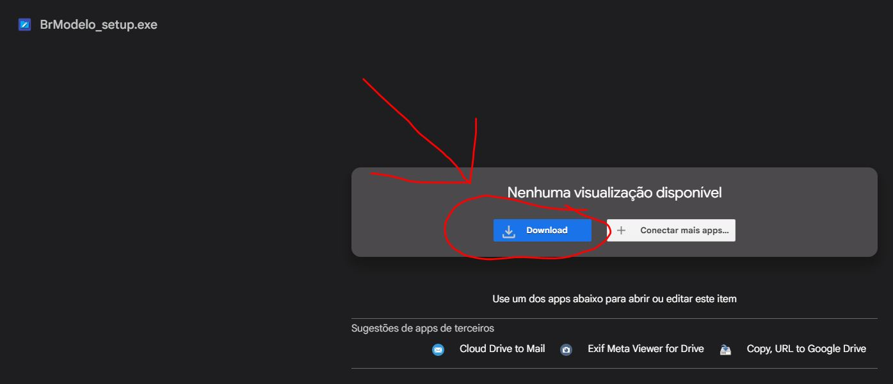
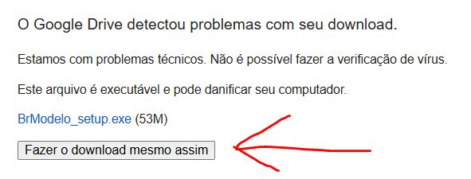
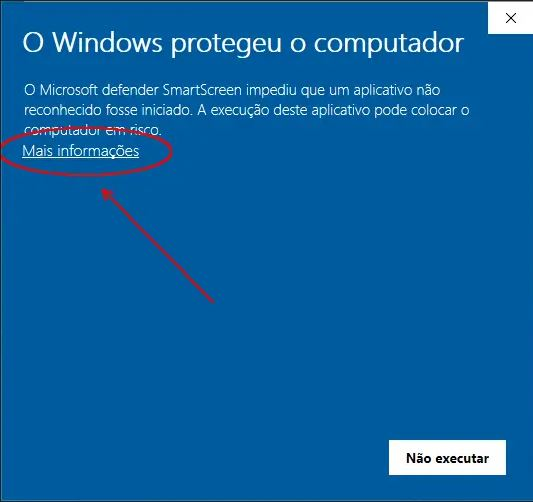
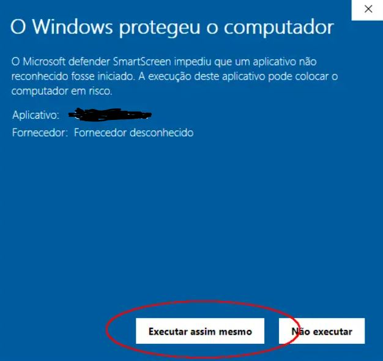
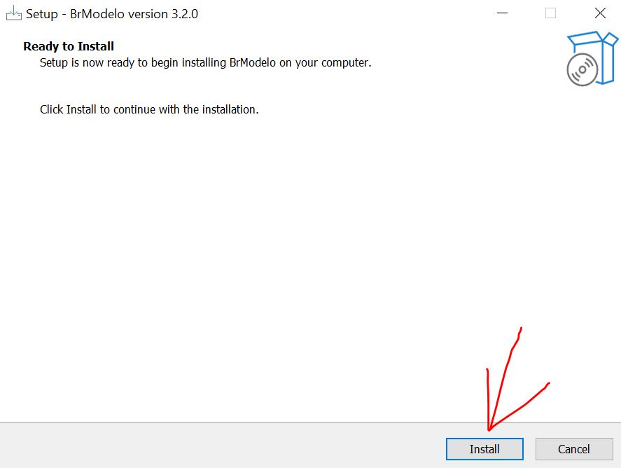
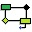
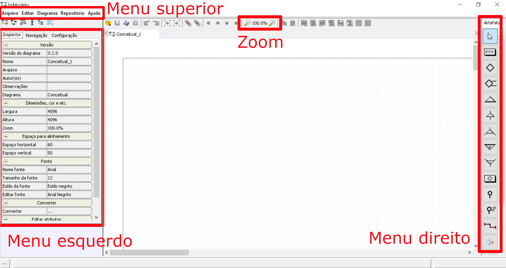
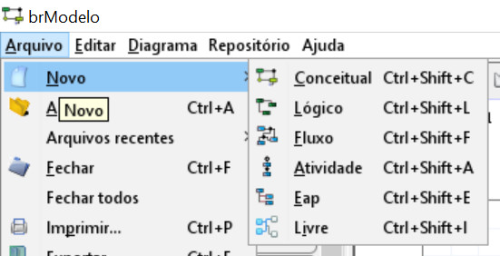
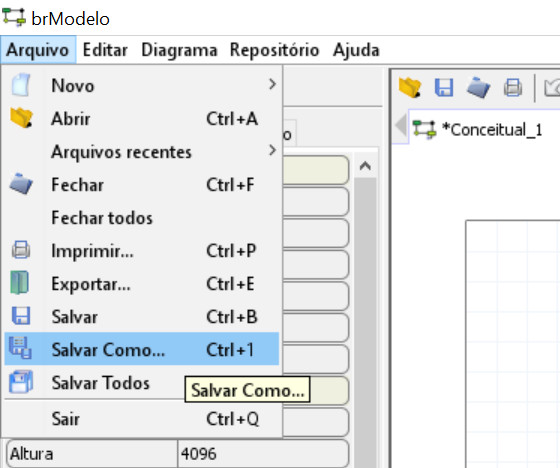
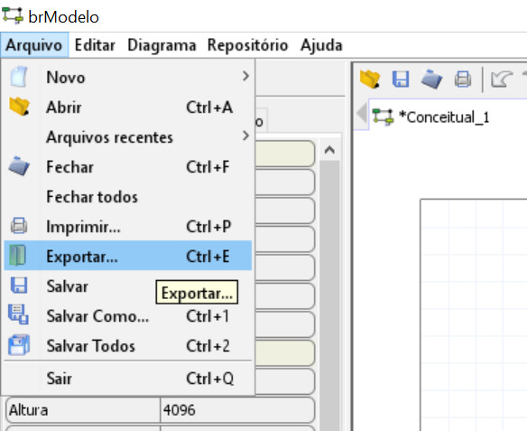

# BrModelo

O BrModelo  é uma ferramenta para construção de modelos conceituais e lógicos de bancos de dados.

**Sumario:**
- [BrModelo](#brmodelo)
  - [Como instalar](#como-instalar)
  - [Interface principal](#interface-principal)
    - [1. Criar um novo modelo no BrModelo](#1-criar-um-novo-modelo-no-brmodelo)
    - [2. Salvar um modelo](#2-salvar-um-modelo)
    - [3. Exportar um modelo como imagem](#3-exportar-um-modelo-como-imagem)
  - [Como usar o BrModelo](#como-usar-o-brmodelo)

## Como instalar 

1. Baixe o [instalador aqui](https://drive.google.com/file/d/18nxaJM0ZwyP7wv5RaZIHMK2H2QyuCn_Q/view?usp=sharing). Pode demorar alguns minutos para abrir a pagina para download.

2. Abra o instalador ``BrModelo_setup.exe``
3. Clique em ``Mais informações``

4. Em seguida clique em ``Executar assim mesmo``

5. Prossiga com a instalação do BrModelo

6. No final da instalação o seguinte ícone aparecerá na sua area de trabalho e no menu iniciar do Windows 

## Interface principal

### 1. Criar um novo modelo no BrModelo
1. Vá no menu superior `Arquivo -> Novo`
2. Escolha o tipo de modelo que deseja criar (``Conceitual`` ou ``Lógico``)

**OBS**: Note que o menu direito muda conforme o modelo que você escolheu criar / abrir.
 
### 2. Salvar um modelo

1. Vá no menu superior `Arquivo -> Salvar como`
2. Escolha o local onde deseja salvar o modelo

**OBS:** SEMPRE salve seu modelo no formato binário (`.bin` ou `.brM3`). 
- EVITE o formato ``.xml`` (esse formato se corrompe com facilidade)

### 3. Exportar um modelo como imagem

1. Vá no menu superior `Arquivo -> Exportar`
2. Escolha o local onde deseja salvar a imagem do modelo

**OBS:** PREFIRA salvar a imagem do seu modelo no formato `.png`.
- O formato ``.bmp`` gera imagens muito grandes, o que dificulta o envio por email ou no Google Classroom.  
 
## Como usar o BrModelo

Estude os roteiros de cada modelo (conceitual e lógico), disponibilizados no [repositório da disciplina](./..).