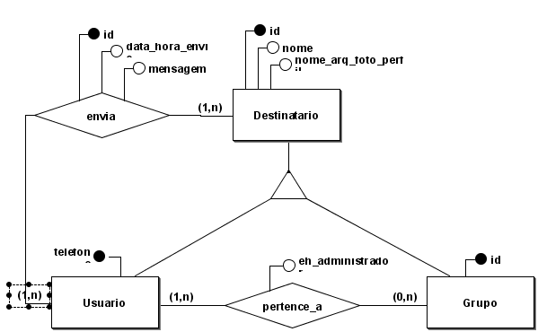
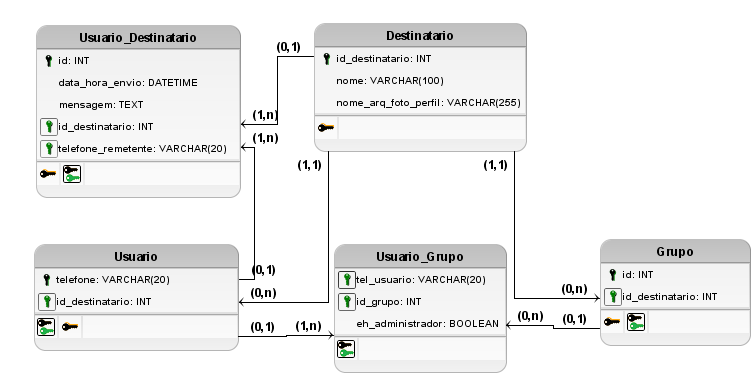

## Sistema de Chat On-line
**Descrição**: Um sistema de chat online semelhante ao WhatsApp, que permite que os usuários enviem mensagens entre si e também participem de grupos de conversa. O sistema armazena informações dos usuários, mensagens, membros dos grupos e histórico de conversas.

**Funcionalidades:**

- Cadastro de usuários (telefone, nome, nome_arquivo_foto_perfil)
- Envio de mensagens de texto (id, data_hora_envio, origem, destinatario, mensagem)
- Criação de grupos de conversa (nome do grupo,usuarios)
- Adição e remoção de membros em grupos (usuario, eh_administrador)
- Histórico completo de mensagens entre usuários e dentro de grupos

**Condições e Restrições:**
- Um usuário só pode enviar mensagens em grupo se for membro daquele grupo.
- Cada grupo pode ter um ou mais administradores.
- Mensagens não podem ser apagadas ou editadas após o envio.
- Um usuário pode participar de vários grupos.
- Um grupo pode ter vários usuários.
- Cada mensagem deve estar associada a um remetente.
- O telefone do usuário deve ser único no sistema.

### Modelo conceitual (completo)

Abra o arquivo do BrModelo [./modelo_conceitual.brM3](./modelo_conceitual.brM3) para maiores detalhes.

### Modelo lógico (completo)

Abra o arquivo do BrModelo [./modelo_logico.brM3](./modelo_logico.brM3) para maiores detalhes.
 