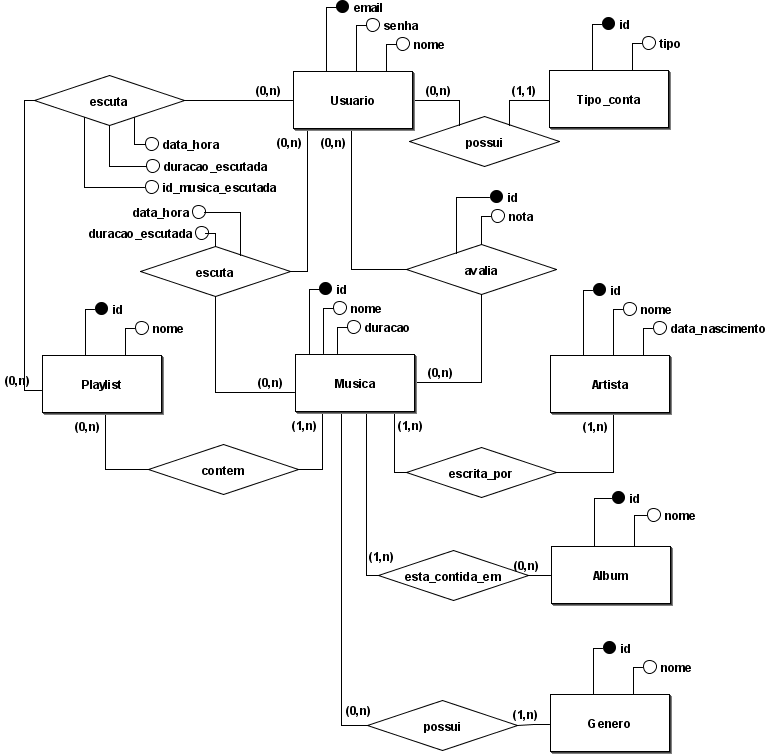
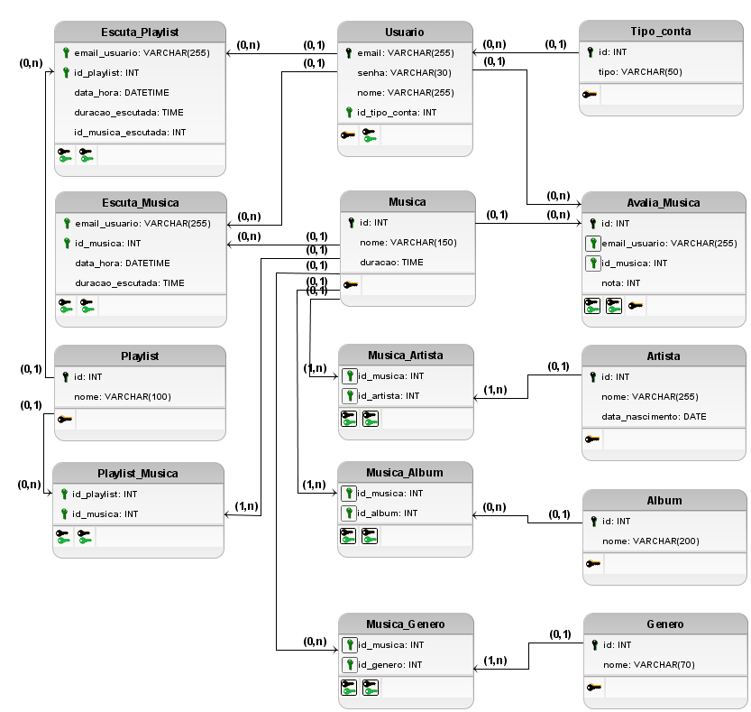

## Sistema de Streaming de Música (Spotify-like)

**Descrição**: Um sistema de *streaming* de músicas, semelhante ao Spotify. 

O sistema permite que usuários acessem, escutem e gerenciem um vasto catálogo de faixas musicais por meio de conexão à internet. Cada usuário pode criar playlists personalizadas, seguir artistas, avaliar músicas

**Sumário**:
- [Sistema de Streaming de Música (Spotify-like)](#sistema-de-streaming-de-música-spotify-like)
  - [Modelo conceitual (completo)](#modelo-conceitual-completo)
  - [Modelo lógico (completo)](#modelo-lógico-completo)
    - [Exemplos de tabelas](#exemplos-de-tabelas)

**Funcionalidades:**

- Cadastro de usuários (email, senha, nome, tipo de conta).
- Tipo de contas (gratuito ou premium).
- Consulta por músicas (id, nome, gênero, artistas, album).
- Consulta por artistas (id, nome, data_nascimento).
- Consulta por álbuns (id, nome).
- Consulta por gêneros (id, nome).
- Criação de playlists pelos usuários (id, musicas).
- Registro de avaliações das musicas (id, nota, musica).
- Histórico de reprodução (musica_ou_playlist, data_hora).
- Relatórios estatísticos: músicas mais ouvidas, playlists populares, usuários ativos, etc.

**Condições e Restrições:**

- Apenas usuários podem criar playlists, avaliar e escutar músicas.
- Cada música deve estar associada a pelo menos um gênero musical, um artista, e um album..
- Álbuns e playlists não podem conter musicas duplicadas.
- O sistema deve registrar o histórico de reprodução para futuras análises e relatórios.
- Nao podem existir usuários diferentes com mesmo email.

### Modelo conceitual (completo)

Abra o arquivo do BrModelo [./modelo_conceitual.brM3](./modelo_conceitual.brM3) para maiores detalhes.

### Modelo lógico (completo)

Abra o arquivo do BrModelo [./modelo_logico.brM3](./modelo_logico.brM3) para maiores detalhes.
 
#### Exemplos de tabelas

**Artista**:
| id  | nome            |
| --- | --------------- |
| 1   | Gun's and Roses |
| 2   | Michael Jackson |

**Album**:
| id  | nome                  |
| --- | --------------------- |
| 1   | Nothing Lasts Forever |
| 2   | Chinese Democracy     |
| 3   | Thriller              |

**Genero**:
| id  | nome |
| --- | ---- |
| 1   | Rock |
| 2   | Pop  |

**Musica**:
| id  | nome     | duracao  |
| --- | -------- | -------- |
| 1   | Beat It  | 00:04:18 |
| 2   | Better   | 00:04:59 |
| 3   | Attitude | 00:02:19 |

**Playlist**:
| id  | nome          |
| --- | ------------- |
| 1   | Rock anos 80  |
| 2   | Pop topíssimo |

**Tipo_conta**:
| id  | nome     |
| --- | -------- |
| 1   | Gratuita |
| 2   | Premium  |

**Usuario**:
| email            | nome             | senha | id_tipo_conta |
| ---------------- | ---------------- | ----- | ------------- |
| joao.c@gmail.com | Joao Costa       | 1234  | 1             |
| eumbu@uol.com.br | Eliane Umbuzeiro | 5678  | 2             |
| carnob@yahoo.com | Carlos Nobrega   | senha | 2             |

**Avalia_Musica**:
| id  | email_usuario    | id_musica | nota |
| --- | ---------------- | --------- | ---- |
| 1   | eumbu@uol.com.br | 3         | 7    |
| 2   | eumbu@uol.com.br | 2         | 10   |
| 2   | joao.c@gmail.co  | 3         | 2    |

**Playlist_Musica**:
| id_playlist | id_musica |
| ----------- | --------- |
| 1           | 3         |
| 2           | 1         |

**Escuta_Playlist**:
| email_usuario    | id_playlist | data_hora           | duracao_escutada | id_musica_escutada |
| ---------------- | ----------- | ------------------- | ---------------- | ------------------ |
| joao.c@gmail.com | 2           | 2025-07-10 08:51:20 | 00:03:01         | 1                  |
| eumbu@uol.com.br | 1           | 2024-01-15 18:32:12 | 00:02:01         | 3                  |

**Escuta_Musica**:
| email_usuario    | id_musica | data_hora           | duracao_escutada |
| ---------------- | --------- | ------------------- | ---------------- |
| carnob@yahoo.com | 2         | 2025-04-20 16:10:11 | 00:03:33         |

**Musica_Artista**:
| id_musica | id_artista |
| --------- | ---------- |
| 1         | 2          |
| 2         | 1          |
| 3         | 1          |

**Musica_Album**:
| id_musica | id_album |
| --------- | -------- |
| 1         | 3        |
| 2         | 2        |
| 3         | 1        |

**Musica_Genero**:
| id_musica | id_genero |
| --------- | --------- |
| 1         | 2         |
| 2         | 1         |
| 3         | 1         |