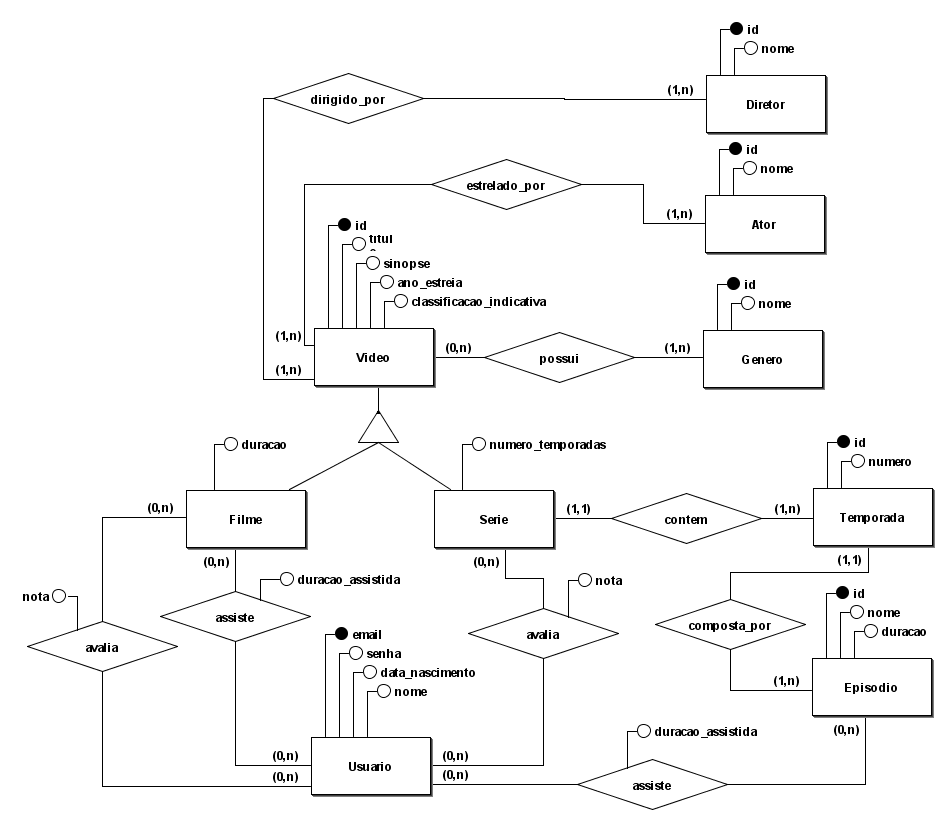
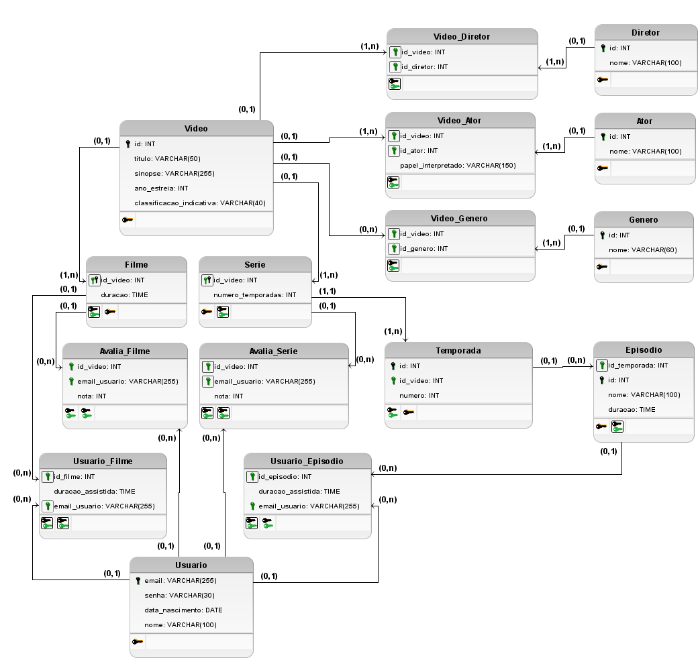

## Sistema de Streaming de Video

**Descrição**: Um sistema de streaming digital que permite a usuários assistirem filmes, séries e episódios sob demanda. 

O sistema oferece funcionalidades para gerenciamento de usuários, vídeos, gêneros, diretores, atores, avaliações e controle de progresso de visualização.

**Sumário**:
- [Sistema de Streaming de Video](#sistema-de-streaming-de-video)
  - [Modelo conceitual (completo)](#modelo-conceitual-completo)
  - [Modelo lógico (completo)](#modelo-lógico-completo)
    - [Exemplos de tabelas](#exemplos-de-tabelas)

**Funcionalidades:**

- Cadastro de videos (título, sinopse, ano de estreia, classificação indicativa, gênero, atores, diretores)
- Cadastro de usuários (e-mail, senha, nome, data de nascimento.)
- Controle de Visualização (registro do histórico de visualização dos usuários / tempo assistido de um filme ou episódio)
- Avaliação de Conteúdo (usuários podem avaliar vídeos com uma nota de 1 a 5)
- Relatórios de vídeos mais avaliados ou mais assistidos.

**Condições e Restrições:**
- Um vídeo pode ser um filme ou uma série.
- Cada vídeo possui um ou mais gêneros, diretores e atores.
- Um usuário pode assistir a vários vídeos (filmes ou episódios) e retomar de onde parou.
- As avaliações dos videos são registradas por vídeo e por usuário.

### Modelo conceitual (completo)

Abra o arquivo do BrModelo [./modelo_conceitual.brM3](./modelo_conceitual.brM3) para maiores detalhes.

### Modelo lógico (completo)

Abra o arquivo do BrModelo [./modelo_logico.brM3](./modelo_logico.brM3) para maiores detalhes.
 
#### Exemplos de tabelas 

**Diretor**:

| id  | nome            |
| --- | --------------- |
| 1   | Charlie Brooker |
| 2   | Jesse Armstrong |
| 3   | William Bridges |
| 4   | Joseph Kosinski |

**Ator**:

| id  | nome                |
| --- | ------------------- |
| 1   | Bryce Dallas Howard |
| 2   | Cristin Milioti     |
| 3   | Tom Cruise          |

**Genero**:
| id  | nome              |
| --- | ----------------- |
| 1   | Drama             |
| 2   | Ficção Científica |
| 3   | Suspense          |
| 4   | Ação              |
| 5   | Aventura          |

**Video**:
| id  | titulo            | sinopse                               | ano_estreia | classificacao_indicativa |
| --- | ----------------- | ------------------------------------- | ----------- | ------------------------ |
| 1   | Top Gun: Maverick | Depois de mais de 30 anos [...]       | 2022        | 12                       |
| 2   | Black Mirror      | Contos de ficção científica que [...] | 2011        | 16                       |

**Filme**:
| id_video | duracao  |
| -------- | -------- |
| 1        | 02:11:00 |

**Serie**:
| id_video | numero_temporadas |
| -------- | ----------------- |
| 2        | 7                 |

**Temporada**:
| id  | numero | id_video |
| --- | ------ | -------- |
| 10  | 1      | 2        |
| 11  | 2      | 2        |
| 12  | 3      | 2        |
| 13  | 4      | 2        |
| 14  | 5      | 2        |
| 15  | 6      | 2        |
| 16  | 7      | 2        |

**Episodio**:
| id  | nome            | duracao  | id_temporada |
| --- | --------------- | -------- | ------------ |
| 21  | Hino Nacional   | 00:44:00 | 10           |
| 22  | Striking Vipers | 01:01:00 | 14           |

**Usuario**:
| email           | senha | data_nascimento | nome                |
| --------------- | ----- | --------------- | ------------------- |
| carla@gmail.com | senha | 1975-03-30      | Carla Perez         |
| didi@bol.com.br | 12345 | 1990-05-10      | Didi dos trapalhões |

**Video_Diretor**:
| id_video | id_diretor |
| -------- | ---------- |
| 2        | 1          |
| 2        | 2          |
| 2        | 3          |
| 1        | 4          |

**Video_Ator**:
| id_video | id_ator |
| -------- | ------- |
| 2        | 1       |
| 2        | 2       |
| 1        | 3       |

**Video_Genero**:
| id_video | id_genero |
| -------- | --------- |
| 2        | 1         |
| 2        | 2         |
| 2        | 3         |
| 1        | 4         |
| 1        | 5         |
| 1        | 1         |

**Usuario_Avalia_Filme**:
| email_usuario   | id_video | nota |
| --------------- | -------- | ---- |
| carla@gmail.com | 1        | 10   |
| didi@bol.com.br | 1        | 2    |

**Usuario_Avalia_Serie**:
| email_usuario   | id_video | nota |
| --------------- | -------- | ---- |
| didi@bol.com.br | 2        | 8    |

**Usuario_Assiste_Filme**:
| email_usuario   | id_video | duracao_assistida |
| --------------- | -------- | ----------------- |
| didi@bol.com.br | 1        | 00:35:05          |

**Usuario_Assiste_Episodio**:
| email_usuario   | id_episodio | duracao_assistida |
| --------------- | ----------- | ----------------- |
| carla@gmail.com | 21          | 00:21:47          |
