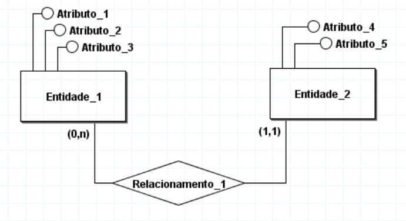
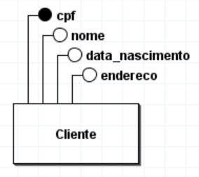
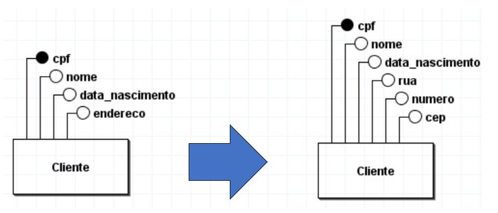
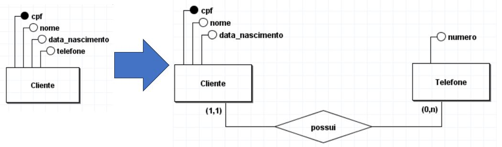
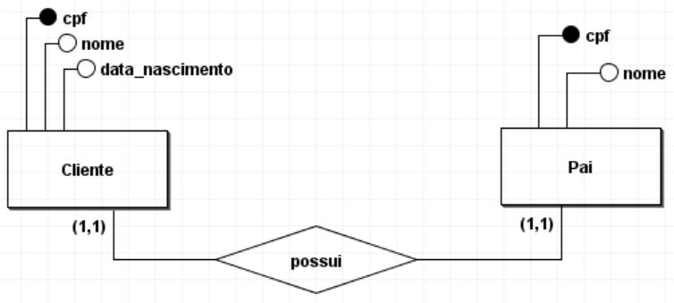
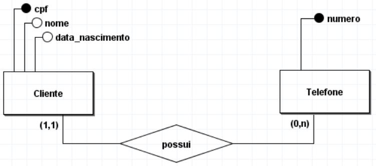
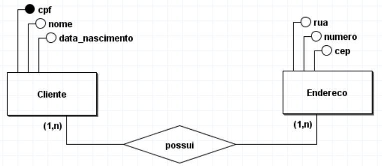
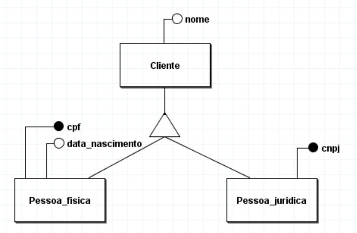

**Sumário**:
- [Modelo conceitual](#modelo-conceitual)
  - [Objetivo do modelo](#objetivo-do-modelo)
  - [Componentes](#componentes)
    - [1. Entidades](#1-entidades)
    - [2. Atributos](#2-atributos)
      - [2.1. Atributos Simples vs Compostos](#21-atributos-simples-vs-compostos)
      - [2.2. Atributos de Valor Único vs Multi-valorado](#22-atributos-de-valor-único-vs-multi-valorado)
      - [2.2. Atributos Determinantes vs Não-determinantes](#22-atributos-determinantes-vs-não-determinantes)
    - [3. Relacionamentos (com cardinalidades)](#3-relacionamentos-com-cardinalidades)
      - [3.1. Generalização e Especialização](#31-generalização-e-especialização)
- [Exemplos de Modelos Conceituais](#exemplos-de-modelos-conceituais)

# Modelo conceitual
O modelo conceitual (também chamado de ``modelo entidade-relacionamento`` ou ``modelo E-R``) é uma representação abstrata e de alto nível da estrutura de um banco de dados. Ele descreve, de forma independente da tecnologia de implementação, os principais elementos e relacionamentos.

## Objetivo do modelo
- *"Descrever quais dados precisam ser armazenados no sistema para que eles seja capaz de realizar as funções/requisitos descritos no projeto".*

## Componentes

### 1. Entidades

Representam os **objetos** principais sobre os quais se deseja armazenar informações no sistema. Cada entidade corresponde a um conceito do mundo real.
- **Exemplos**: Cliente, Produto, Pedido, Funcionário

O nome das entidades devem seguir algumas **regras**:
- Deve ser um **substantivo no singular**
- Começa com letras
- Não pode ter espaços
- Não pode ter caracteres especiais (com exceção do underline)
- O nome deve ser único dentro do banco de dados
  - *"Nao pode ter mais de uma entidade com mesmo nome"*

### 2. Atributos

São as **propriedades** ou características que descrevem uma entidade. 

Por exemplo, um ``Cliente`` pode ter atributos como ``CPF`` (atributo identificador), ``nome``, ``data_nascimento`` e ``endereço`` (vide imagem abaixo).

``Atributos identificadores`` sao aqueles que identificam de maneira única uma entidade específica. Eles devem estar marcados com um **circulo totalmente preenchido** (vide `CPF` na imagem acima).

O nome de cada atributo também deve seguir as mesmas regras usadas nas entidades. Além disso, **não pode ter dois atributos com mesmo nome dentro de uma mesma entidade**.

Os atributos podem ser classificados de diversas maneiras, conforme descrito abaixo. 

#### 2.1. Atributos Simples vs Compostos

| Atributo Simples       | Atributo Composto                     |
| ---------------------- | ------------------------------------- |
| Sao indivisíveis       | Podem ser subdivididos                |
| **Ex**: CPF, RG, idade | **Ex**: nome, endereco, dt_nascimento |

Em geral, um bom banco de dados **evita o uso de atributos compostos**, fazendo uso de atributos simples em seu lugar (vide imagem abaixo).

#### 2.2. Atributos de Valor Único vs Multi-valorado

| Atributo de Valor Único            | Atributo Composto                      |
| ---------------------------------- | -------------------------------------- |
| Contém um único valor por registro | Contem varios valores em cada registro |
| **Ex**: nome, idade, cpf           | **Ex**: telefone, email, endereco      |

Em geral, um bom banco de dados **evita o uso de atributos multi-valorados**. Para isso devemos:
- Remover o atributo multi-valorado da entidade
- Criar uma nova entidade para o atributo multi-valorado
- Conectar esse nova entidade com a entidade anterior, usando um relacionamento (veja imagem abaixo)

#### 2.2. Atributos Determinantes vs Não-determinantes

| Atributo Determinante                                 | Atributo Não-determinante                                   |
| ----------------------------------------------------- | ----------------------------------------------------------- |
| Há apenas um registo com o mesmo valor deste atributo | Pode existir vário registros com um mesmo valor do atributo |
| **Ex**: cpf, rg, chassi_carro                         | **Ex**: nome, data_nascimento, modelo_carro                 |

### 3. Relacionamentos (com cardinalidades)

Representam associações entre duas ou mais entidades. Um relacionamento descreve como as entidades se conectam.

- **Exemplo**: ``Cliente`` **faz** ``Pedido``, ``Aluno`` **está** matriculado em ``Disciplina``.

Todo relacionamento deve ser um **verbo singular no infinitivo**. 

Além disso, relacionamentos **não representam funcionalidades do sistema**, mas sim como as entidades (dados) estão associadas umas com as outras.

Relacionamentos podem conter **cardinalidades** (mínimas e máximas), que indicam quantos registros de cada entidade estão associados entre si (veja imagens abaixo).

A depender da cardinalidade MÁXIMA, podemos classificar os  relacionamentos como:
- **Um para Um (1:1)**: Um registro de uma entidade interage com no máximo um registro de outra entidade.

- **Um para Muitos (1:N)**: Um registro de uma entidade interage com vários (N) registros da outra entidade.

- **Muitos para Muitos (N:N)**: Vários registros (N) de uma entidade podem se relacionar com vários outros (N) registros de outra entidade.

#### 3.1. Generalização e Especialização

- **Generalização**: é o processo de abstrair características comuns de duas ou mais entidades distintas, agrupando-as em uma entidade mais genérica.
  - **Ex**: ``Pessoa_Fisica`` e ``Pessoa_Juridica`` podem ser generalizadas em uma entidade mais genérica chamada ``Cliente``, que contém os atributos comuns como ``nome``.

- **Especialização** é o processo inverso: a partir de uma entidade genérica, identificam-se subconjuntos que possuem características específicas, criando assim entidades especializadas.
  - **Ex:** a entidade ``Cliente`` pode ser especializada em ``Pessoa_Fisica`` e `Pessoa_Juridica`, cada uma com atributos ou relacionamentos próprios, como `Pessoa_Fisica.cpf` e `Pessoa_Juridica.cnpj`.

# Exemplos de Modelos Conceituais

Nesta pasta vocês encontrarão vários exemplos de modelos conceituais, construídos usando o BrModelo.

A ideia aqui é que voces possam utiliza-los como base no estudo de vocês.