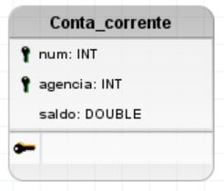

# Modelo logico

O modelo lógico é uma representação estruturada do modelo conceitual, adaptada para um sistema de banco de dados relacional (SGBD).

- Trata-se de uma etapa intermediária entre o modelo conceitual (alto nível e abstrato) e o modelo físico (dependente do SGBD).

O modelo lógico transforma entidades, atributos e relacionamentos em tabelas relacionais (vide imagem abaixo). 

Existem varias representações de modelo lógico (tabelas, diagramas UML, representação matemática, etc). 

- No decorrer do curso iremos trabalhar com maior frequência com a representação de **diagrama UML** (vide imagem abaixo), na qual podemos definir os  tipos de dados, chaves primárias e estrangeiras de cada tabela .

 
**Sumário**:
- [Modelo logico](#modelo-logico)
  - [Objetivo do modelo](#objetivo-do-modelo)
  - [Componentes](#componentes)
    - [1. Tabelas](#1-tabelas)
    - [2. Atributos](#2-atributos)
      - [Tipos de dados](#tipos-de-dados)
      - [Chave primária (primary key ou PK)](#chave-primária-primary-key-ou-pk)
      - [Chave estrangeira (foreign key ou FK)](#chave-estrangeira-foreign-key-ou-fk)
    - [3. Associações](#3-associações)

## Objetivo do modelo
- Estruturar os dados de forma normalizada e organizada, garantindo:
  - Integridade referencial
  - Eficiência de consulta
  - Consistência no armazenamento
- Servir como base para a implementação física do banco de dados (código SQL)
- Facilitar a manutenção e expansão futura do sistema

---

## Componentes

### 1. Tabelas

As tabelas representam entidades do modelo conceitual (ou relacionamentos transformados) e armazenam os dados em formato tabular, com colunas (atributos) e linhas (registros). Veja imagem de exemplo abaixo.

Cada tabela deve ter:
- Um nome único e representativo (**sem espaços, acentos ou caracteres especiais** - o único caractere especial permitido é o `_`)
- Atributos com seus respectivos tipos de dados
- Uma chave primária
- Zero ou mais chaves estrangeiras

- **Exemplos de tabelas**: Paciente, Consulta, Medico, Especialidade, Video, Usuario

Para criar uma tabela no BrModelo, faça o seguinte:
1. No menu a direita, clique na ferramenta `Criar nova tabela` 
2. Clique em qualquer local no centro do BrModelo
3. Ajuste o nome da tabela (veja imagem abaixo)
   1. Clique em cima da tabela
   2. No menu a esquerda, digite o novo nome da tabela no campo `Nome`
   3. Pressione ``Enter`` para salvar o novo nome

---

### 2. Atributos

Atributos são as colunas das tabelas, que armazenam valores nos registros (veja imagens abaixo).

 

Cada atributo deve conter um nome único (dentro da mesma tabela), que satisfaça as condições abaixo:
- Sem espaços
- Sem acentos 
- Sem caracteres especiais (o único caractere especial permitido é o `_`)

**OBS**: Tabelas diferentes podem ter atributos com mesmo nome (**ex**: `aluno.cpf` e `professor.cpf`).

Cada atributo deve ser nomeado com clareza, conter um tipo de dado apropriado e, quando necessário, indicar restrições (como PK, FK, NOT NULL, UNIQUE, etc). Tipos de dados sao representados ao lado do nome do atributo no formato `:tipo_de_dados` (veja imagem abaixo).

 

**Exemplos de atributos**: 
- ``aluno.cpf`` (do tipo ``VARCHAR(11)``)
- ``aluno.ano_ingresso`` (do tipo ``DATE``)
- ``professor.cpf`` (do tipo ``VARCHAR(11)``)
- ``professor.matricula_siape`` (do tipo ``INT``)

Para criar um atributo em uma tabela no BrModelo, faça o seguinte:
1. No menu a direita, clique na ferramenta `Criar novo campo`  
2. Clique em cima da tabela que deseja adicionar um novo campo
3. Ajuste o nome do atributo (veja imagem abaixo)
   1. Clique em cima do atributo
   2. No menu a esquerda, digite o novo nome do atributo no campo `Nome`
   3. Pressione ``Enter`` para salvar o novo nome

 
#### Tipos de dados

Os tipos de dados definem o formato e o tipo de informação que o atributo pode armazenar (**domínio do atributo**).

- **Exemplos**:
  - ``INT`` – números inteiros (**ex**: ``id``, ``qtd``)
  - ``FLOAT`` ou `DOUBLE` – números reais com ponto decimal, e precisão simples ou dupla (**ex**: ``preco_custo``, ``nota_avaliacao``)
  - ``BOOLEAN`` – representa valores que podem ser verdadeiro ou falso (**ex**: `aprovacao_no_ano_letivo`, `status_entrega_produto`)
  - ``VARCHAR(N)`` – texto de tamanho variável, contendo até ``N`` caracteres (**ex**: ``nome``, ``email``)
  - ``CHAR(N)`` – texto de tamanho fixo, contendo **exatos** N caracteres (**ex**: ``cpf``, ``estado``)
  - ``DATE`` – datas no formato `YYYY-MM-DD` (**ex**: ``data_nascimento``)
  - ``TIME`` – tempo no formato `HH:MM:SS` (**ex**: ``duracao_assistida_filme``, `hora_entrada_empresa`)
  - ``DATETIME`` – representa um instante de tempo no formato `YYYY-MM-DD HH:MM:SS` (**ex**: ``data_hora_entrada``, `data_hora_saida`)

No BrModelo, os tipos de dados de um atributo sao representadas por `nome_do_atributo: tipo_de_dados`. 

Para alterar o tipo de dados de um atributo no BrModelo, faça o seguinte:
1. Clique no atributo
2. No menu a esquerda, digite o novo tipo de dados no campo `Tipo de campo`
3. Pressione ``Enter`` para salvar o novo nome

 
#### Chave primária (primary key ou PK)

``Chaves primárias`` (primary keys ou PKs) sao atributos que, em conjunto, identificam de maneira única um registro específico de uma tabela. 

**Exemplos de PKs**:
- ``aluno.cpf``
- ``professor.matricula_siape``
- ``usuario.email``
- ``video.id``

No BrModelo, `chaves primárias` sao representadas por uma **chave preta** (vide `CPF` na imagem abaixo). 

Para marcar um atributo como ``chave primária`` no BrModelo, faça o seguinte:
1. Clique no atributo
2. No menu a esquerda, clique no campo `Chave primaria`
3. O campo deve mudar de `Não` para `Sim`
 

**OBS**: Uma ``chave primária`` de uma tabela pode ser formada por **um ou mais atributos**(veja exemplo abaixo).

 
#### Chave estrangeira (foreign key ou FK)

``Chaves estrangeiras`` (foreign keys ou FKs) sao atributos que criam uma ligação entre duas tabelas, associando um registro da tabela atual ($T_A$) a um registro de outra tabela ($T_B$). Para isso, a chave estrangeira de $T_A$ **deve se referir** a chave primaria de $T_B$.
- Isto é, todo valor que será inserido na chave estrangeira de $T_A$ deve existir na chave primária de $T_B$, em alguma linha de $T_B$ (veja exemplo abaixo).
- Para que isso funcione, **a chave primaria e a chave estrangeira devem ter os mesmos tipos de dados**.

No BrModelo, `chaves estrangeiras` sao representadas por uma **chave verde** (vide `Aluno.id_turma` no exemplo abaixo). 

 

Para marcar um atributo como ``chave estrangeira`` no BrModelo, faça o seguinte:
1. Clique no atributo
2. No menu a esquerda, clique no campo `Chave estrangeira`
3. O campo deve mudar de `Não` para `Sim`

**OBS**: Uma tabela pode conter várias ``chaves estrangeiras``. Um exemplo disso sao as **tabelas de junção** (veja exemplo abaixo).

---

### 3. Associações

Uma associação é uma **forma de representar os relacionamentos** que existem no modelo conceitual. 

Há diferentes formas de relacionamentos que conseguimos representar, dependendo da cardinalidade:
- **Relacionamento 1:N (um para muitos)**:
  - A chave primária da tabela se torna o lado "1" do relacionamento, enquanto que a chave estrangeira da outra tabela se torna o lado "N". 
  - **Exemplo**:
    - Uma turma tem vários alunos, e um aluno pertence a apenas uma turma
    - Relacionamento ``Turma`` (1) para ``Aluno`` (N)
    - ``Aluno`` possui atributo ``id_turma`` (FK), que conecta com o atributo `turma.id` (PK)

- **Relacionamento N:N (muitos para muitos)**:
  - O relacionamento N:N é implementado através de uma **tabela de junção**, que contem as FKs para cada tabela conectada. 
  - **Exemplo**:
    - Um professor leciona em varias turmas, e cada turma possui varios professores
    - Relacionamento `Professor` (N) para `Turma` (N) 
    - Devemos criar a tabela ``Professor_Turma`` (para representar o relacionamento **lecionar**)
    - Na tabela ``Professor_Turma``, criamos os atributos `matricula_professor` (FK) e `id_turma` (FK)
 

 
No BrModelo, `associações` sao representadas por uma **seta** que aponta SEMPRE para o **lado N (cardinalidade máxima N)**. 

Para criar uma ``associação`` entre tabelas no BrModelo, faça o seguinte:
1. No menu a direita, clique a ferramenta `Criar novo relacionamento entre duas tabelas` 
2. Clique na tabela que contem a ``chave primária``
3. Clique na tabela que contem a ``chave estrangeira``
4. Ajuste as cardinalidades da associação
   1. Clique em cima da cardinalidade 
   2. No menu a esquerda, escolha uma das opções disponíveis no campo `Cardinalidade`

