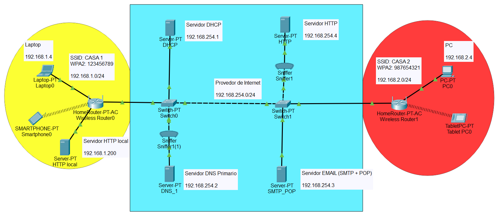
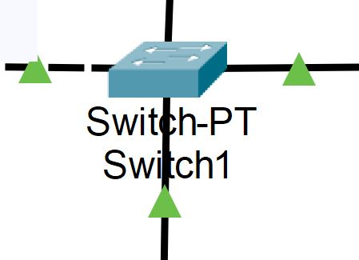
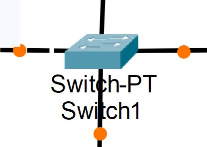
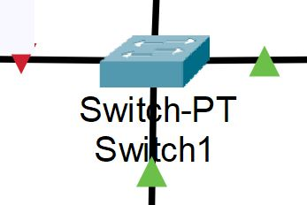
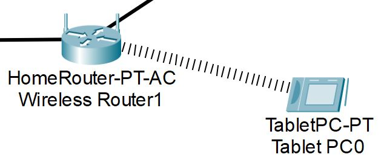

# Projeto - Interconexão de redes locais com Packet Tracer

**Descrição:** Instalar e configurar a topologia descrita na Figura 1, de forma a permitir que dispositivos das diferentes redes se comuniquem entre si. 

  
  
<b>Figura 1:</b> Topologia da Rede

**Objetivos**:
- Permitir a comunicação entre dispositivos de redes distintas
  - Todos os dispositivos devem responder a pacotes ICMP enviados por quaisquer outros dispositivos finais (dentro da rede atual e dentro da rede do provedor)
  - Configurar parâmetros das redes LAN e WAN
  - Instalar e configurar enlaces e parâmetros wireless e cabeados
- Todos os dispositivos devem ser capazes de acessar os servidores DHCP, DNS, HTTP e de EMAIL (SMTP + POP3) do provedor
- Somente o servidor HTTP da rede amarela deve estar acessível para dispositivos finais externos das demais (rede azul e vermelha). Os demais dispositivos da rede amarela nao devem estar acessíveis para as demais redes.
- Os dispositivos da rede vermelha nao devem estar acessíveis para os dispositivos da rede amarela. 
- Configurar serviços HTTP
  - Somente o servidor HTTP deve fornecer este serviço
- Configurar serviço DHCP nas redes LAN e WAN
- Configurar serviço DNS nas redes LAN e WAN
  - Criar registros DNS do tipo A e CNAME que apontem para o servidor HTTP
  - Criar registros DNS do tipo NS que apontem para o servidor DNS
- Configurar serviços de EMAIL
  - Criar e configurar servidor POP3 e SMTP
  - Criar e configurar usuários (emails) no servidor
- Vocês devem usar pacotes ICMP (comando PING ou mensagens simuladas do Cisco Packet Tracer), e os sniffers da rede para identificar e corrigir falhas de conexão e de configuração das redes

**Lembrete**: Para testar o DNS, você deve verificar se o acesso ao IP do servidor funciona e se esse acesso pelo nome do servidor também funciona. Se o acesso via IP funcionar porém via nome nao funcionar, isso indica falha de configuração no DNS.

**Sumário**
- [Projeto - Interconexão de redes locais com Packet Tracer](#projeto---interconexão-de-redes-locais-com-packet-tracer)
  - [Descrição da instalação e configuração das redes](#descrição-da-instalação-e-configuração-das-redes)
    - [Rede LAN 01 (DOMÍNIO AMARELO)](#rede-lan-01-domínio-amarelo)
    - [Rede LAN 02 (DOMÍNIO VERMELHO)](#rede-lan-02-domínio-vermelho)
    - [Rede WAN (DOMÍNIO AZUL)](#rede-wan-domínio-azul)
  - [Instruções](#instruções)
  - [Entregáveis](#entregáveis)
    - [1) Entrega das Redes LAN](#1-entrega-das-redes-lan)
    - [2) Entrega da Rede WAN](#2-entrega-da-rede-wan)
    - [3) Entrega Final](#3-entrega-final)

## Descrição da instalação e configuração das redes
Segue a descrição das redes LAN domésticas e WAN (provedor de serviço).

**DICA:** Preste atenção aos cabeamentos utilizados para instalar cada enlace cabeado. 
- Dispositivos da mesma camada de rede devem ser interconectados com cabeamento CROSS-OVER
- Dispositivos de camadas diferentes devem usar cabeamento STRAIGHT-THROUGH

**DICA 02:** A conexão entre enlaces cabeados está OK se um triangulo verde aparecer em ambas as extremidades do enlace (Figura 2).
- Círculos laranja nas extremidades indicam que os dispositivos estão tentando se conectar (Figura 3).
- Triângulos vermelhos indicam erro na conexão (Figura 4).

   
  
<b>Figura 2:</b> Enlaces com Conexão OK.

   
  
<b>Figura 3:</b> Enlaces em configuração (''se conectando'').

  
<b>Figura 4:</b> Enlace com falha.

**DICA 03:** Enlaces wireless aparecem como uma sequencia de linhas paralelas entre dois dispositivos sem fio (Figura 5). 

   
  
<b>Figura 5:</b> Enlaces wireless com Conexão OK.

### Rede LAN 01 (DOMÍNIO AMARELO)

- **Topologia**: Estrela
- **Equipamentos:**
  - 01 Roteador SOHO (Small-Office / Home-Office)  
  - 01 Servidor HTTP local
  - Pelo menos 01 dispositivo wireless    
  - Pelo menos 01 dispositivo cabeado (Laptop)
- **Enlaces:**
  - Enlaces wireless (802.11n ou 802.11ac)    
  - Enlaces cabeados (Fast Ethernet ou Gigabit)
- **Cabeamento (para enlaces cabeados):** 
  - Straight-Through
  - Cross-Over
- **Configurações da WAN (Internet):** 
  - Obter do DHCP
- **Configurações da LAN:** 
  - **Rede**: 192.168.1.0/24
  - **Gateway / DHCP**: 192.168.1.1
  - **DNS**: 192.168.254.2
  - **IP do Laptop**: 192.168.1.4 (reservado no servidor DHCP)
  - **IP do Servidor HTTP local**: 192.168.1.200 (configuração de IP estática no servidor)
- **Configurações Wireless 2.4 / 5 GHz**: 
  - **Segurança:** WPA2-PSK (AES)
  - **SSID**: CASA 1
  - **Senha:** 123456789

### Rede LAN 02 (DOMÍNIO VERMELHO)

- **Topologia**: Estrela
- **Equipamentos:**
  - 01 Roteador SOHO (Small-Office / Home-Office)  
  - Pelo menos 01 dispositivo wireless    
  - Pelo menos 01 dispositivo cabeado (PC)
- **Enlaces:**
  - Enlaces wireless (802.11n ou 802.11ac)    
  - Enlaces cabeados (Fast Ethernet ou Gigabit)
- **Cabeamento (para enlaces cabeados):** 
  - Straight-Through
  - Cross-Over  
- **Configurações da WAN (Internet):** 
  - Obter do DHCP
- **Configurações da LAN:** 
  - **Rede**: 192.168.2.0/24
  - **Gateway / DHCP**: 192.168.2.1
  - **DNS**: 192.168.254.2
  - **IP do PC**: 192.168.2.4 (reservado no servidor DHCP)
- **Configurações Wireless 2.4 / 5 GHz**: 
  - **Segurança:** WPA2-PSK (AES)
  - **SSID**: CASA 2
  - **Senha:** 987654321

### Rede WAN (DOMÍNIO AZUL)

- **Equipamentos:**
  - 02 Switches (de rack)  
  - 01 Servidor DNS (primário)
  - 01 Servidor DHCP
  - 01 Servidor HTTP
  - 01 Servidor EMAIL (POP3 + SMTP)
- **Enlaces:**
  - Enlaces cabeados (Fast Ethernet ou Gigabit)
- **Cabeamento (para enlaces cabeados):** 
  - Straight-Through
  - Cross-Over
- **Configurações da LAN:** 
  - **Rede**: 192.168.254.0/24
  - **Gateway / DHCP**: 192.168.254.1
  - **DNS**: 192.168.254.2 (primário)
  - **EMAIL (POP3 + SMTP)**: 192.168.254.3
  - **HTTP**: 192.168.254.4
- **Configurações de DNS:** 
  - **Nome do domínio DNS**: ufba.br
  - **Nome do servidor DNS**: ns1.ufba.br
  - **Nome do servidor EMAIL (POP e SMTP)**: mx.ufba.br
  - **Nome do servidor HTTP**: ufba.br
  - **Alias para o servidor HTTP**: portal.ufba.br 

**DICA**: Para configurar o DNS, estudem os tipos de registro (A, CNAME, e NS). O Cisco Packet Tracer nao possui o registro do tipo MX, porém isso nao afeta o funcionamento dos serviços no simulador.

## Instruções

1) Baixe e instale o [Cisco Packet Tracer](https://www.netacad.com/resources/lab-downloads?courseLang=en-US)
2) Baixe e abra o arquivo `template.pkt`
3) Coloque os dispositivos e equipamentos de rede
4) Conecte-os usando os enlaces apropriados
5) Configure as redes e serviços
6) Teste a configuração IP, enlaces e conexões de redes usando pacotes ICMP e os sniffers da rede
7) Teste os serviços DHCP (adicione dispositivos e verifique se eles se configuram automaticamente na rede)
8) Teste o serviço DNS (faça um ping para o domínio `ufba.br` e `cisco.srv`)
9) Teste o serviço HTTP do provedor (altere o arquivo ``index.html`` e verifique se as alterações visualizadas em outros dispositivos de rede)
   1)  Faça o mesmo teste para o serviço HTTP local da rede amarela (acesso pelos dispositivos da rede amarela e acesso por dispositivos externos)

## Entregáveis

Este trabalho esta dividido em 3 entregas parciais, cada uma com seu conjunto de arquivos e demais documentos (entregáveis). 

Ao termino de cada etapa do trabalho, cada grupo deve submeter os seguintes arquivos (entregáveis):

### 1) Entrega das Redes LAN

- **Arquivo texto** (formato .txt)
  - Nome / número do grupo
  - Nome dos integrantes
- **Arquivo Packet Tracer** (formato .pkt)
  - O arquivo deve conter os dispositivos e equipamentos de cada rede LAN, com seus respectivos enlaces.
  - Nesta etapa, se espera que todos os dispositivos das redes LAN sejam capazes de se comunicar dentro de suas respectivas redes, usando pacotes ICMP (ping).
  - Nesta etapa do trabalho **NÃO** é necessário realizar a conexão entre redes (LAN <-> WAN <-> LAN). Basta que os dispositivos de uma mesma rede sejam capazes de se comunicar entre si.

### 2) Entrega da Rede WAN 

- **Arquivo texto** (formato .txt)
  - Nome / número do grupo
  - Nome dos integrantes
- **Arquivo Packet Tracer** (formato .pkt)
  - O arquivo deve conter os dispositivos e equipamentos de cada rede LAN e WAN, com seus respectivos enlaces.
  - Todos os dispositivos das redes LAN e WAN devem se comunicar entre si (pacotes ping / ICMP), sendo capazes de utilizar os equipamentos de rede da WAN para comunicação.
  - Nesta etapa do trabalho **É necessário** realizar a conexão entre redes (LAN <-> WAN <-> LAN). 
  - Contudo, **NÃO É** necessário ter todos os serviços de rede configurados (e.g., DHCP, DNS, etc).
  
### 3) Entrega Final 

- **Slides de apresentação** (formato PDF)
- **Relatório** (formato PDF)
  - Descrevendo o que foi feito, como foi feito e por quem foi feito (integrantes da equipe)
  - Deve seguir as normas da ABNT
  - Deve seguir o formato de documentos acadêmicos (Introdução, Metodologia, Resultados e Discussão, Conclusão)
- **Arquivo Packet Tracer** (formato .pkt)
  - Redes LAN e WAN com todos os dispositivos e equipamentos configurados.
  - Redes LAN e WAN com todos os enlaces (cabeados e wireless) instalados, configurados e operantes.
  - Deve haver conectividade entre todos os dispositivos finais, de forma que todos respondam a pacotes ICMP (ping).
  - Serviços de rede de DNS e HTTP funcionais e acessíveis por todos os dispositivos finais, independentemente da rede em que estes estejam conectados.
  - Serviços DHCP, DNS e Wireless (e.g., SSID, senha, segurança, etc) configurados corretamente para cada rede.
  - Registros DNS configurados corretamente em ambos os servidores (primário e secundário).
